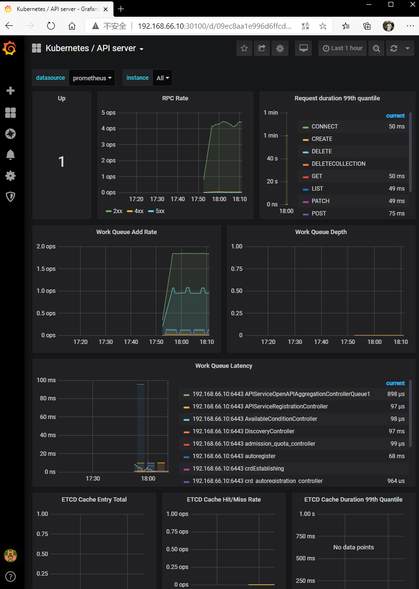

## 介绍

### 基本介绍

Kubernetes 是一个轻便的和可扩展的开源平台， 用于管理容器化应用和服务。 通过Kubernetes 能够进行应用的自动化部署和扩缩容。

谷歌用Go语言重写了borg组件成为我们的kubernetes。


### 发展经历

基础设施级服务 iaas :阿里云 

平台设施级服务 paas :新浪云

软件设施级服务 saas :Office365

资源管理器：

前生：

Apache：MESOS - 分布式系统内核 、分布式资源管理框架 2019-05 Twitter>k8s

docker：SWARM 集群，轻量 2019-07 阿里云宣布 Docker Swarm集群框架从阿里云选择框架剔除

今世：

google：kubernetes，10年google容器基础框架borg ，容器火了以后，Google使用GO语言参考Borg设计思路开发出K8s

　　特点：轻量级，基于GO语言，消耗资源小

　　　　　开源

　　　　　弹性伸缩

　　　　　负载均衡：LVS(IPVS)


### 功能

1. 自动装箱

   基于容器对应用运行环境的资源配置要求自动部署应用容器

2. 自我修复(自愈能力)
   当容器失败时， 会对容器进行重启
   当所部署的 Node 节点有问题时， 会对容器进行重新部署和重新调度
   当容器未通过监控检查时， 会关闭此容器直到容器正常运行时， 才会对外提供服务
3. 水平扩展
   通过简单的命令、 用户 UI 界面或基于 CPU 等资源使用情况， 对应用容器进行规模扩大或规模剪裁
4. 服务发现
   用户不需使用额外的服务发现机制， 就能够基于 Kubernetes 自身能力实现服务发现和负载均衡
5. 滚动更新
   可以根据应用的变化， 对应用容器运行的应用， 进行一次性或批量式更新
6.  版本回退
   可以根据应用部署情况， 对应用容器运行的应用， 进行历史版本即时回退
7.  密钥和配置管理
   在不需要重新构建镜像的情况下， 可以部署和更新密钥和应用配置， 类似热部署。
8. 存储编排
   自动实现存储系统挂载及应用， 特别对有状态应用实现数据持久化非常重要，存储系统可以来自于本地目录、 网络存储(NFS、 Gluster、 Ceph 等)、 公共云存储服务
9. 批处理
   提供一次性任务， 定时任务； 满足批量数据处理和分析的场景


### 架构图

`主要组件`：

<center></center>

1. **api server**：**所有服务访问统一入口，所有的组件都只和APIServer交互，除此之外并不两两交互**。提供认证、授权、访问控制、API注册和发现等机制
2. **Scheduler**: 负责资源的调度，按照预定的调度策略将Pod调度到相应的机器上；
3. **controller manager(replication controller 等)**：负责维护集群的状态，比如故障检测、自动扩展、滚动更新等；
4. **etcd**：储存K8S集群所有重要信息(持久化)。比如：①apiserver接收到pod的创建命令后，会将构建的完整pod信息存储到etcd中；②etcd存储了每一个svc的endpoint对象，用来记录一个svc对应的所有pod的访问地址；
5. **Kubelet**：直接跟容器引擎交互实现容器的生命周期管理；
6. **Kube-proxy**：负责为Service提供cluster内部的服务发现和负载均衡，负责写入规则至 IPTABLES、IPVS 实现服务映射访问的。

master节点的主要主组件就是apiserver、etcd、controller、scheduler。每一个执行节点node中都有一个**kubelet**，**kube proxy**，和一个或多个**pod**。 pod是最小部署单位，是一组容器的集合。

>master节点是不会被分配Pod的，因为master节点中默认存在一个污点：node-role.kubernetes.io/master:NoSchedule。

`重要插件`：

1. **CoreDNS**：可以为集群中的SVC创建一个域名IP的对应关系解析
2. **Dashboard**：提供一种B/S GUI的方式对集群资源进行管理，可以获取运行在集群中的应用的信息，也可以创建或者修改 Kubernetes 资源 （如 Deployment，Job，DaemonSet 等等）
3. **Ingress Controller**：为服务提供外网入口，对外提供服务的方式之一
4. **Federation**：提供一 个可以跨集群中心多K8S统一管理功能
5. **Prometheus**：提供资源监控
6. **elk**：提供集群日志采集、存储与查询
7. **Flannel**：是CoreOS团队针对Kubernetes设计的一个**网络规划服务**，简单来说，它的功能是**让集群中的不同节点主机创建的Docker容器都具有全集群唯一的虚拟IP地址**。而且它还能在这些IP 地址之间建立一个**覆盖网络**(Overlay Network) ，**通过这个覆盖网络，将数据包原封不动地传递到目标容器内**


推荐在 Kubernetes 集群中使用 Etcd v3，v2 版本已在 Kubernetes v1.11 中弃用。etcd 的官方将它定位成一个可信赖的分布式键值存储服务,它能够为整个分布式集群存储一些关键数据,协助分布式集群的正常运转：

<center></center>


### Pod

Pod是可以在 Kubernetes 中创建和管理的、最小的可部署的计算单元，一个node可以有多个Pod。

**Pod**（就像在鲸鱼荚或者豌豆荚中）是一组（一个或多个） [容器](https://kubernetes.io/zh-cn/docs/concepts/overview/what-is-kubernetes/#why-containers)； 这些容器共享存储、网络、以及怎样运行这些容器的声明。 Pod 中的内容总是并置（colocated）的并且一同调度，在共享的上下文中运行。 Pod 所建模的是特定于应用的 “逻辑主机”，其中包含一个或多个应用容器， 这些容器相对紧密地耦合在一起。 在非云环境中，在相同的物理机或虚拟机上运行的应用类似于在同一逻辑主机上运行的云应用。

除了应用容器，Pod 还可以包含在 Pod 启动期间运行的 Init 容器。 

Pod可以分为：自主式Pod(不是控制器控制的pod, 死了没人拉起来)，控制器管理的Pod。

**自主式Pod**：（不是被控制器管理的Pod）：死亡后不会被拉起来，也不会有人创建新的Pod：

每个Pod里运行着一个特殊的被称为**Pause容器**，其他容器为业务容器，这些业务容器共享Pause容器的网络栈和Volume挂载卷，因此他们之间通信和数据交互更为高效。

在设计时我们可以充分利用这一特性将一组密切相关的服务进程放入同一个Pod中，同一个Pod里的容器之间仅需通过localhost就能互相通信。


**控制器管理的Pod类型：**

（1）**ReplicationController**(RC)

ReplicationController用来确保容器应用的副本数始终保持在用户定义的副本数，即如果有容器异常退出，会自动创建新的Pod来替代;而如果异常多出来的容器也会自动回收。在新版本的Kubernetes 中建议使用RepliicaSet来取代ReplicationControlle。

（2）**ReplicaSet(RS)**

ReplicaSet跟ReplicationController没有本质的不同，只是名字不一样，并且ReplicaSet**支持集合式的selector**。虽然ReplicaSet 可以独立使用，但一般还是建议使用**Deployment** 来自动管理ReplicaSet，这样就无需担心跟其他机制的不兼容问题(比如ReplicaSet不支持rolling update但Deployment 支持)。

(3) **Deployment** 

Deployment 为 Pod 和 ReplicaSet 提供了一个声明式定义 (declarative) 方法,用来替代以前的 ReplicationController 来方便的管理应用。典型的应用场景包括:
　　　* 定义 Deployment 来创建 Pod 和 ReplicaSet
　　　* 滚动升级和回滚应用
　　　* 扩容和缩容
　　　* 暂停和继续 Deployment

滚动更新：


更新V1到V2，新建个RS然后创建1个V2，删除1个V1：


直至：


达到滚动更新，此时RS，停用、保留，可以回滚：


（4）**Horizontal Pod Autoscaling**(HPA)

HPA根据利用率平滑扩展，**仅适用于Deployment 和ReplicaSet** ，在V1版本中仅支持根据Pod的CPU利用率扩所容，在vlalpha 版本中，**支持根据内存和用户自定义的metric扩缩容**。　

HPA基于RS定义，并且监控V2Pod的资源利用率：


当符合条件后，会创建Pod：


每次创建后判断条件，符合后继续创建，直到最大值。使用率小就回收，直到最小值，实现水平自动扩展（弹性伸缩）。

（5）**StatefulSet**

StatefulSet是为了解决有状态服务的问题(对应Deployments 和Repl icaSets是为无状态服务而设计)，其应用场景包括:

- 稳定的持久化存储，即Pod重新调度后还是能访问到相同的**持久化数据**，基于PVC来实现
- 稳定的网络标志，即**Pod重新调度后其PodName 和HostName 不变**，基于Headless Service(即没有Cluster IP的Service )来实现
- 有序部署，有序扩展，即Pod是有顺序的，在部署或者扩展的时候**要依据定义的顺序依次依次进行(**即从0到N-1,**在下一个Pod运行之前所有之前的Pod必须都是Running 和Ready状态**)，基于init containers来实现
- 有序收缩，有序删除(即从N-1到0)

（6）**DaemonSet**

DaemonSet确保全部(或者一些) Node上运行一个Pod的副本。当有Node加入集群时，也会为他们新增一个Pod。当有Node从集群移除时，这些Pod也会被回收。删除DaemonSet 将会删除它创建的所有Pod。使用DaemonSet的–些典型用法:

- 运行集群存储daemon, 例如在每个Node上运行glusterd、 ceph；
- 在每个Node上运行日志收集daemon, 例如fluentd、 logstash；
- 在每个Node上运行监控daemon, 例如Prometheus Node Exporter。

（7）**Job，Cronjob**

job负责批处理任务，即仅执行一次的任务，他保证批处理任务的一个或者多个Pod成功结束。（比如要备份数据库，备份代码可以放到统一Pod里，再放到Job里执行，与Linux直接运行不同点是是封装好的Job可以重复利用，并且脚本执行异常退出可以重复执行，并且可以设置正常退出次数才算Job执行成功）

Cronjob管理基于时间的Job，即在给定时间点运行一次或周期性地在给定时间点运行

(8)　**服务发现**

Client访问service的IP和端口，使用RR（Round ribbon轮训）等算法间接访问到Pod。

<center></center>


### 网络通讯方式-Flannel

Kubernetes的网络模型假定了**所有Pod都在一个可以直接连通的扁平的网络空间中**，这在GCE (Google Compute Engine)里面是现成的网络模型，Kubernetes 假定这个网络已经存在。而在私有云里搭建Kubernetes 集群，就不能假定这个网络已经存在了。我们需要自己实现这个网络假设，将不同节点上的Docker 容器之间的互相访问先打通，然后运行Kubernetes。

- 同Service下的pod可以直接根据PodIP相互通信
- 不同Service下的pod在集群间pod通信要借助于 cluster ip
- pod和集群外通信，要借助于node ip

Flannel是CoreOS 团队针对Kubernetes 设计的一个网络规划服务，简单来说，它的功能是**让集群中的不同节点主机创建的Docker容器都具有全集群唯一的虚拟IP地址**。而且它还能在这些IP 地址之间建立一个**覆盖网络**(Overlay Network) ，**通过这个覆盖网络，将数据包原封不动地传递到目标容器内。**

<center></center>

ETCD之Flannel 提供说明:

- 存储管理Flannel 可分配的IP地址段资源
- 监控ETCD中每个Pod 的实际地址，并在内存中建立维护Pod 节点路由表

**网络通讯过程**：

- **同一个Pod内部通讯**：同一个Pod共享同一个网络命名空间，共享同一个Linux 协议栈

- **Pod1至Pod2**，分两种情况：
  - Pod1 与Pod2在同一台机器。由Docker0 网桥直接转发请求至Pod2, 不需要经过Flannel
  - Pod1 与Pod2不在同一台主机。Pod的地址是与docker0在同一个网段的，但docker0网段与宿主机网卡是两个完全不同的IP网段，并且环同Node之间的通信只能通过宿主机的物理网卡进行。**将Pod的IP和所在Node的IP关联起来，通过这个关联让Pod可以互相访问**

- **Pod至Service 的网络**：
  - 目前基于性能考虑，全部为iptables维护和转发Pod到外网:
  - Pod 向外网发送请求，查找路由表，转发数据包到宿主机的网卡，宿主网卡完成路由选择后，iptables执行Masquerade,把源IP更改为宿主网卡的IP,然后向外网服务器发送请求
  - 外网访问Pod: Service

<center></center>

只有节点网络是真实网络(只需一张网卡就可实现)。


> Flannel细节可以参考： https://www.cnblogs.com/centos-python/articles/10874350.html


## 集群安装

整体架构如下

<center></center>

:point_right:[K8S构建1台master2台node+Harbor - 一代肝帝 - 博客园 (cnblogs.com)](https://www.cnblogs.com/yyq1/p/13991453.html)

:point_right: [从零开始搭建K8S集群_xybDIY的博客-CSDN博客_如何搭建k8s集群](https://blog.csdn.net/qq_45392321/article/details/125341136)


## kubctl命令

<center></center>

> 图来源：https://jimmysong.io/kubernetes-handbook/guide/using-kubectl.html

Kubectl 的子命令主要分为 8 个类别：

- 基础命令（初学者都会使用的）
- 基础命令（中级）
- 部署命令
- 集群管理命令
- 故障排查和调试命令
- 高级命令
- 设置命令
- 其他命令

下面列出来一些常用的：

1. 查看集群状态：

   ```bash
   # 查看客户端及服务端程序版本信息
   kubectl version --short=true 
   # 查看集群信息
   kubectl cluster-info 
   ```

2. 查看资源清单配置字段的解释：

   ```bash
   kubectl explain pods/deployments/...(二级对象可用类似于pods.spec这种方式查看)
   ```

3. 创建资源对象：

   ```bash
   # 创建并运行一个指定的可复制的镜像。 创建一个`deployment`或者`job`来管理创建的容器。
   kubectl run NAME --image=image [--env="key=value"] [--port=port] [--replicas=replicas] [--dry-run=bool] [--overrides=inline-json] [--command] -- [COMMAND] [args...]
   # 陈述式对象配置管理方式
   kubectl create -f **.yaml  
   # 声明式对象配置管理方式（也适用于更新等）
   kubectl apply -f **.yaml  
   # 将service暴露出去
   kubectl expose deployments/deployment_name --type="NodePort" --port=(要暴露的容器端口) --name=(Service对象名字)
   ```

   - **kubectl create命令可创建新资源。 因此，如果再次运行该命令，则会抛出错误，因为资源名称在名称空间中应该是唯一的;**
   - **kubectl apply命令将配置应用于资源。 如果资源不在那里，那么它将被创建。 如果配置文件中的资源在集群中已存在，则根据配置对资源字段进行更新。**

4. 查看资源对象：

   ```bash
   # 查看命名空间
   kubectl get namespace 
   # 查看pod或者service，-o 输出格式 wide表示plain-text
   kubectl get pods,services -o wide 
   # -l 标签选择器(多个的话是与逻辑)，-n 指定命名空间，不指定默认default
   kubectl get pod -l "key=value,key=value" -n kube-system 
   #  -l 基于集合的标签选择器, -L查询结果显示标签，注意：为了避免和shell解释器解析!,必须要为此类表达式使用单引号
   kubectl get pod -l "key1 in (val1,val2),!key2" -L key
   # -w 监视资源变动信息
   kubectl get pod -w
   ```

5. 更新资源对象：

   ```bash
   # 进行热更新，直接编辑
   kubectl edit [pods/services/deployments/...]  name
   # apply进行更新
   kubectl apply -f **.yaml  
   # --force 如果需要基于此前的配置文件进行替换，需要加上force
   kubectl replace -f xx.yaml --force
   ```

6. 删除资源对象：

   ```bash
   # 删除指定资源对象
   kubectl delete [pods/services/deployments/...] name 
   # 删除kube-system下指定标签的资源对象
   kubectl delete [pods/services/deployments/...] -l key=value -n kube-system  
   # 删除kube-system下所有资源对象
   kubectl delete [pods/services/deployments/...] --all -n kube-system 
   # 强制删除Terminating的资源对象
   kubectl delete [pods/services/deployments/...] source_name --force --grace-period=0 -n kube-system 
   # 删除yaml定义的资源对象
   kubectl delete -f xx.yaml
   # 一般不用这种方式删除
   kubectl apply -f xx.yaml --prune -l <labels>
   # 默认删除控制器会同时删除其管控的所有Pod对象，加上cascade=false就只删除rs
   kubectl delete rs rs_name --cascade=fale
   ```

7. 查看某资源对象的配置文件：

   ```bash
   kubectl get source_type source_name -o yaml --export(--export表示省略由系统生成的信息) 后面加 > file.yaml就可以快速生成一个配置文件了
   ```

8. 标签管理(node/pod)：

   ```bash
   # 查看所有节点的标签
   kubectl get node --show-labels
   # 查看指定节点的标签
   kubectl get node k8s-node01 --show-labels
   # 添加节点标签
   kubectl label node k8s-node01 app=node01
   # 修改节点标签
   # kubectl label node 节点名 新的标签键值对 --overwrite=true
   kubectl label node k8s-node01 app=app01 --overwrite=true
   # 删除节点标签
   kubectl label node k8s-node01 app-
   ```

9. 打印容器中日志信息：

   ```bash
   # -f 持续监控，-c如果pod中只有一个容器不用加
   kubectl logs name -f -c container_name -n kube-system 
   ```

10. 在容器中执行命令：

   ```bash
   # 执行命令
   kubectl exec pod_name -c container_name -n kube-system -- COMMAND [args...]
   # 进入容器， 如果 POD 中有多个容器，则需要 -c 指定容器名
   kubectl exec pod_name [-c  container_name] -it -- /bin/sh
   ```

11. 扩容和缩容：

    ```bash
    kubectl scale deployment/deployment_name --replicas=N
    # 只有当前副本数等于M时才会执行扩容或者缩容
    kubectl scale deployment/deployment_name --replicas=N --current-replicas=M 
    ```

12. patch修改Deployment控制器进行控制器升级：

    ```bash
    # -p 以补丁形式更新补丁形式默认是json
    kubectl patch deployment deployment-demo -p '{"spec": {"minReadySeconds": 5}}'
    # 修改depolyment中的镜像文件
    kubectl set image deployments deployment-demo myapp=ikubernetes/myapp:v2 
    # 打印滚动更新过程中的状态信息
    kubectl rollout status deployment deployment-demo 
    # 监控deployment的更新过程
    kubectl get deployments deployment-demo --watch
    # 暂停更新
    kubectl kubectl rollout pause deployments deployment-demo 
    # 继续更新
    kubectl rollout resume deployments deployment-demo 
    # 查看历史版本(能查到具体的历史需要在apply的时候加上--record参数)
    kubectl rollout history deployments deployment-demo 
    # 回滚到指定版本，不加--to-version则回滚到上一个版本
    kubectl rollout undo deployments deployment-demo --to-revision=2 
    ```

    


## 资源清单

资源清单含义：在 k8s 中，一般使用 yaml 格式的文件来创建符合我们预期期望的 pod ，这样的 yaml 文件我们一般 称为资源清单。

### 分类

1. 名称空间级别：仅存此名称空间下生效
   - 工作负载型资源(workload)：
     Pod： k8s中最小单元
     ReplicaSet：调度器，通过标签控制 pod 的副本数目
     Deployment：控制器，通过控制 rs 的创建来创建 pod
     StatefulSet：为有状态服务创建的管理器
     DaemonSet：可以在每个节点运行 pod 主键
     Job：为批处理而生
     CronJob（ReplicationController）在v1.11版本被废弃：为批处理而生
   - 服务发现及负载均衡型资源（ServiceDiscoveryLoadBalance）：Service、Ingress、…
   - 配置与存储型资源：Volume（存储卷）、CSI（容器存储接口,可以扩展各种各样的第三方存储卷）
   - 特殊类型的存储卷：
     ConfigMap（当配置中心来使用的资源类型）：通过他可以创建一些配置文件，达到热更新
     Secret（保存敏感数据）：加密方案存储数据，可以用它存储一些秘钥等
     DownwardAPI（把外部环境中的信息输出给容器）：下载文件的接口，可以下载、上传

2. 集群级别：所有名称空间都可以使用
   Namespace：名称空间
   Node：工作节点
   Role
   ClusterRole
   RoleBinding
   ClusterRoleBinding

3. 元数据型资源
   HPA
   PodTemplate（pod模板）
   LimitRange（资源限制）

### Pod 资源清单常用字段解释

可以使用命令：`kubectl explain` 来查看详细属性

```bash
kubectl explain pod
kubectl explain pod.spec
kubectl explain pod.spec.containers
```


required就是必须要有的。

**必须存在的属性**

<table><thead><tr><th>参数名</th><th>字段类型</th><th>说明</th><th>默认值</th></tr></thead><tbody><tr><td><code>apiVersion</code></td><td>String</td><td>这里是指的是K8S API的版本&#xff0c;目前基本上是v1&#xff0c;可以用 kubectl api-versions 或者 <code>kubectl explain pod</code> 命令查询</td><td></td></tr><tr><td><code>kind</code></td><td>String</td><td>这里指的是yaml文件定义的资源类型和角色&#xff0c;比如: Pod</td><td></td></tr><tr><td><code>metadata</code></td><td>Object</td><td>元数据对象&#xff0c;固定值就写metadata</td><td></td></tr><tr><td><code>metadata.name</code></td><td>String</td><td>元数据对象的名字&#xff0c;这里由我们编写&#xff0c;比如命名Pod的名字</td><td></td></tr><tr><td><code>metadata.namespace</code></td><td>String</td><td>元数据对象的命名空间&#xff0c;由我们自身定义，用来逻辑上隔离集群资源，默认就是default命名空间</td><td>default</td></tr><tr><td><code>metadata.labels</code></td><td>map[string]string</td><td>键值数据&#xff0c;常被用作挑选条件</td><td></td></tr><tr><td><code>spec</code></td><td>Object</td><td>详细定义对象&#xff0c;固定值就写Spec</td><td></td></tr><tr><td><code>spec.containers[]</code></td><td>List</td><td>这里是Spec对象的容器列表定义&#xff0c;是个列表</td><td></td></tr><tr><td><code>spec.containers[].name</code></td><td>String</td><td>这里定义容器的名字</td><td></td></tr><tr><td><code>spec.containers[].image</code></td><td>String</td><td>这里定义要用到的镜像名称&#xff0c;如果镜像的标签是 latest&#xff0c;每次使用该镜像都会从远程下载</td><td></td></tr></tbody></table>

**主要对象**

<table><thead><tr><th>参数名</th><th>字段类型</th><th>说明</th><th>默认值</th></tr></thead><tbody><tr><td>spec.containers[].name</td><td>String</td><td>定义容器的名字</td><td>随机指定</td></tr><tr><td>spec.containers[].image</td><td>String</td><td>定义要用到的镜像名称&#xff0c;如果镜像的标签是 latest&#xff0c;每次使用该镜像都会从远程下载</td><td></td></tr><tr><td>spec.containers[].imagePullPolicy</td><td>String</td><td>定义镜像拉取策略&#xff0c;有Always、 Never、IfNotPresent三个值可选<br />(1) Always: 意思是每次都尝试重新拉取镜像<br />(2) Never: 表示仅使用本地镜像<br />(3) IfNotPresent: 如果本地有镜像就使用本地镜像&#xff0c;没有就拉取在线镜像</td><td>Always</td></tr><tr><td>spec.containers[].command[]</td><td>List</td><td>指定容器启动命令&#xff0c;因为是数组可以指定多个</td><td>默认使用镜像打包时使用的启动命令</td></tr><tr><td>spec.containers[].args[]</td><td>List</td><td>指定容器启动命令参数&#xff0c;因为是数组可以指定多个</td><td></td></tr><tr><td>spec.containers[].workingDir</td><td>String</td><td>指定容器的工作目录</td><td></td></tr><tr><td>spec.containers[].volumeMounts[]</td><td>List</td><td>指定容器内部的存储卷配置</td><td></td></tr><tr><td>spec.containers[].volumeMounts[].name</td><td>String</td><td>指定可以被容器挂载的存储卷的名称</td><td></td></tr><tr><td>spec.containers[].volumeMounts[].mountPath</td><td>String</td><td>指定可以被容器挂载的存储卷的路径</td><td></td></tr><tr><td>spec.containers[].volumeMounts[].readOnly</td><td>Boolean</td><td>设置存储卷路径的读写模式&#xff0c;ture 或者 false</td><td>false</td></tr><tr><td>spec.containers[].ports[]</td><td>List</td><td>指定容器需要用到的端口列表</td><td></td></tr><tr><td>spec.containers[].ports[].name</td><td>String</td><td>指定端口名称</td><td></td></tr><tr><td>spec.containers[].portsl].containerPort</td><td>String</td><td>指定容器需要监听的端口号</td><td></td></tr><tr><td>spec.containers[].ports[].hostPort</td><td>String</td><td>指定容器所在主机需要监听的端口号&#xff0c;默认跟上面containerPort相同&#xff0c; 注意设置了hostPort同一台主机无法启动该容器的相同副本(因为主机的端口号不能相同&#xff0c;这样会冲突)</td><td></td></tr><tr><td>spec.containers[].ports[].protocol</td><td>String</td><td>指定端口协议&#xff0c;支持TCP和UDP</td><td>TCP</td></tr><tr><td>spec.containers[].env[]</td><td>List</td><td>指定容器运行前需设置的环境变量列表</td><td></td></tr><tr><td>spec.containers[].env[].name</td><td>String</td><td>指定环境变量名称</td><td></td></tr><tr><td>spec.containers[].env[].value</td><td>String</td><td>指定环境变量值</td><td></td></tr><tr><td>spec.containers[].resources</td><td>Object</td><td>指定资源限制和资源请求的值(这里开始就是设置容器的资源上限)</td><td></td></tr><tr><td>spec.containers[].resources.limits</td><td>Object</td><td>指定设置容器运行时资源的运行上限</td><td></td></tr><tr><td>spec.containers[].resources.limits.cpu</td><td>String</td><td>指定CPU的限制&#xff0c;单位为core数&#xff0c;将用于docker run --Cpu-shares参数 (这里前面文章Pod资源限制有讲过)</td><td></td></tr><tr><td>spec.containers[].resources.limits.memory</td><td>String</td><td>指定MEM内存的限制&#xff0c;单位为MIB、GiB</td><td></td></tr><tr><td>spec.containers[].resources.requests</td><td>Object</td><td>指定容器启动和调度时的限制设置</td><td></td></tr><tr><td>spec. containers[].resources.requests.cpu</td><td>String</td><td>CPU请求&#xff0c;单位为core数&#xff0c;容器启动时初始化可用数量</td><td></td></tr><tr><td>spec. containers[].resources.requests .memory</td><td>String</td><td>内存请求&#xff0c;单位为MIB、GiB, 容器启动的初始化可用数量</td><td></td></tr></tbody></table>
 **额外参数项** 

<table><thead><tr><th>参数名</th><th>字段类型</th><th>说明</th><th>默认值</th></tr></thead><tbody><tr><td>spec.restartPolicy</td><td>String</td><td>定义Pod的重启策略&#xff0c;可选值为Always、OnFailure、Never<br />1.AIways&#xff1a;Pod 一旦终止运行&#xff0c;则无论容器是如何终止的&#xff0c;kubelet服务都将重启它。<br />2.OnFailure&#xff1a;只有Pod以非零退出码终止时&#xff0c;kubelet才会重启该容器。如果容器正常结束(退出码为0)&#xff0c;则kubelet将不会重启它。<br />3. Never&#xff1a;Pod终止后&#xff0c;kubelet将退出码报告给Master,不会重启该Pod</td><td>Always</td></tr>
    <tr><td>spec.nodeName</td><td>String</td><td>将该Pod调度到指定名称的node节点上</td><td></td></tr>
    <tr><td>spec.nodeSelector</td><td>Object</td><td>定义Node的Label过滤标签&#xff0c;以key:value格式指定</td><td></td></tr>
    <tr><td>spec.imagePullSecrets</td><td>Object</td><td>定义pull镜像时使用secret名称&#xff0c;以name:secretkey格式指定</td><td></td></tr>
    <tr><td>spec.hostNetwork</td><td>Boolean</td><td>定义是否使用主机网络模式。设置true表示使用宿主机网络&#xff0c;不使用docker网桥&#xff0c;同时设置了true将无法在同一台宿主机上启动第二个副本</td><td>false</td></tr>
    <tr><td>spec.volumns</td><td>List</td><td>在该pod上定义存储卷列表，声明周期和pod相同</td><td></td></tr>
     <tr><td>spec.affinity</td><td>Object</td><td>亲和性，主要用于pod调度，有node亲和性、pod亲和性</td><td></td></tr>
    </tbody></table>

YAML编写例子：

```yaml
apiVersion: v1                             # 必选，版本号v1
kind: Pod                                  # 必选，资源类型Pod
metadata:       　                         # 必选，元数据
  name: string                             # 必选，Pod名称
  namespace: string                        # Pod所属的命名空间, 默认为"default"
  labels:       　　                       # 自定义标签列表
    - name: string      　          
spec:                                      # 必选，Pod中容器的详细定义
  containers:                              # 必选，Pod中容器列表
  - name: string                           # 必选，容器名称
    image: string                          # 必选，容器的镜像名称
    imagePullPolicy: [Always|Never|IfNotPresent]          # 获取镜像的策略 
    command: [string]                      # 容器的启动命令列表，默认是打包时使用的启动命令
    args: [string]                         # 容器的启动命令参数列表
    workingDir: string                     # 容器的工作目录
    volumeMounts:                          # 挂载到容器内部的存储卷配置
    - name: string                         # 引用pod定义的共享存储卷的名称，需用volumes[]部分定义的的卷名
      mountPath: string                    # 存储卷在容器内mount的绝对路径，应少于512字符
      readOnly: boolean                    # 是否为只读模式
    ports:                                 # 需要暴露的端口号列表
    - name: string                         # 端口的名称
      containerPort: int                   # 容器需要监听的端口号
      hostPort: int                        # 容器所在主机需要监听的端口号，默认与Container相同
      protocol: string                     # 端口协议，支持TCP和UDP，默认TCP
    env:                                   # 容器运行前需设置的环境变量列表
    - name: string                         # 环境变量名称
      value: string                        # 环境变量的值
    resources:                             # 资源限制和请求的设置
      limits:                              # 资源限制的设置
        cpu: string                        # Cpu的限制，单位为core数，将用于docker run --cpu-shares参数
        memory: string                     # 内存限制，单位可以为Mib/Gib，将用于docker run --memory参数
      requests:                            # 资源请求的设置
        cpu: string                        # Cpu请求，容器启动的初始可用数量
        memory: string                     # 内存请求,容器启动的初始可用数量
    lifecycle:                             # 生命周期钩子
		postStart:                         # 容器启动后立即执行此钩子,如果执行失败,会根据重启策略进行重启
		preStop:                           # 容器终止前执行此钩子,无论结果如何,容器都会终止
    livenessProbe:                         # 对Pod内各容器健康检查的设置，当探测无响应几次后将自动重启该容器
      exec:       　                       # 对Pod容器内检查方式设置为exec方式
        command: [string]                  # exec方式需要制定的命令或脚本
      httpGet:                             # 对Pod内个容器健康检查方法设置为HttpGet，需要制定Path、port
        path: string
        port: number
        host: string
        scheme: string
        HttpHeaders:
        - name: string
          value: string
      tcpSocket:                           # 对Pod内的容器健康检查方式设置为tcpSocket方式
         port: number
       initialDelaySeconds: 0              # 容器启动完成后首次探测的时间，单位为秒
       timeoutSeconds: 0    　　           # 对容器健康检查探测等待响应的超时时间，单位秒，默认1秒
       periodSeconds: 0     　　           # 对容器健康检查的定期探测时间设置，单位秒，默认10秒一次
       successThreshold: 0
       failureThreshold: 0
       securityContext:
         privileged: false
  restartPolicy: [Always|Never|OnFailure]          # Pod的重启策略
  nodeName: <string>                       # 设置NodeName表示将该Pod调度到指定到名称的node节点上
  nodeSelector: obeject                    # 设置NodeSelector表示将该Pod调度到包含这个label的node上
  imagePullSecrets:                        # Pull镜像时使用的secret名称，以key：secretkey格式指定
  - name: string
  hostNetwork: false                       # 是否使用主机网络模式，默认为false，如果设置为true，表示使用宿主机网络
  volumes:                                 # 在该pod上定义共享存储卷列表
  - name: string                           # 共享存储卷名称 (volumes类型有很多种)
    emptyDir: {}                           # 类型为emtyDir的存储卷，与Pod同生命周期的一个临时目录。为空值
    hostPath: string                       # 类型为hostPath的存储卷，表示挂载Pod所在宿主机的目录
      path: string      　　               # Pod所在宿主机的目录，将被用于同期中mount的目录
    secret:       　　　                    # 类型为secret的存储卷，挂载集群与定义的secret对象到容器内部
      scretname: string  
      items:     
      - key: string
        path: string
    configMap:                             # 类型为configMap的存储卷，挂载预定义的configMap对象到容器内部
      name: string
      items:
      - key: string
        path: string
```


### 案例和命令

```yaml
apiVersion: v1
kind: Pod    		 #类型
metadata:
  name: myapp-pod     #pod的名称
  labels:   		 #键值数据，常被用作挑选对象
    app: myapp
    version: v1
spec:
  containers:     
  - name: app     					   #容器名称
    image: hub.zyx.com/library/myapp:v1  #镜像
  - name: test
    image: hub.zyx.com/library/myapp:v1
```

> :point_right: 更多参考 [k8s学习笔记之五:Pod资源清单spec字段常用字段及含义](https://www.cnblogs.com/panwenbin-logs/p/9895953.html)

```bash
kubectl apply -f pod.yaml   # 应用yaml

kubectl describe pod myapp-pod  # describe 查看pod信息

kubectl logs myapp-pod test  # 查看 pod 中指定容器的日志

kubectl get pod -o wide/json/yaml  # 以指定的格式输出
kubectl delete podName    # 删除pod
kubectl create -f pod.yaml  
```

- **kubectl create命令可创建新资源。 因此，如果再次运行该命令，则会抛出错误，因为资源名称在名称空间中应该是唯一的;**
- **kubectl apply命令将配置应用于资源。 如果资源不在那里，那么它将被创建。 kubectl apply命令可以第二次运行，因为它只是应用如下所示的配置。 在这种情况下，配置没有改变。 所以，pod没有改变。**

比如上面的yaml文件就会因为占用同一个端口，其中一个就会报错：

```bash
kubectl describe pod myapp-pod
```

<center></center>

可以发现第二个 test容器报错了。

查看test容器的日志：

```
kubectl logs myapp-pod test
```


报错原因就是80端口被占用。

删除 test容器:

```bash
vim pod.yaml
```

```yaml
apiVersion: v1
kind: Pod    		 #类型
metadata:
  name: myapp-pod     #pod的名称
  labels:   		 #键值数据，常被用作挑选对象
    app: myapp
    version: v1
spec:
  containers:     
  - name: app     					   #容器名称
    image: hub.zyx.com/library/myapp:v1  #镜像
```

删除正在运行的pod：

```bash
kubectl delete myapp-pod    # 删除pod
```

再创建该pod：

```bash
kubectl create -f pod.yaml  
```


### Pod的生命周期

和一个个独立的应用容器一样，Pod 也被认为是**相对临时性**（而不是长期存在）的实体。 Pod 会被创建、赋予一个唯一的 ID（UID），并被调度到节点，并在终止（根据重启策略）或删除之前一直运行在该节点。

如果一个节点死掉了，调度到该节点 的 **Pod 也被计划在给定超时期限结束后删除**。

**Pod 自身不具有自愈能力**。如果 Pod 被调度到某节点 而该节点之后失效，或者调度操作本身失效，Pod 会被删除；与此类似，Pod 无法在节点资源 耗尽或者节点维护期间继续存活。Kubernetes 使用一种高级抽象，称作 控制器，来管理这些相对而言 可随时丢弃的 Pod 实例。

**任何给定的 Pod （由 UID 定义）从不会被“重新调度（rescheduled）”到不同的节点； 相反，这一 Pod 可以被一个新的、几乎完全相同的 Pod 替换掉。 如果需要，新 Pod 的名字可以不变，但是其 UID 会不同。**

如果某物声称其生命期与某 Pod 相同，例如存储卷， 这就意味着该对象在此 Pod （UID 亦相同）存在期间也一直存在。 **如果 Pod 因为任何原因被删除，甚至某完全相同的替代 Pod 被创建时， 这个相关的对象（例如这里的卷）也会被删除并重建。**


一般将pod对象从创建至结束的这段时间范围成为pod的生命周期，它主要包含下面的过程：

- **pod创建过程**

- **运行初始化容器(init container)过程**（可多可少，可有可无）

- **运行主容器(main container)过程**

  容器启动后执行的钩子函数（post start），容器终止前执行的钩子函数（ pre stop）
  容器的存活性探测(liveness probe)、就绪性探测(readiness probe)

- **pod终止过程**


#### Pod的创建过程

<center></center>

1. 用户通过kubectl或APIServer提供的调用接口将要创建的pod信息提交给apiserver；
2. APIServer通过鉴权等后，构建出完整的Pod信息，并将该信息存储到etcd中，然后返回确认信息至客户端；
3. apiserver开始反映etcd中的pod对象的变化，其他组件使用watch（监听）机制来跟踪检查apiserver上的变动；
4. Scheduler watch(监听)到pod的事件，发现有新的pod创建信息， 随即为该pod分配合适的node，然后调用APIServer的修改接口，将Pod与node绑定；
5. node节点上的kubelet watch到pod事件，发现有pod调度过来，尝试调用docker启动容器，并将结果送至apiserver；
6. apiserver将接收到的pod状态信息存入etcd中；

>**APIServer反复出现的原因是因为所有的组件都只和APIServer交互，除此之外并不两两交互**
>
>watch是个很重要的功能，Scheduler、Controller-Manager、kubelet组件都通过watch来检测变化做出响应。

#### 运行初始化容器(init container)过程

Init Container就是用来做初始化工作的容器，可以是一个或者多个，如果有多个的话，这些容器会按定义的顺序依次执行，只有所有的Init Container执行完后，主容器才会被启动。我们知道一个Pod里面的所有容器可以共享数据卷和网络命名空间的，所以Init Container里面产生的数据可以被主容器使用到的。

- Pod 能够具有多个容器，应用运行在容器里面，但是它也可能有一个或多个先于应用容器启动的 Init 容器
- Init 容器与普通的容器非常像，除了如下两点：
  - Init 容器总是运行到成功完成为止
  - 每个 Init 容器都必须在下一个 Init 容器启动之前成功完成
  - 不支持 lifecycle、livenessProbe、readinessProbe 和 startupProbe
  - 可以访问 应用容器不能访问的 Secret 的权限
- 如果 Pod 的 Init 容器失败，Kubernetes 会不断地重启该 Pod，直到 Init 容器成功为止。然而，如果Pod 对应的 restartPolicy 为 Never，它不会重新启动
  

##### init容器作用

因为 Init 容器具有与应用程序容器分离的单独镜像，所以它们的启动相关代码具有如下优势：

- 它们可以包含并运行实用工具，但是出于安全考虑，是不建议在应用程序容器镜像中包含这些实用工具的；
- **它们可以包含使用工具和定制化代码来安装，但是不能出现在应用程序镜像中**。例如，创建镜像没必要FROM另一个镜像，只需要在安装过程中使用类似sed、awk、python或dig这样的工具；
- 应用程序镜像可以分离出创建和部署的角色，而没有必要联合它们构建一个单独的镜像；
- **Init 容器使用 Linux Namespace，所以相对应用程序容器来说具有不同的文件系统视图**。因此，它们能够具有访问 Secret 的权限，而应用程序容器则不能；
- **它们必须在应用程序容器启动之前运行完成**，而应用程序容器是并行运行的，所以**Init容器能够提供了一种简单的阻塞或延迟应用容器的启动的方法，直到满足了一组先决条件。**


##### Init容器特殊说明

在 Pod 启动过程中，Init 容器会按顺序在网络和数据卷初始化之后启动。每个容器必须在下一个容器启动之前成功退出（网络和数据卷初始化是在 pause）

如果由于运行时或失败退出，将导致容器启动失败，它会根据 Pod 的 restartPolicy 指定的策略进行重试。例如，如果 Pod 的 restartPolicy 设置为 Always，Init容器失败时会不断重试，直到达到他的最大上限为止

在所有的 Init 容器没有成功之前，Pod 将不会变成 Ready 状态。Init 容器的端口将不会在 Service 中进行聚集。正在初始化中的 Pod 处于 Pending 状态，但应该会将 Initializing 状态设置为true

如果 Pod 重启，所有 Init 容器必须重新执行

对 Init 容器 spec 的修改（kubectl edit pod）被限制在容器 image 字段，修改其他字段都不会生效（不会自动重启）。更改 Init 容器的image 字段，会自动重启该 Init 容器，相当于重启 Pod

Init 容器具有应用容器的所有字段。除了 readinessProbe（就绪检测），因为 Init 容器无法定义不同于完成（completion）的就绪（readiness）之外的其他状态。这会在验证过程中强制执行

在 Pod 中的每个 app 和 Init 容器的名称必须唯一；与任何其它容器共享同一个名称，会在验证时抛出错误（同一个 Pod 中 Init 的端口是可以相同的）

##### init容器实例

```yaml
apiVersion: v1
kind: Pod
metadata:
  name: myapp-pod
  labels:
    app: myapp
spec:
  containers:	# 这是主容器
  - name: myapp-container
    image: busybox		# 如果镜像的标签是 latest 且下载策略是 Always，每次使用该镜像都会从远程下载
    command: ['sh', '-c', 'echo The app is running! && sleep 3600']
  initContainers:	# 这是 init 容器
  - name: init-myservice
    image: busybox
    # 循环检测 myservice 域名是否能被解析，如果可以解析，退出循环
    command: ['sh', '-c', 'until nslookup myservice; do echo waiting for myservice; sleep 2; done;'] 
  - name: init-mydb
    image: busybox
    # 循环检测 mydb 是否能被解析，如果可以解析，退出循环
    command: ['sh', '-c', 'until nslookup mydb; do echo waiting for mydb; sleep 2; done;']
```


#### 运行主容器(main container)过程

##### Start/Stop

Pod hook(钩子)是由 Kubernetes 管理的 kubelet 发起的，当容器中的进程启动前或者容器中的进程终止之前运行，这是包含在容器的生命周期之中。可以同时为 Pod 中的所有容器都配置 hook

Hook 的类型包括两种：①exec：执行一段命令；②HTTP：发送HTTP请求。

```yaml
apiVersion: v1
kind: Pod
metadata:
  name: lifecycle-start-stop-pod
  namespace: default
spec:
  containers:
  - name: readiness-start-stop-container
    image: nginx
    imagePullPolicy: IfNotPresent
    lifecycle:
      postStart:
        exec:
          command: ["/bin/sh","-c","echo Hello from the postStart handler > /usr/share/message"]
      preStop:
        exec:
          command: ["/bin/sh","-c","echo Hello from the postStop handler > /usr/share/message"]
```


##### 探针

探针是由每一个 Node 上的 kubelet 对容器执行的定期诊断。要执行诊断，kubelet 调用由容器实现的 Handler。有三种类型的处理程序：

- **ExecAction**：在容器内执行指定命令。如果命令退出时返回码为 0 则认为诊断成功；
- **TCPSocketAction**：对指定容器端口的IP地址进行 TCP 检查。如端口打开，则诊断被认为是成功的；
- **HTTPGetAction**：对指定的端口和路径上的容器的IP地址执行 HTTPGet 请求。如果响应的状态码大于等于 200 且小于400，则诊断被认为是成功的。

每次探测都将获得以下三种结果之一：

- 成功：容器通过了诊断。
- 失败：容器未通过诊断。
- 未知：诊断失败，因此不会采取任何行动

探测方案也有两种：

- readinessProbe： 就绪检测

  指示容器是否准备好服务请求。如果就绪探测失败，端点控制器将从与 Pod 匹配的所有 Service 的端点中删除该 Pod 的 IP 地址。初始延迟之前的就绪状态默认为 Failure。如果容器不提供就绪探针，则默认状态为 Success

- livenessProbe： 生存检测

  指示容器是否正在运行。如果存活探测失败，则 kubelet 会杀死容器，并且容器将受到其重启策略的影响。如果容器不提供存活探针，则默认状态为 Success（会随着容器的生命周期一直存在）

区别：**readinessProbe 检测成功之后，主容器才能宣布对外能够正常访问，否则状态都是 Failure。而 livenessProbe 跟随着容器的整个生命周期，会循环检测容器中的资源是否可用。**


（1）**就绪检测 - httpGet**

就绪检测 nginx 的 index1.html 存在否，存在的话，就绪检测通过。

```yaml
apiVersion: v1
kind: Pod
metadata:
  name: readiness-httpget-pod
  namespace: default
spec:
  containers:
  - name: readiness-httpget-container
    image: wangyanglinux/myapp:v1
    imagePullPolicy: IfNotPresent
    readinessProbe:		# 就绪检测
      httpGet:			# httpGet 检测方案
        port: 80		# 端口 80
        path: /index1.html	# 请求文件
      initialDelaySeconds: 1	# 初始化检测的延时，容器启动 1 之后再开始检测
      periodSeconds: 3		# 重试的检测时间
```

可以看到，容器在运行（Running），但是没有 Ready：

```yaml
[root@k8s-master01 ~]# kubectl get pod
NAME                    READY   STATUS    RESTARTS   AGE
readiness-httpget-pod   0/1     Running   0          12s

# 查看日志信息，显示 HTTP 请求状态码为 404
[root@k8s-master01 ~]# kubectl describe pod readiness-httpget-pod
Type     Reason     Age                   From                            Message
----     ------     ----                  ----                            -------
Warning  Unhealthy  75s (x22 over 2m18s)  kubelet, localhost.localdomain  Readiness probe failed: HTTP probe failed with statuscode: 404
```

手动进入容器，添加 index1.html 之后：

```bash
# 进入容器， 如果 POD 中有多个容器，则需要 -c 指定容器名
# kubectl exec (POD | TYPE/NAME) [-c CONTAINER] [flags] -- COMMAND [args...] [options]
kubectl exec readiness-httpget-pod -it -- /bin/sh

# 添加文件
cd /usr/share/nginx/html/
echo "123" > index1.html
exit

# 查看 Pod，已经 READY
[root@k8s-master01 ~]# kubectl get pod
NAME                    READY   STATUS    RESTARTS   AGE
readiness-httpget-pod   1/1     Running   0          6m25s
```


（2）**存活检测 - ExecAction**

模板说明：pod 创建，容器初始化完成后，创建文件后休眠 60 秒后删除该文件，存活检测在容器创建后延时 1s 进行检测，重试时间间隔 3s。

```yaml
apiVersion: v1
kind: Pod
metadata:
  name: liveness-exec-pod
  namespace: default
spec:
  containers:
  - name: liveness-exec-container
    image: busybox
    imagePullPolicy: IfNotPresent
    # 创建一个文件，休眠 60s，然后把该文件删除
    command: ["/bin/sh","-c","touch /temp/live ; sleep 60 ; rm -rf /temp/live; sleep 3600"]
    livenessProbe:		# 存活检测
      exec:
        # 检测该文件是还存在， 如果存在，返回值为 0
        command: ["test","-e","/temp/live"]
      initialDelaySeconds: 1	# 容器启动后延时 1s 再开始检测
      periodSeconds: 3			# 每隔 3s 检测一次
```

容器启动时会创建 `/temp/live` 文件，60s 之后删除该文件。当 `livenessProbe` 发现文件不存在，就会重启容器，重启后的容器 60秒之后又会删除 `/temp/live` 文件，所以容器不断被重启。


(3) **存活检测 - HTTPGetAction**

每隔一段时间（3s），检测 nginx 中的 index1.html 能否被访问，如果不能访问，就重启容器。

```yaml
apiVersion: v1
kind: Pod
metadata:
  name: liveness-httpget-pod
  namespace: default
spec:
  containers:
  - name: liveness-httpget-container
    image: wangyanglinux/myapp:v1
    imagePullPolicy: IfNotPresent
    ports:
    - name: http
      containerPort: 80
    livenessProbe:
      httpGet:
        port: http				# http 和 80 等价
        path: /index1.html
      initialDelaySeconds: 1
      periodSeconds: 3
      timeoutSeconds: 10		# 最大超时时间
```


(4) **存活检测 - TCPSocketAction**

创建一个 pod，镜像文件是 nginx，存活检测镜像容器中的 nginx（80），使用 tcp 连接，端口指定8080，当探测结果失败时(不可访问)，重启容器。

```yaml
apiVersion: v1
kind: Pod
metadata:
  name: liveness-tcp-pod
  namespace: default
spec:
  containers:
  - name: liveness-tcp-container
    image: wangyanglinux/myapp:v1
    imagePullPolicy: IfNotPresent
    livenessProbe:
      initialDelaySeconds: 1
      timeoutSeconds: 5
      periodSeconds: 3
      tcpSocket:
        port: 8080		# nginx 是 80 端口
```


#### Pause容器

其实在初始化容器之前，已经创建了Pause容器，**kubernetes中用pause容器来作为一个pod中所有容器的父容器，pause容器又叫Infra(infrastucture container)容器**，有以下功能：

作为init pod存在，其他pod都会从pause 容器中fork出来。每个Pod里运行着一个特殊的被称之为Pause的容器，其他容器则为业务容器，**这些业务容器共享Pause容器的网络栈和Volume挂载卷**，因此他们之间通信和数据交换更为高效，在设计时我们可以充分利用这一特性将一组密切相关的服务进程放入同一个Pod中。

有以下功能：

- PID命名空间：Pod中的不同应用程序可以看到其他应用程序的进程ID，pause容器在每个pod中都作为PID为1进程，并回收僵尸进程
- 网络命名空间：Pod中的多个容器能够访问同一个IP和端口范围。
- IPC命名空间：Pod中的多个容器能够使用SystemV IPC或POSIX消息队列进行通信。
- UTS命名空间：Pod中的多个容器共享一个主机名、Volumes（共享存储卷）：
- Pod中的各个容器可以访问在Pod级别定义的Volumes。


#### Pod的终止过程

1. 用户向apiserver发送删除pod对象的命令

2. apiserver中的pod对象信息会随着时间的推移而更新，在宽限期内（默认是30s），pod被视为dead

3. 将pod标记为terminating（正在删除）状态

4. kubelet在监控到pod对象转为terminating状态的同时启动pod关闭过程

5. 端点控制器监控到pod对象的关闭行为时将其从所有匹配到此端点的service资源的端点列表中移除

6. 如果当前pod对象定义了 preStop钩子处理器，则在其标记为terminating后即会以同步的方式启动执行

7. pod对象中的容器进程收到停止信号

8. 宽限期结束后，若pod中还存在仍在运行的进程，那么pod对象会收到立即终止的信号

9. kubelet请求apiserver将此pod资源的宽限期设置为0，从而完成删除操作，此时pod对于用户已不可见


#### Pod状态(phase相位)

| 取值                | 描述                                                         |
| :------------------ | :----------------------------------------------------------- |
| `Pending`（悬决）   | Pod 已被 Kubernetes 系统接受，但有一个或者多个容器尚未创建亦未运行。此阶段包括等待 Pod 被调度的时间和通过网络下载镜像的时间。 |
| `Running`（运行中） | Pod 已经绑定到了某个节点，Pod 中所有的容器都已被创建。至少有一个容器仍在运行，或者正处于启动或重启状态。 |
| `Succeeded`（成功） | Pod 中的所有容器都已成功执行并退出，且不会再重启。           |
| `Failed`（失败）    | Pod 中的所有容器都已终止，并且至少有一个容器是因为失败终止。也就是说，容器以非 0 状态退出或者被系统终止。 |
| `Unknown`（未知）   | 因为某些原因无法取得 Pod 的状态。这种情况通常是因为与 Pod 所在主机通信失败。 |

查看Pod状态：

```bash
$ kubectl get pod <pod-name> -o yaml | grep phase
phase: Running
```


#### Pod状况(Condition)

可以通过查看`Pod`的`Condition`列表了解更多信息，`pod`的`Condition`指示`pod`是否已达到某个状态，以及为什么会这样，与状态相反，一个`Pod`同时具有多个Conditions。

| **Pod Condition** | 描述                                                         |
| ----------------- | ------------------------------------------------------------ |
| PodScheduled      | 表示pod是否已调度到节点                                      |
| Initialized       | Pod的 `init`容器都已成功完成                                 |
| ContainersReady   | Pod 中所有容器都已就绪                                       |
| Ready             | Pod 可以为请求提供服务，并且应该被添加到对应服务的负载均衡池中 |

显示pod的状况

```shell
$ kubectl describe po <pod-name> | grep Conditions: -A5
```


#### 容器状态

| Container State | 描述                                                         |
| --------------- | ------------------------------------------------------------ |
| Waiting         | 容器正在等待启动                                             |
| Running         | 容器已创建并且进程正在其中运行，`startAt`字段指示此容器启动的时间 |
| Terminated      | 已在容器中运行的进程已终止，`finishedAt` 字段指示容器何时终止，主进程终止的退出代码位于`exitCode`字段中 |
| Unknown         | 无法确定容器的状态                                           |

显示pod的容器状态

```shell
$ kubectl describe po <pod-name> | grep Containers: -A15
$ kubectl get po <pod-name> -o json | jq .status.containerStatuses
$ kubectl get po <pod-name> -o json | jq .status
```


## 资源控制器

Pod分为自主式Pod和控制器管理的Pod。类型：

- ReplicationController 和 ReplicaSet （无状态服务RS-Deployment）
- Deployment  (一般推荐)
- DaemonSet（以Node为节点部署）
- Horizontal Pod Autoscaling （根据利用率平滑扩，可以理解为并不是一个控制器，而是一个控制器的附属品，以其他控制器作为模板）
- StateFulSet （有状态服务）
- Job/CronJob （批处理任务部署）

### ReplicationController(RC)

ReplicationController用来**确保容器应用的副本数始终保持在用户定义的副本数**，即如果有容器异常退出，会自动创建新的Pod来替代；而如果异常多出来的容器也会自动回收。在新版本的Kubernetes 中建议使用RepliicaSet来取代ReplicationControlle。

### ReplicaSet(RS)

ReplicaSet跟ReplicationController没有本质的不同，只是名字不一样，并且ReplicaSet**支持集合式的selector**，**通过标签（matchLabels）来管理 Pod**。虽然ReplicaSet 可以独立使用，但一般还是建议使用**Deployment** 来自动管理ReplicaSet，这样就无需担心跟其他机制的不兼容问题(比如ReplicaSet不支持rolling update但Deployment 支持)。

```yaml
apiVersion: apps/v1  #api版本定义
kind: ReplicaSet  #定义资源类型为ReplicaSet
metadata:  #元数据定义
  name: frontend
  namespace: default
spec:  # ReplicaSet的规格定义
  replicas: 3  #定义副本数量为3个
  selector:  #标签选择器，定义匹配Pod的标签
    matchLabels:  # RS通过labels来确定某个Pod是否归该RS管，即RS通过标签来监控Pod
      tier: frontend
  template:  #Pod的模板定义，与上面Pod的定义一致
    metadata:  #Pod的元数据定义
      name: myapp-pod  #自定义Pod的名称
      labels:  #定义Pod的标签，需要和上面的标签选择器内匹配规则中定义的标签一致，可以多出其他标签
        tier: frontend
    spec:  #Pod的规格定义
      containers:  #容器定义
      - name: mynginx  #容器名称
        image: hub.zyx.com/library/nginx:v1  #容器镜像
        imagePullPolicy: IfNotPresent  #拉取镜像的规则
        env:
        - name: GET_HOSTS_FROM
          value: dns
        ports:  #暴露端口
        - name: http  #端口名称
          containerPort: 80
```

创建RS并查看：

```bash
# 创建 RS
[root@k8s-master01 yaml]# kubectl create -f rs.yaml

# 查看创建的 rs
[root@k8s-master01 yaml]# kubectl get rs
NAME       DESIRED   CURRENT   READY   AGE
frontend   3         3         3       23m

# 查看rs创建的 3 个 Pod，
[root@k8s-master01 yaml]# kubectl get pod
NAME             READY   STATUS    RESTARTS   AGE
frontend-cbxp2   1/1     Running   0          23m
frontend-qnfcd   1/1     Running   0          23m
frontend-qqngq   1/1     Running   0          23m

# 删除 Pod后，RS会自动重建 Pod，维持设置的副本数（3），通过 Pod 后的随机值可以看出，Pod是重新创建的
[root@k8s-master01 yaml]# kubectl delete pod --all
pod "frontend-cbxp2" deleted
pod "frontend-qnfcd" deleted
pod "frontend-qqngq" deleted
[root@k8s-master01 yaml]# kubectl get pod
NAME             READY   STATUS    RESTARTS   AGE
frontend-5lgj9   1/1     Running   0          14s
frontend-gxhrv   1/1     Running   0          14s
frontend-rwhc5   1/1     Running   0          14s
```

修改labels：

```bash
# 查看Pod的标签
[root@k8s-master01 yaml]# kubectl get pod --show-labels
NAME             READY   STATUS    RESTARTS   AGE     LABELS
frontend-5lgj9   1/1     Running   0          5m20s   tier=frontend
frontend-gxhrv   1/1     Running   0          5m20s   tier=frontend
frontend-rwhc5   1/1     Running   0          5m20s   tier=frontend

# 修改其中一个Pod的标签
[root@k8s-master01 yaml]# kubectl label pod frontend-5lgj9 tier=abc --overwrite=true
pod/frontend-5lgj9 labeled

# RS会通过匹配 labels 来确定哪些 Pod 是自己管理的
# 当改变了 frontend-5lgj9 的 labels 时，该 Pod 已经不归 frontend 这个 RS 管了，所以 RS 又重新创建了一个Pod
[root@k8s-master01 yaml]# kubectl get pod --show-labels
NAME             READY   STATUS    RESTARTS   AGE   LABELS
frontend-5lgj9   1/1     Running   0          84m   tier=abc
frontend-7fbp8   1/1     Running   0          4s    tier=frontend
frontend-gxhrv   1/1     Running   0          84m   tier=frontend
frontend-rwhc5   1/1     Running   0          84m   tier=frontend

# 删除RS，Pod也会被删除
[root@k8s-master01 yaml]# kubectl delete rs frontend
[root@k8s-master01 yaml]# kubectl get pod --show-labels
NAME             READY   STATUS    RESTARTS   AGE   LABELS
frontend-5lgj9   1/1     Running   0          98m   tier=abc
```


###  Deployment (一般推荐)

Deployment 为 Pod 和 ReplicaSet 提供了一个声明式定义 (declarative) 方法,用来替代以前的 ReplicationController 来方便的管理应用。典型的应用场景包括:

   * 定义 Deployment 来创建 ReplicaSet和Pod 
   * 滚动升级和回滚应用
   * 扩容和缩容
   * 暂停和继续 Deployment


Deployment是通过管理RS来管理Pod的。

滚动更新：


更新V1到V2，新建个RS然后创建1个V2，删除1个V1：


直至：


达到滚动更新，此时RS，停用、保留，可以回滚：


#### 创建并查看

```yaml
apiVersion: apps/v1  #api版本定义
kind: Deployment  #定义资源类型为Deploymant
metadata:  #元数据定义
  name: nginx-deployment  #deployment控制器名称
  namespace: default  #名称空间
spec:  #deployment控制器的规格定义
  replicas: 3  #定义deployment副本数量为2个
  selector:  #标签选择器，定义匹配Pod的标签
    matchLabels:
      app: nginx-deployment
  template:  #Pod的模板定义
    metadata:  #Pod的元数据定义
      labels:  #定义Pod的标签，和上面的标签选择器标签一致，可以多出其他标签
        app: nginx-deployment
    spec:  #Pod的规格定义
      containers:  #容器定义
      - name: nginx  #容器名称
        image: hub.zyx.com/library/nginx:v1  #容器镜像
        ports:  #暴露端口
        - name: http  #端口名称
          containerPort: 80
```

创建Deployment并查看：

```bash
# 创建Deployment对象
# --record 可以方便的查看 revision 的变化（roolout 被触发（spec.template被更改）就会创建一个 revision）
kubectl apply -f deployment.yaml --record

[root@k8s-master01 yaml]# kubectl get deployment
NAME               READY   UP-TO-DATE   AVAILABLE   AGE
nginx-deployment   3/3     3            3           4m30s
[root@k8s-master01 yaml]# kubectl get rs
NAME                          DESIRED   CURRENT   READY   AGE
nginx-deployment-645ccc47cc   3         3         3       4m32s
[root@k8s-master01 yaml]# kubectl get pod
NAME                                READY   STATUS    RESTARTS   AGE
nginx-deployment-645ccc47cc-885sz   1/1     Running   0          4m37s
nginx-deployment-645ccc47cc-k5jcm   1/1     Running   0          4m37s
nginx-deployment-645ccc47cc-rwnk5   1/1     Running   0          4m37s
```

kubectl get deployment 命令所显示的字段有：

- NAME：Deployment 的名称。
- READY：显示应用程序的可用的副本数。显示的模式是“就绪个数/期望个数”。
- UP-TO-DATE：显示为了达到期望状态已经更新的副本数。
- AVAILABLE：显示应用可供用户使用的副本数。
- AGE：显示应用程序运行的时间。


#### 扩容

```bash
kubectl scale deployment nginx-deployment --replicas=5
```


#### 更新

修改 `Pod` 模板相关的配置参数便能完成 `Deployment` 控制器资源的更新。

由于是声明式配置，因此对 `Deployment` 控制器资源的修改尤其适合使用 `apply` 和 `patch` 命令来进行；如果仅只是修改容器镜像，`set image` 命令更为易用。

更新容器的镜像：`kubectl set image deployment/[deployment名称] [容器名称]=[镜像名称]`

```bash
kubectl set image deployment/nginx-deployment nginx=wangyanglinux/myapp:v2

# 可以看到原来的 RS 已经停用并做为备份，并创建了新的 RS
[root@k8s-master01 yaml]# kubectl get rs
NAME                          DESIRED   CURRENT   READY   AGE
nginx-deployment-645ccc47cc   0         0         0       3h45m
nginx-deployment-6c67f64d64   5         5         4       8s
```


#### 回滚

可以通过设置 `.spec.revisonHistoryLimit` 项来指定 `deployment` 最多保留多少 `revision` 历史记录。默认的会保留所有的 `revision`；如果将该项设置为 `0`，`Deployment` 就不允许回退了

```bash
# 回到上一个版本
kubectl rollout undo deployment/nginx-deployment

# 查看当前的更新状态
# 如果 rollout 成功完成， 该命令将返回一个 0 值的 Exit Code
kubectl rollout status deployments/nginx-deployment
# echo $?		# 输出 0

# 查看当前版本（自定义 Pod 的输出）
kubectl get pods -o custom-columns=Name:metadata.name,Image:spec.containers[0].image

# 通过该命令查看更新历史记录，Pod 模板被修改就会创建一个 revision
kubectl rollout history deployment/nginx-deploy
# 查询结果，创建 Deployment 时加上 --record 才会显示CHANGE-CAUSE
# REVISION  CHANGE-CAUSE
# 1         kubectl apply --filename=deployment.yaml --record=true
# 2         kubectl apply --filename=deployment.yaml --record=true


# 回滚到指定版本
kubectl rollout undo deployment/nginx-deployment --to-revision=1

# 暂停 deployment 的更新
kubectl rollout pause deployment/nginx-deployment
```


#### 更新策略

- **Deployment 可确保在更新时仅关闭一定数量的 Pod**。默认情况下，它确保至少所需 Pods 75% 处于运行状态（最大不可用比例为 25%）。
- **Deployment 还确保创建 Pod 数量只可能比期望 Pods 数高一点点**。 默认情况下，它可确保启动的 Pod 个数比期望个数最多多出 25%（最大峰值 25%）。
- **如果旧的 Pod 创建还没有达到期望数时（如期望数是 5，但现在只创建了3个），就更新了 Pod。在这种情况下，Deployment 会立即杀掉已创建的旧 Pod，并开始创建新 Pod**。它不会等到所有的旧 Pod 都创建完成后才开始创建新 Pod。

例如，如果仔细查看上述 Deployment （kubectl describe deployment），将看到它首先创建了一些新的 Pod，然后删除了一些旧的 Pods。并且创建新的 Pods 创建没有到达 25% ，它不会杀死老 Pods，直到有足够的数量新的 Pods 已经出现。 然后开始杀死老 Pods ，在足够数量的旧 Pods 被杀死前并没有创建新 Pods。它确保至少 4 个 Pod 可用，同时最多总共 7 个 Pod 可用。


### Horizontal Pod Autoscaling(HPA)

HPA**根据利用率平滑扩展**，**仅适用于Deployment 和ReplicaSet** ，在V1版本中仅支持根据Pod的CPU利用率扩所容，在vlalpha 版本中，**支持根据内存和用户自定义的metric扩缩容**。　

HPA基于RS定义，并且监控V2Pod的资源利用率：


当符合条件后，会创建Pod：


每次创建后判断条件，符合后继续创建，直到最大值。使用率小就回收，直到最小值，实现水平自动扩展（弹性伸缩）。


### StatefulSet

StatefulSet是为了解决**有状态服务的问题**(对应Deployments 和Repl icaSets是为无状态服务而设计)，其应用场景包括:

- **稳定的持久化存储**，即Pod重新调度(比如删除后重新创建)后还是能访问到相同的**持久化数据**，基于PVC来实现
- **稳定的网络标志**，即**Pod重新调度后其PodName 和HostName 不变**，基于Headless Service(即没有Cluster IP的Service )来实现
- **有序部署，有序扩展**，即Pod是有顺序的，在部署或者扩展的时候**要依据定义的顺序依次依次进行(**即从0到N-1,**在下一个Pod运行之前所有之前的Pod必须都是Running 和Ready状态**)，基于init containers来实现
- **有序收缩，有序删除**(即从N-1到0)

> 部署顺序和收缩顺序是相反的。

一个完整的 StatefulSet 应用由三个部分组成： headless service（无头服务）、StatefulSet controller、volumeClaimTemplate(PVC)。

- **Headless Service**：用来定义 Pod 网络标识( DNS domain)；
- **volumeClaimTemplates** ：存储卷申请模板，创建 PVC，指定 pvc 名称大小，将自动创建 pvc，且 pvc 必须由存储类供应；
- **StatefulSet** ：定义具体应用，名为 Nginx，有三个 Pod 副本，并为每个 Pod 定义了一个域名部署 statefulset。

**为什么需要 headless service 无头服务？**

在用 Deployment 时，每一个 Pod 名称是没有顺序的，是随机字符串，因此是 Pod 名称是无序的，但是在 statefulset 中要求必须是有序 ，每一个 pod 不能被随意取代，pod 重建后 pod 名称还是一样的。而 pod IP 是变化的，所以是以 Pod 名称来识别。pod 名称是 pod 唯一性的标识符，必须持久稳定有效。这时候要用到无头服务，它可以给每个 Pod 一个唯一的名称 。

除此之外，StatefulSet 在 Headless Service 的基础上又为 StatefulSet 控制的每个 Pod 副本创建了一个 DNS 域名，这个域名的格式为：

```bash
$(podname).(headless server name)
FQDN：$(podname).(headless server name).namespace.svc.cluster.local
```

**为什么需要 volumeClaimTemplate？**

对于有状态的副本集都会用到持久存储，对于分布式系统来讲，它的最大特点是数据是不一样的，所以各个节点不能使用同一存储卷，每个节点有自已的专用存储，但是如果在 Deployment 中的 Pod template 里定义的存储卷，是所有副本集共用一个存储卷，数据是相同的，因为是基于模板来的；而 statefulset 中每个 Pod 都要自已的专有存储卷，所以 statefulset 的存储卷就不能再用 Pod 模板来创建了，于是 statefulSet 使用 volumeClaimTemplate，称为卷申请模板，它会为每个 Pod 生成不同的 pvc，并绑定 pv，从而实现各 pod 有专用存储。这就是为什么要用 volumeClaimTemplate 的原因。

```yaml
# headless service
apiVersion: v1
kind: Service
metadata:
  name: nginx
  labels:
    app: nginx
spec:
  ports:
    - port: 80
      name: web
  clusterIP: None	# 通过指定 clusterIP 为 None 实现 headless service
  selector:
    app: nginx		# (A) A，B，C 三处要相同，根据 label 来匹配哪些 pod 归无头服务管
---
apiVersion: apps/v1
kind: StatefulSet
metadata:
  name: web
spec:
  selector:
    matchLabels:
      app: nginx		# (B) A，B，C 三处要相同，根据 label 匹配决定哪些 pod 归StatefulSet管
  serviceName: "nginx"		# 指定 Service 名称（上面创建的，一定要是个无头服务）
  replicas: 3		# 副本数
  template:
    metadata:
      labels:
        app: nginx		# (C) A，B，C 三处要相同，label标签
    spec:
      containers:		# 容器信息
        - name: nginx
          image: wangyanglinux/myapp:v2
          ports:
            - containerPort: 80		# 释放的端口
              name: web		# 端口名字
          volumeMounts:		# 挂载
            - name: www
              mountPath: /usr/share/nginx/html	 # 容器内目录
  volumeClaimTemplates:		# 卷请求声明模板(pvc模板)
    - metadata:
        name: www
      spec:
        accessModes: [ "ReadWriteOnce" ]	# 指定要请求的卷的访问模式
        storageClassName: "nfs"		# 指定要请求的卷的类名，只有与 PV 中的storageClassName 相同时，才会匹配
        resources:
          requests:
            storage: 1Gi	# 指定要请求的卷大小必须满足 1G
```


###  DaemonSet

**DaemonSet确保全部(或者一些) Node上运行一个Pod的副本**（同一个 Node 上运行多个 Pod 需要多个 DaemonSet）。当有Node加入集群时，也会为他们新增一个Pod。当有Node从集群移除时，这些Pod也会被回收。删除DaemonSet 将会删除它创建的所有Pod。使用DaemonSet的–些典型用法:

- 运行集群存储daemon, 例如在每个Node上运行glusterd、 ceph；
- 在每个Node上运行日志收集daemon, 例如fluentd、 logstash；
- 在每个Node上运行监控daemon, 例如Prometheus Node Exporter。

```yaml
apiVersion: apps/v1             #api版本定义
kind: DaemonSet                 #定义资源类型为DaemonSet
metadata:                       #元数据定义
  name: daemonset-nginx         #daemonset控制器名称
  namespace: default            #名称空间
  labels:                       #设置daemonset的标签
    app: daemonset
spec:                           #DaemonSet控制器的规格定义
  selector:                     #指定匹配pod的标签
    matchLabels:                #指定匹配pod的标签
      app: daemonset-nginx      #注意：这里需要和template中定义的标签一样
  template:                     #Pod的模板定义
    metadata:                   #Pod的元数据定义
      name: nginx
      labels:                   #定义Pod的标签，需要和上面的标签一致，可以多出其他标签
        app: daemonset-nginx
    spec:                       #Pod的规格定义
      containers:               #容器定义
      - name: nginx-pod         #容器名字
        image: hub.zyx.com/library/nginx:v1     #容器镜像
        ports:                  #暴露端口
        - name: http            #端口名称
          containerPort: 80     #暴露的端口
```

可以看到两个节点上各运行一个：

```bash
[root@k8s-master01 yaml]# kubectl get pod -o wide
NAME                                READY   STATUS    RESTARTS   AGE    IP            NODE         NOMINATED NODE   READINESS GATES
daemonset-nginx-js4tc               1/1     Running   0          82s    10.244.1.21   k8s-node01   <none>           <none>
daemonset-nginx-kkc5q               1/1     Running   0          9s     10.244.2.21   k8s-node02   <none>           <none>
```


### Job

**job负责一次性的批处理任务**，即仅执行一次的任务，他保证批处理任务的一个或者多个Pod成功结束。（比如要备份数据库，备份代码可以放到统一Pod里，再放到Job里执行，与Linux直接运行不同点是是封装好的Job可以重复利用，并且脚本执行异常退出可以重复执行，并且可以设置正常退出次数才算Job执行成功）

随着 Pod 成功结束，Job 跟踪记录成功完成的 Pod 个数。 当数量达到指定的成功个数阈值时，任务（即 Job）结束。如 删除 Job ，会清除所创建的全部 Pod。 挂起 Job 的操作会删除 Job 的所有活跃 Pod，直到 Job 被再次恢复执行。

```yaml
apiVersion: batch/v1		# kubectl explain job 查看 job 版本
kind: Job
metadata:
  name: pi
spec:
  template:
    metadata:
      name: pi
    spec:
      containers:
      - name: pi
        image: perl
        command: ["perl","-Mbignum=bpi","-wle","print bpi(2000)"]  # 通过 perl 进行圆周率计算，输出小数点后2000位
      restartPolicy: Never		# 重启策略
```

- spec.template 格式同 Pod
- 容器的 restartPolicy 仅支持 Never 或 OnFailure，因为 Job 就是批处理任务，执行完自动退出，如果是 Always，那么就会不断的执行
- 单个 Pod 时，默认 Pod 成功运行后（返回码为 0） Job 即结束
  spec.completions：标志Job结束需要成功运行的 Pod 个数，默认为 1
  spec.parallelism：标志并行运行的 Pod 的个数，默认为 1
  spec.activeDeadlineSeconds：标志失败 Pod 的重试最大时间，超过这个时间不会继续重试


### Cronjob

Cronjob**管理基于时间的Job**，即在给定时间点运行一次或周期性地在给定时间点运行Job。

- 在给定的时间点调度 Job 运行
- 创建周期性运行的 Job，例如：数据库备份、发送邮件

**创建 Job 操作应该是 幂等的。CronJob 仅负责创建与其调度时间相匹配的 Job，而 Job 又负责管理其代表的 Pod。**

**CronJob Spec**

- spec.schedule：调度，必需字段，指定任务运行周期，格式同 Cron

- spec.jobTemplate：Job 模板，必需字段，指定需要运行的任务，格式同 Job

- spec.startingDeadlineSeconds：启动 Job 的期限（秒级别），该字段是可选的。如果因为任何原因而错过了被调度的时间，那么错过执行时间的 Job 将被认为是失败的。如果没有指定，则没有期限

- spec.concurrencyPolicy：并发策略，该字段也是可选的。它指定了如何处理被 Cron Job 创建的 Job 的并发执行。只允许指定下面策略中的一种：

  - Allow （默认）：允许并发运行 Job
  - Forbid ：禁止并发运行，如果前一个还没有完成，则直接跳过下一个
  - Replace ：取消当前正在运行的 Job，用一个新的来替换

  注意：当前策略只能应用于同一个 Cron Job 创建的 Job。如果存在多个 Cron Job，它们创建的 Job 之间总是允许并发运行。

- spec.suspend：挂起，该字段也是可选的。如果设置为 true ，后续所有执行都会被挂起。它对已经开始执行的 Job 不起作用。默认值为 false 。
- spec.successfulJobsHistoryLimit 和 .spec.failedJobsHistoryLimit：历史限制，是可选的字段。它们指定了可以保留多少完成和失败的 Job。默认情况下，它们分别设置为 3 和 1 。设置限制的值为 0 ，相关类型的 Job 完成后将不会被保留。

```yaml
apiVersion: batch/v1beta1 
kind: CronJob 
metadata: 
  name: hello 
spec: 
  schedule: "*/1 * * * *" 
  jobTemplate: 
    spec: 
      template: 
        spec: 
          containers: 
          - name: hello 
            image: busybox 
            args: 		# 运行命令，输出当前时间
            - /bin/sh 
            - -c 
            - date; echo Hello from the Kubernetes cluster 
          restartPolicy: OnFailure 
```

```bash
[root@k8s-master01 yaml]# kubectl get cronjob
NAME    SCHEDULE      SUSPEND   ACTIVE   LAST SCHEDULE   AGE
hello   */1 * * * *   False     0        <none>          29s

[root@k8s-master01 yaml]# kubectl get job
NAME               COMPLETIONS   DURATION   AGE
hello-1603320660   1/1           108s       2m4s
hello-1603320720   0/1           64s        64s
hello-1603320780   0/1           4s         4s

# 删除 CronJob
kubectl delete deployment/nginx-deployment
```


## Service

### kubernetes中的三种IP

- Node IP：Node节点IP地址
- Pod IP：Pod的IP地址
- Cluster IP：Service的IP地址


- Node IP是Kubernetes集群中每个节点的物理网卡的IP地址,这是一个真实存在的物理网络,所有属于这个网络的服务器之间都能通过这个网络直接通讯，不管他们中间是否含有不属于Kubernetes集群中的节点。想Kubernetes之外的节点访问Kubernetes集群内的节点或者**TCP/IP**服务时，必须通过Node IP。

- Pod IP是每个Pod的IP地址,它是Docker Engine 根据docker0网桥的IP地址段进行分配的,通常是一个**虚拟的二层网络**，Kubernetes要求位于不同Node上的Pod能够彼此直接通讯,所以Kubernetes里一个Pod里的容器访问另外一个Pod里的容器,就是通过Pod IP所在的虚拟二层网络进行通信，而真实的TCP/IP流量则是通过Node IP所在的物理网卡流出。

  - 同Service下的pod可以直接根据PodIP相互通信
  - 不同Service下的pod在集群间pod通信要借助于 cluster ip
  - pod和集群外通信，要借助于node ip

- Cluster IP,它是一个**虚拟IP**,但更像是一个伪造的IP网络

  (1)Cluster IP仅仅作用于Kubernetes Service对象，并由Kubernetes管理和分配IP地址(来源于Cluster IP地址池)
  (2)Cluster IP无法被Ping,因为没有一个"实体网络对象"来影响
  (3)在Kubernetes集群内,Node IP、Pod IP、Cluster IP之间的通信，采用的是Kubernetes自己设计的特殊路由规则

  如下图所示，外网访问物理IP，然后将访问请求映射到service VIP上，service VIP从etcd上获取endpoints中pod的IP，然后使用负载均衡策略选择一个pod进行调用

  


### kubernetes的四种端口

1. nodeport。**nodePort是外部访问k8s集群中service的端口**，通过nodeIP: nodePort可以从外部访问到某个service；
2. port。**port是k8s集群内部访问service的端口**，即通过clusterIP: port可以访问到某个service；
3. targetPort。**targetPort是pod的端口**，从port和nodePort来的流量经过kube-proxy流入到后端pod的targetPort上，最后进入容器；
4. containerPort。**containerPort是pod内部容器的端口**，targetPort映射到containerPort。

<center></center>


### kube-proxy和service介绍

**kube-proxy每个node都有一个，负责Pod网络代理，负责为Service提供cluster内部的服务发现和负载均衡。它是K8s集群内部的负载均衡器，也是一个分布式代理服务器**。

- 监控pod，通过 pod的标签（ lables）去判断这个断点信息是否写入到 Endpoints里，pod如果发生了变化，及时修改映射关系，修改映射关系的同时，修改路由规则，以便在负载均衡时可以选择到新的pod；
- 监控service，定时从etcd服务获取到service信息来做相应的策略，维护网络规则和四层负载均衡工作；
- 负责写入规则至 IPTABLES、IPVS；
- 对每个 Service，它都为其在本地节点开放一个端口，作为其服务代理端口；发往该端口的请求会采用一定的策略转发给与该服务对应的后端 Pod 实体。

>endpoint是k8s集群中的一个资源对象，存储在etcd中，**用来记录一个service对应的所有pod的访问地址**。service配置selector，endpoint controller才会自动创建对应的endpoint对象；否则，不会生成endpoint对象。
>
>【例如】k8s集群中创建一个名为hello的service，就会生成一个同名的endpoint对象，ENDPOINTS就是service关联的pod的ip地址和端口。

**service是一组pod的服务抽象**，**负责将请求分发给对应的pod。service是K8S的资源对象，service资源对象运行在每一个node节点上，每一个node节点都有一个service进程，service有自己的IP地址（虚拟IP），而service VIP相当于一个网关，所有的请求都要经过service VIP，通过service VIP进行转发，从而实现负载均衡。**

service VIP一旦被创建，是不会被修改的，除非删除service后重新创建service；同时由于service信息存储在高可用的etcd中，且service实例运行在多个node节点上，因此Service VIP不存在单点故障的问题；由于service VIP中使用的是虚拟IP，因此Service VIP只能在局域网内部进行访问，不能通过外网进行访问，如果想要进行外网访问，则需要借助物理网卡进行端口映射转发。

**kube-proxy的作用主要是负责service的实现**，具体来说，就是实现了内部**从pod到service和外部的从node port向service的访问**。

Service 能够提供负载均衡的能力，但是在使用上有以下限制：**只提供 4 层负载均衡能力，而没有 7 层功能**。但是可以通过增加 `Ingress` 来添加一个 7 层的负载均衡能力。


### 负载均衡分类

二层负载均衡：**负载均衡服务器对外依然提供一个VIP（虚IP），集群中不同的机器采用相同IP地址，但是机器的MAC地址不一样。**当负载均衡服务器接受到请求之后，通过改写报文的目标MAC地址的方式将请求转发到目标机器实现负载均衡。

三层负载均衡：**和二层负载均衡类似，负载均衡服务器对外依然提供一个VIP（虚IP），但是集群中不同的机器采用不同的IP地址**。当负载均衡服务器接受到请求之后，根据不同的负载均衡算法，通过IP将请求转发至不同的真实服务器。

四层负载均衡：四层负载均衡工作在OSI模型的传输层，由于在传输层，只有TCP/UDP协议，这两种协议中除了包含源IP、目标IP以外，还包含源端口号及目的端口号。**四层负载均衡服务器在接受到客户端请求后，以后通过修改数据包的地址信息（IP+端口号）将流量转发到应用服务器。**

七层负载均衡：七层负载均衡工作在OSI模型的应用层，应用层协议较多，常用http、radius、dns等。七层负载就可以基于这些**应用层协议来负载**。这些应用层协议中会包含很多有意义的内容。比如同一个Web服务器的负载均衡，**除了根据IP加端口进行负载外，还可根据七层的URL、浏览器类别、语言来决定是否要进行负载均衡**。


### service代理方式

在 Kubernetes 集群中，每个 Node 运行一个 kube-proxy 进程。kube-proxy 负责为 Service 实现了一种VIP（虚拟 IP）的形式，而不是 ExternalName 的形式。

在 Kubernetes v1.0 版本，代理完全在 userspace。

在 Kubernetes v1.1 版本，新增了 iptables 代理，但并不是默认的运行模式。从 Kubernetes v1.2 起，默认就是 iptables 代理。

在 Kubernetes v1.8.0-beta.0 中，添加了 ipvs 代理，在 Kubernetes 1.14 版本开始默认使用 ipvs 代理。


>Q：为什么使用服务代理而不使用 DNS 轮询？
>
>A：
>
>1. DNS 实现的历史由来已久，它不遵守记录 TTL，并且在名称查找结果到期后对其进行缓存。
>2. 有些应用程序仅执行一次 DNS 查找，并无限期地缓存结果。
>3. 即使应用和库进行了适当的重新解析，DNS 记录上的 TTL 值低或为零也可能会给 DNS 带来高负载，从而使管理变得困难。


1. 在 Kubernetes 集群中，每个 Node 运行一个 kube-proxy 进程
2. apiserver 通过监控 kube-proxy 去进行对服务和端点的监控
3. iptables 是 Service 代理方式的一种，其中保存地址映射及规则，通过 kube-proxy 写入的
4. 客户端访问节点时通过 iptables 来实现
5. kube-proxy 通过 pod 的标签（lables）是否匹配去判断这个断点信息是否写入到 Endpoints（包含服务选择器（通过标签匹配）匹配到的所有 Pod 的引用） 里去。
6. kube-proxy 通过不同的负载均衡策略，访问对应的 Pod。
   

#### userspace

userspace是在用户空间，通过kube-proxy来实现service的代理服务。

<center></center>

userspace这种mode最大的问题是，**service的请求会先从用户空间进入内核iptables，然后再回到用户空间，由kube-proxy完成后端Endpoints的选择和代理工作，这样流量从用户空间进出内核带来的性能损耗是不可接受的**。这也是k8s v1.0及之前版本中对kube-proxy质疑最大的一点，因此社区就开始研究iptables mode。

userspace这种模式下，kube-proxy 持续监听 Service 以及 Endpoints 对象的变化；对每个 Service，它都为其在本地节点开放一个端口，作为其服务代理端口；发往该端口的请求会采用一定的策略转发给与该服务对应的后端 Pod 实体。kube-proxy 同时会在本地节点设置 iptables 规则，配置一个 Virtual IP，把发往 Virtual IP 的请求重定向到与该 Virtual IP 对应的服务代理端口上。其工作流程大体如下:

<center></center>

**由此分析:** 该模式请求在到达 iptables 进行处理时就会进入内核，而 kube-proxy 监听则是在用户态, 请求就形成了从用户态到内核态再返回到用户态的传递过程, 一定程度降低了服务性能。


#### iptables

该模式完全利用内核iptables来实现service的代理和LB。

<center></center>

<center></center>

**kube-proxy 持续监听 Pod 以及 service 变化，发生变化后，修改地址映射和路由规则，写入iptables中，由iptables完成反向代理**；即 iptables 采用NAT直接将对 VIP 的请求转发给后端 Pod，通过 iptables 设置转发策略。其工作流程大体如下:

<center></center>

**由此分析:** 该模式相比 userspace 模式，克服了请求在用户态-内核态反复传递的问题，性能上有所提升，但使用 iptables NAT 来完成转发，存在不可忽视的性能损耗，而且在大规模场景下，iptables 规则的条目会十分巨大，性能上还要再打折扣。而且iptables主要是专门用来做主机防火墙的，而不是专长做负载均衡的。


#### ipvs（常用）

<center></center>

与iptables、userspace 模式一样，kube-proxy 依然监听Service以及Endpoints对象的变化, 不过它并不创建反向代理, 也不创建大量的 iptables 规则, 而是通过**netlink 创建ipvs规则**，并使用k8s Service与Endpoints信息，对所在节点的ipvs规则进行定期同步; **netlink 与 iptables 底层都是基于 netfilter 钩子，但是 netlink 由于采用了 hash table 而且直接工作在内核态，在性能上比 iptables 更优。**

ipvs与iptables的区别：①ipvs为大型集群提供了更好的可扩展性和性能；②ipvs支持比iptables更复杂的负载均衡算法；③ipvs支持服务器的健康检查和连接重试等。

与 iptables 类似，ipvs 于 netfilter 的 hook 功能，但使用哈希表作为底层数据结构并在内核空间中工作。这意味着 ipvs 可以更快地重定向流量，并且在同步代理规则时具有更好的性能。此外，ipvs 为负载均衡算法提供了更多选项，例如：

- rr：轮询调度
- lc：最小连接数
- dh：目标哈希
- sh：源哈希
- sed：最短期望延迟
- nq：不排队调度

注意：要在 IPVS 模式下运行 kube-proxy，必须在启动 kube-proxy 之前确保 IPVS 内核模块已安装。当 kube-proxy 以 IPVS 代理模式启动时，它将验证节点上 IPVS 内核模块是否可用。 如果未检测到 IPVS 内核模块，则 kube-proxy 将退回到以 iptables 代理模式运行。

其工作流程大体如下:

<center></center>

**由此分析：**ipvs 是目前 kube-proxy 所支持的最新代理模式，相比使用 iptables，使用 ipvs 具有更高的性能。


> 参考：
>
> :point_right: [Kubernetes（k8s）kube-proxy、Service详解 - 掘金 (juejin.cn)](https://juejin.cn/post/7110243618182397982)
>
> :point_right: [kubernetes核心组件kube-proxy - 努力乄小白 - 博客园 (cnblogs.com)](https://www.cnblogs.com/fuyuteng/p/11598768.html)
>
> :point_right: [K8S--负载均衡 - lcl-mm - 博客园 (cnblogs.com)](https://www.cnblogs.com/liconglong/p/15048814.html)


### service的类型

#### ClusterIp

**默认类型**，自动分配一个仅 `Cluster` 内部可以访问的`vip`，只能被集群内部的应用程序所访问。

一个Service可能对应多个EndPoint(Pod)，client访问的是Cluster IP，通过iptables规则转到某个Pod，从而达到负载均衡的效果。

ClusterIP:ServicePort→PodIP:containerPort

<center></center>

- apiserver：用户通过 kubectl 命令向 apiserver 发送创建 service 的命令，apiserver 接收到请求后将数据存储到 etcd 中
- kube-proxy：kubernetes 的每个节点中都有一个叫做 kube-porxy 的进程，这个进程负责感知 service，pod 的变化，并将变化的信息写入本地的 iptable 规则中
- iptable：使用 NAT 等技术将 virtualIP 的流量转至 endpoint 中

实例：

创建一个 Deployment（后面几种 Service 类型都使用的这个 Deployment），先写一个 svc-deployment.yaml 资源清单：

```yaml
apiVersion: apps/v1
kind: Deployment
metadata:
 name: myapp-deploy		# Deployment 名称
 namespace: default
spec:
 replicas: 3
 selector:
   matchLabels:
     app: myapp
     release: stable
 template:
   metadata:
     name: myapp	# Pod 名
     labels:
       app: myapp
       release: stable
   spec:
     containers:
     - name: myapp						# 容器名
       image: wangyanglinux/myapp:v2	# nginx
       imagePullPolicy: IfNotPresent
       ports:
       - name: http
         containerPort: 80
```

创建 Service 资源清单，来代理上面创建的三个 Pod。myapp-svc.yaml：

```yaml
apiVersion: v1
kind: Service
metadata:
  name: myapp-svc       # Service名称
spec:
  type: ClusterIP		# Service 类型，不写默认就是 ClusterIP
  selector:             # 用于匹配后端的 Pod 资源对象，需和上面 Pod 的标签一致
    app: myapp
    release: stable
  ports:
  - name: http
    port: 80            # Service端口号
    targetPort: 80      # 后端 Pod 端口号
    protocol: TCP       # 使用的协议
```

访问：

```yaml
[root@k8s-master01 yaml]# kubectl get pod -o wide
NAME                            READY   STATUS    RESTARTS   AGE   IP            NODE         NOMINATED NODE   READINESS GATES
myapp-deploy-6998f78dfc-nt28j   1/1     Running   0          11m   10.244.1.29   k8s-node01   <none>           <none>
myapp-deploy-6998f78dfc-p9bkc   1/1     Running   0          11m   10.244.1.30   k8s-node01   <none>           <none>
myapp-deploy-6998f78dfc-xqwbk   1/1     Running   0          11m   10.244.2.25   k8s-node02   <none>           <none>

# svc 是 service 的简写，使用 kubectl get service 也可
[root@k8s-master01 yaml]# kubectl get svc
NAME         TYPE        CLUSTER-IP      EXTERNAL-IP   PORT(S)   AGE
myapp-svc    ClusterIP   10.101.140.64   <none>        80/TCP    6s

# 可以看到负载均衡策略是轮询
[root@k8s-master01 yaml]# ipvsadm -Ln
IP Virtual Server version 1.2.1 (size=4096)
Prot LocalAddress:Port Scheduler Flags
  -> RemoteAddress:Port           Forward Weight ActiveConn InActConn
TCP  10.101.140.64:80 rr
  -> 10.244.1.29:80               Masq    1      0          2
  -> 10.244.1.30:80               Masq    1      0          3
  -> 10.244.2.25:80               Masq    1      0          3

# 多访问几次也可以看到负载均衡策略是轮询
[root@k8s-master01 yaml]# curl 10.101.140.64/hostname.html
myapp-deploy-6998f78dfc-nt28j
```


#### NodePort

在 `ClusterIP` 基础上为 `Service` 在每台机器上绑定一个端口，这样就可以通过 `NodeIp:NodePort` 来访问该服务

<center></center>

Client→NodeIP:NodePort→ClusterIP:ServicePort→PodIP:containerPort

实例：

创建一个 NodePort Service，匹配 ClusterIP 实例中创建的 Deployment：

```yaml
apiVersion: v1
kind: Service
metadata:
  name: myapp       #service对象名
spec:
  type: NodePort        
  selector:
    app: myapp          #匹配上面定义的pod资源
    release: stable
  ports:
  - port: 80            #service端口
    targetPort: 80      #后端pod端口
    nodePort: 30001     #节点端口，物理机上暴露出来的端口
    protocol: TCP       #协议
```

查看svc：

```yaml
[root@k8s-master01 yaml]# kubectl get svc
NAME             TYPE        CLUSTER-IP      EXTERNAL-IP   PORT(S)        AGE
myapp            NodePort    10.97.100.171   <none>        80:30001/TCP   7s
```

可以从外部访问到 `30001` 端口（每个 k8s 集群的节点都可以该端口）：

<center></center>


#### LoadBalancer

loadBalancer 和 nodePort 其实是同一种方式。区别在于 loadBalancer 在 nodePort 的基础上，借助 cloud provider 创建了 LB 来向节点导流（外部负载均衡器），并将请求转发到 NodeIp:NodePort

- LB 是供应商提供的，是收费的
- 服务器必须是云服务器

<center></center>


>ClusterIP、NodePort、LoadBalancer每一个都是前者的加强版，也就意味着ClusterIP是最基础的，如果一个service没有IP，那么就叫Headless
>Service（无头服务），可以直接解析到后端的PodIP，如果不是无头service那么解析的是ServiceIP


#### Headless Service（无头服务）

有时不需要或不想要负载均衡，以及单独的 Service IP 。遇到这种情况，可以通过指定 ClusterIP（**spec.clusterIP**）的值为 “**None**” 来创建 Headless Service 。**这类 Service 并不会分配 Cluster IP， kube-proxy 不会处理它们，而且平台也不会为它们进行负载均衡和路由**。**主要用来解决 Hostname 与 Podname 变化问题。在创建 StatefulSet 时，必须先创建一个 Headless Service。**

使用场景：

1. 第一种：自主选择权，有时候 client 想自己来决定使用哪个 Real Server，可以通过查询 DNS 来获取 Real Server 的信息；
2. 第二种：Headless Services 还有一个用处（PS：也就是我们需要的那个特性）。Headless Service 的对应的每一个 Endpoints，即每一个 Pod，都会有对应的 DNS 域名。当删除 Pod 时，Pod 的 IP 会变，但是 Pod 的名字不会改变，这样**各 Pod 之间就可以通过 Pod 名来互相访问**。

实例：

创建一个 Headless Service，还是匹配上面创建的 Deployment（ClusterIP 实例） 下的 Pod：

```yaml
apiVersion: v1
kind: Service
metadata:
  name: myapp-headless    #service对象名
spec:
  clusterIP: None    #将ClusterIP字段设置为None，即表示为headless类型的service资源对象
  selector:
    app: myapp    #匹配上面定义的pod资源
  ports:
  - port: 80    #service端口
    targetPort: 80    #后端pod端口
    protocol: TCP    #协议
```

查看 svc：

```bash
# 可以看到，Cluster-IP 对应位置的值为 None
[root@k8s-master01 yaml]# kubectl get svc
NAME             TYPE        CLUSTER-IP      EXTERNAL-IP   PORT(S)   AGE
myapp-headless   ClusterIP   None            <none>        80/TCP    8s
```

在 DNS 中查询域名的 A 记录：

```bash
# 查看 k8s coredns 的ip
[root@k8s-master01 yaml]# kubectl get pod -n kube-system -o wide
NAME                                   READY   STATUS    RESTARTS   AGE   IP              NODE           NOMINATED NODE   READINESS GATES
coredns-5c98db65d4-5ztqn               1/1     Running   6          21d   10.244.0.11     k8s-master01   <none>           <none>
coredns-5c98db65d4-pc62t               1/1     Running   6          21d   10.244.0.10     k8s-master01   <none>           <none>

# 使用 dig 解析域名（没有 dig 要安装：yum -y install bind-utils）：dig -t A 域名 @DNS服务器IP
# DNS服务器IP：上面获取的两个 coredns ip 中选取一个
# 默认域名：SVC_NAME.NAMESPACE.svc.cluster.local
[root@k8s-master01 yaml]# dig -t A myapp-headless.default.svc.cluster.local. @10.244.0.11
;; ANSWER SECTION:
myapp-headless.default.svc.cluster.local. 30 IN	A 10.244.1.30
myapp-headless.default.svc.cluster.local. 30 IN	A 10.244.1.29
myapp-headless.default.svc.cluster.local. 30 IN	A 10.244.2.25 
# 可以看到解析的结果和前面创建的 Pod 是对应的，因此可以通过域名访问这几个 Pod
```


#### ExternalName
**把集群外部的服务引入到集群内部来，在集群内部直接使用。**没有任何类型代理被创建，这只有 kubernetes 1.7 或更高版本的 kube-dns 才支持。

这种类型的 Service 通过返回 CNAME 和它的值，可以将服务映射到 externalName 字段的内容（例如私有仓库：hub.zyx.com）。ExternalName Service 是 Service 的特例，它没有 selector，也没有定义任何的端口和 Endpoint。相反的，对于运行在集群外部的服务，它通过返回该外部服务的别名这种方式来提供服务。

实例：

```yaml
apiVersion: v1
kind: Service
metadata:
  name: my-service-1
  namespace: default
spec:
  type: ExternalName
  externalName: hub.zyx.com
```

当查询主机 my-service.defalut.svc.cluster.local ( SVC_NAME.NAMESPACE.svc.cluster.local )时，集群的 DNS 服务将返回一个值 hub.zyx.com 的 CNAME（别名） 记录。访问这个服务的工作方式和其他的相同，唯一不同的是重定向发生在 DNS 层，而且不会进行代理或转发。


### ingress

K8s集群对外暴露服务的方式目前只有三种：`Loadblancer`；`Nodeport`；`ingress`。ingress其实是一种Nodeport类型的service。

Ingress-Nginx github 地址：https://github.com/kubernetes/ingress-nginx

Ingress-Nginx 官方网站：https://kubernetes.github.io/ingress-nginx/

<center></center>

ingress具体的工作原理如下:

1. **ingress contronler通过与k8s的api进行交互，动态的去感知k8s集群中ingress服务规则的变化，然后读取它，并按照定义的ingress规则，转发到k8s集群中对应的service**；
2. **而这个ingress规则写明了哪个域名对应k8s集群中的哪个service，然后再根据ingress-controller中的nginx配置模板，生成一段对应的nginx配置**；
3. 然后再把该配置动态的写到ingress-controller的pod里，该ingress-controller的pod里面运行着一个nginx服务，**控制器会把生成的nginx配置写入到nginx的配置文件中，然后reload一下**，使其配置生效,以此来达到域名分配置及动态更新的效果。
   

作用：

- **动态配置服务**。如果按照传统方式, 当新增加一个服务时, 我们可能需要在流量入口加一个反向代理指向我们新的k8s服务. 而如果用了Ingress, 只需要配置好这个服务, 当服务启动时, 会自动注册到Ingress的中, 不需要而外的操作。
- **减少不必要的端口暴露**。配置过k8s的都清楚, 第一步是要关闭防火墙的, 主要原因是k8s的很多服务会以NodePort方式映射出去, 这样就相当于给宿主机打了很多孔, 既不安全也不优雅，而Ingress可以避免这个问题, **除了Ingress自身服务可能需要映射出去, 其他服务都不要用NodePort方式**。

**Ingress Controller 用 Deployment 方式部署，给它添加一个 Service，类型为 NodePort**，部署完成后查看会给出一个端口，通过 `kubectl get svc` 我们可以查看到这个端口，**这个端口在集群的每个节点都可以访问，通过访问集群节点的这个端口就可以访问 Ingress Controller 了**。但是集群节点这么多，而且端口又不是 80和443，太不爽了，**一般我们会在前面自己搭个负载均衡器，比如用 Nginx，将请求转发到集群各个节点的那个端口上**，这样我们访问 Nginx 就相当于访问到 Ingress Controller 了


#### 部署

官方网址：https://kubernetes.github.io/ingress-nginx/deploy/#bare-metal

官方给的方法：

```bash
kubectl apply -f https://raw.githubusercontent.com/kubernetes/ingress-nginx/controller-v1.0.3/deploy/static/provider/baremetal/deploy.yaml
```

我先下载 .yaml 文件，然后再创建：

```bash
# 先获取 yaml 文件，可以用这个文件来创建或者删除 Ingress
wget https://raw.githubusercontent.com/kubernetes/ingress-nginx/controller-v1.0.3/deploy/static/provider/baremetal/deploy.yaml

# 安装 Ingress
kubectl apply -f deploy.yaml

# 删除 Ingress
kubectl delete -f deploy.yaml
```

可能出现的问

1. yam文件版本报错

   ```bash
   # 安装时发现 yaml 文件中 ValidatingWebhookConfiguration 版本报错，先获取版本
   # 没有报错可以不用管这条命令
   [root@k8s-master01 yaml]# kubectl explain ValidatingWebhookConfiguration
   KIND:     ValidatingWebhookConfiguration
   VERSION:  admissionregistration.k8s.io/v1beta1
   
   # 修改下载 yaml 中 ValidatingWebhookConfiguration 对应的 pod 的版本，再重新安装
   ```

2. 镜像下载不下来

   查看 pod 日志，找到是哪个镜像下载不下来，然后到 DockerHub 上找到相应替代的镜像，修改 `yaml` 文件中对应的镜像，再重新启动

   这是我找到的两个替代镜像，（注意版本对应）：

   - https://registry.hub.docker.com/r/liangjw/kube-webhook-certgen/tags
   - https://registry.hub.docker.com/r/liangjw/ingress-nginx-controller/tags

   ```bash
   image: k8s.gcr.io/ingress-nginx/controller:v1.0.3@sha256:4ade87838eb8256b094fbb5272d7dda9b6c7fa8b759e6af5383c1300996a7452
   替换为：
   image: liangjw/ingress-nginx-controller:v1.0.3@sha256:4ade87838eb8256b094fbb5272d7dda9b6c7fa8b759e6af5383c1300996a7452
   ```

   ```bash
   image: k8s.gcr.io/ingress-nginx/kube-webhook-certgen:v1.0@sha256:f3b6b39a6062328c095337b4cadcefd1612348fdd5190b1dcbcb9b9e90bd8068
   替换为：
   image: liangjw/kube-webhook-certgen:v1.0@sha256:f3b6b39a6062328c095337b4cadcefd1612348fdd5190b1dcbcb9b9e90bd8068
   ```

   

#### Ingress HTTP 代理访问示例

（1）先创建两个 `Pod` 和 `ClusterIP Service`，提供 Nginx 内部访问：

```yaml
# vim deployment-nginx.yaml
apiVersion: apps/v1
kind: Deployment
metadata:
 name: nginx-dm
spec:
 replicas: 2
 selector:
   matchLabels:
     name: nginx
 template:
   metadata:
     labels:
       name: nginx
   spec:
     containers:
     - name: nginx
       image: wangyanglinux/myapp:v1
       ports:
       - name: http
         containerPort: 80
---
# 定义nginx 的 svc
apiVersion: v1
kind: Service
metadata:
  name: nginx-svc
  annotations:
	kubernets.io/ingress.class: "nginx"
spec:
  ports:
  - port: 80
    targetPort: 80
    protocol: TCP
  selector:
    name: nginx
```

（2）再创建 Ingress 将服务暴露到外部

> 官方文档：https://kubernetes.io/docs/concepts/services-networking/ingress/

```yaml
apiVersion: extensions/v1beta1
kind: Ingress
metadata:
  name: nginx-test
spec:
  rules:							# 规则，List，可配置多个域名。
  - host: "www.zyx.com"				# 主机域名
    http:
      paths:						# 路径
      - path: /
        backend:
          serviceName: nginx-svc	# 这里链接的是上面创建的 svc 的名称 
          servicePort: 80			# svc 的端口
```

```bash
# 查看 ingress
kubectl get ingress
```

Ingress 资源清单中的 spec.rules 最终会转换为 nginx 的虚拟主机配置，进入到 ingress-nginx 容器中查看配置：

```bash
kubectl exec ingress-nginx-controller-78fd88bd5-sbrz5 -n ingress-nginx -it -- /bin/bash

cat nginx.conf 
```

（3）修改 hosts 文件，设置上面的域名解析

```bash
192.168.66.10   www.zyx.com
```

（4）查看端口

```bash
[root@k8s-master01 ingress]# kubectl get svc -n ingress-nginx
NAME                                 TYPE        CLUSTER-IP      EXTERNAL-IP   PORT(S)                      AGE
ingress-nginx-controller             NodePort    10.96.189.184   <none>        80:31534/TCP,443:31345/TCP   10h
```

（5）域名访问

<center></center>


#### Ingress HTTPS 代理访问示例

（1）创建证书，以及 cert 存储方式

```bash
# 生成私钥和证书
openssl req -x509 -sha256 -nodes -days 365 -newkey rsa:2048 -keyout tls.key -out tls.crt -subj "/CN=nginxsvc/O=nginxsvc"

# kubectl 创建 secret 资源，这个 secret 后面要用
kubectl create secret tls tls-secret --key tls.key --cert tls.crt

# 查看kubectl 的 secret 资源
kubectl get secret tls-secret
```

（2）创建 Deployment 和 Service，这里仍使用上面创建的 Deployment

（3）创建Ingress

```yaml
apiVersion: extensions/v1beta1
kind: Ingress
metadata:
  name: nginx-test-https
spec:
  tls:
  - hosts:
    - www.zyx3.com					# host 主机
    secretName: tls-secret			# 与上面创建的 secret 要对应上
  rules:							# 规则，List，可配置多个域名。
  - host: www.zyx3.com				# 主机域名
    http:
      paths:						# 路径
      - path: /						# 域名的根路径
        backend:
          serviceName: nginx-svc	# 这里链接的是上面创建的 svc 的名称 
          servicePort: 80			# svc 的端口
```

（4）获取 https 连接的端口

```bash
[root@k8s-master01 https]# kubectl get svc -n ingress-nginx
NAME                                 TYPE        CLUSTER-IP      EXTERNAL-IP   PORT(S)                      AGE
ingress-nginx-controller             NodePort    10.96.189.184   <none>        80:31534/TCP,443:31345/TCP   11h
```

（5）配置 hosts，然后访问域名

<center></center>


#### Nginx 进行 BasicAuth

（1）创建秘钥文件

```bash
yum install -y httpd

# 创建密钥文件
# -c 创建，创建文件为 auth，用户名为 foo
htpasswd -c auth foo
# 然后连输两次密码，这个密码为为之后认证使用

# 构建基础权限认证，根据文件
kubectl create secret generic basic-auth --from-file=auth
```

（2）创建Ingress

```yaml
apiVersion: extensions/v1beta1
kind: Ingress
metadata:
  name: ingress-with-auth
  annotations:
    # 身份验证类型
    nginx.ingress.kubernetes.io/auth-type: basic
    # secret 的名字（上面定义好了）
    nginx.ingress.kubernetes.io/auth-secret: basic-auth
    # 要显示的信息，说明为什么需要认证
    nginx.ingress.kubernetes.io/auth-realm: 'Authentication Required - foo'
spec:
  rules:
  - host: auth.zyx.com
    http:
      paths:
      - path: /
        backend:
          serviceName: nginx-svc
          servicePort: 80
```

（3）添加 hosts 域名解析，然后访问就可以看到 BasicAuth 已经成功

<center></center>


####  Nginx 进行重写

|名称	|描述|	值|
|---|---|---|---|
|nginx.ingress.kubernetes.io/rewrite-target	|必须重定向流量的目标URI|	串|
|nginx.ingress.kubernetes.io/ssl-redirect	|指示位置部分是否仅可访问SSL（当Ingress包含证书时默认为True）|	布尔|
|nginx.ingress.kubernetes.io/force-ssl-redirect	|即使Ingress未启用TLS，也强制重定向到HTTPS|	布尔|
|nginx.ingress.kubernetes.io/app-root	|定义Controller必须重定向的应用程序根，如果它在’/'上下文中	|串|
|nginx.ingress.kubernetes.io/use-regex|	指示Ingress上定义的路径是否使用正则表达式|	布尔|

重定向：

```yaml
apiVersion: extensions/v1beta1
kind: Ingress
metadata:
  name: nginx-test
  annotations:
    nginx.ingress.kubernetes.io/rewrite-target: https://auth.zyx.com:31345
spec:
  rules:
  - host: re.zyx.com		# 访问这个地址，就会被重定向到 https://auth.zyx.com:31345
    http:					# 这里配置不配置均可
      paths:
      - path: /
        backend:
          serviceName: nginx-svc
          servicePort: 80
```


## 存储

### ConfigMap

ConfigMap 功能在 Kubernetes1.2 版本中引入，许多应用程序会从配置文件、命令行参数或环境变量中读取配置信息。ConfigMap API 给我们提供了向容器中注入配置信息的机制，**ConfigMap 可以被用来保存单个属性，也可以用来保存整个配置文件或者 JSON 二进制大对象，提供了一种集中式的配置管理。**

#### 创建

主要分为资源清单创建、命令行创建。

（1） **资源清单创建**

```yaml
apiVersion: v1			# 版本，通过 kubectl explain cm 可以查看
kind: ConfigMap
metadata:
  name: special-config	# ConfigMap 的名字
  namespace: default	# 名称空间
data:					# key: value 结构，配置数据
  special.how: very
  special.type: charm
```

在不同的应用下，kv会表现为具体的属性或者是文件。比如：替代环境变量时，通过key获取value属性；挂载数据卷时，key是文件名，value就是文件内容，confiMap就可以理解为是一个目录。

创建：

```bash
kubectl apply -f comfigmap.yaml
```


（2）**命令行创建**

1. 通过目录创建：

   ```bash
   kubectl create configmap game-config --from-file=../configmap/
   ```

   `--from-file` 指定在目录下的所有文件都会被用在 `ConfigMap` 里面创建一个键值对，**键的名字就是文件名，值就是文件的内容**

2. 通过文件创建：

   ```bash
   kubectl create configmap game-config-2 --fromfile=game.properties
   ```

   `--from-file` 参数只要指定为一个文件就可以从单个文件中创建 `ConfigMap。`--from-file` 这个参数可以使用多次，你可以使用两次分别指定上个实例中的那两个配置文件，效果就跟指定整个目录是一样的

3. 通过字面值创建：

   ```bash
   kubectl create configmap special-config --from-literal=special.how=very --fromliteral=special.type=charm
   ```

   使用文字值创建，利用 `--from-literal` 参数传递配置信息，该参数可以使用多次。


#### ConfigMap设置环境变量

创建两个 `ConfigMap`（configmap.yaml）：

```yaml
apiVersion: v1
kind: ConfigMap
metadata:
  name: special-config
  namespace: default
data:
  special.how: very
  special.type: charm
---
apiVersion: v1
kind: ConfigMap
metadata:
  name: env-config
  namespace: default
data:
  log_level: INFO
```

创建pod，并引入：

```yaml
apiVersion: v1
kind: Pod
metadata:
  name: dapi-test-pod
spec:
  containers:
  - name: test-container
    image: wangyanglinux/myapp:v1
    command: [ "/bin/sh", "-c", "env" ]			# 打印 env
    env:										# 从 ConfigMap 中选择读取的键，并起个别名
    - name: SPECIAL_LEVEL_KEY					# 键别名，在这值应该是 very
      valueFrom:
        configMapKeyRef:
          name: special-config					# ComfigMap 的名称
          key: special.how						# 上句指定 ConfigMap 中的键名
    - name: SPECIAL_TYPE_KEY					# 键别名，在这值应该是 charm
      valueFrom:
        configMapKeyRef:
          name: special-config					# ComfigMap 的名称
          key: special.type						# 上句指定 ConfigMap 中的键名
    envFrom:									# 直接从 ConfigMap 中读取全部配置
    - configMapRef:
        name: env-config						# ComfigMap 的名称
  restartPolicy: Never
```

查看日志，可以看到 ConfigMap 中的配置已经注入到了容器中：

<center></center>


####  ConfigMap设置命令行参数

创建 ConfigMap：

```yaml
apiVersion: v1
kind: ConfigMap
metadata:
  name: special-config
  namespace: default
data:
  special.how: very
  special.type: charm
```

创建Pod：

```yaml
apiVersion: v1
kind: Pod
metadata:
  name: dapi-test-pod
spec:
  containers:
  - name: test-container
    image: wangyanglinux/myapp:v1
    command: [ "/bin/sh", "-c", "echo $(SPECIAL_LEVEL_KEY) $(SPECIAL_TYPE_KEY)" ]	#可以调整启动Pod时的命令
    env:										# 从 ConfigMap 中选择读取的键，并起个别名
    - name: SPECIAL_LEVEL_KEY					# 键别名，在这值应该是 very
      valueFrom:
        configMapKeyRef:
          name: special-config					# ComfigMap 的名称
          key: special.how						# 上句指定 ConfigMap 中的键名
    - name: SPECIAL_TYPE_KEY					# 键别名，在这值应该是 charm
      valueFrom:
        configMapKeyRef:
          name: special-config					# ComfigMap 的名称
          key: special.type
  restartPolicy: Never
```

查看日志：

```bash
$ kubectl logs dapi-test-pod
very charm
```


#### ConfigMap挂载数据卷

通过 `Volume` 方式挂载，`ConfigMap` 中的键名就是 文件名，键值就是 文件内容，而这个ConfigMap也可以理解为是一个目录。

创建ConfigMap：

```yaml
apiVersion: v1
kind: ConfigMap
metadata:
  name: special-config
  namespace: default
data:
  special.how: very
  special.type: charm
```

创建Pod：

```yaml
apiVersion: v1
kind: Pod
metadata:
  name: dapi-test-pod
spec:
  containers:
    - name: test-container
      image: wangyanglinux/myapp:v1
      command: ["/bin/sh", "-c", "cat /etc/config/special.how"]    # 打印挂载目录下的文件内容
      volumeMounts:                 # volume 挂载
        - name: config-volume       # 挂载下面指定的 volume
          mountPath: /etc/config    # 挂载到的目录(容器内路径，该目录下，文件名就里键名，文件内容就是键值)
  volumes:
    - name: config-volume           # volume 名称
      configMap:                    # 来自 ConfigMap
        name: special-config        # ConfigMap 名字
  restartPolicy: Never
```

查看日志：

```bash
$ kubectl logs dapi-test-pod
very
```


#### 热更新

通过**kubectl edit configmap [configmap name]**命令直接修改内容就可以达到热更新。如下：

创建一个 `ConfigMap` 和 `Deployment`：

```yaml
apiVersion: v1
kind: ConfigMap
metadata:
  name: log-config
  namespace: default
data:
  log_level: INFO
---
apiVersion: extensions/v1beta1
kind: Deployment
metadata:
  name: my-nginx
spec:
  replicas: 1
  template:
    metadata:
      labels:
        run: my-nginx
    spec:
      containers:
        - name: my-nginx
          image: wangyanglinux/myapp:v1
          ports:
            - containerPort: 80
          volumeMounts:					# 这块儿不懂看上一节《通过数据卷插件使用ConfigMap》
            - name: config-volume
              mountPath: /etc/config	# 容器内这个目录下会有 log_level 这个文件，内容为 INFO
      volumes:
        - name: config-volume
          configMap:
            name: log-config
```

查看 `/etc/config/log_level` 文件的内容：

```bash
$ kubectl exec my-nginx-c484b98b4-sbls9 -it -- cat /etc/config/log_level
INFO
```

修改 ConfigMap：

```bash
kubectl edit configmap log-config
```

<center></center>

稍微等一会儿，再次查看 `/etc/config/log_level` 文件的内容，可以看到，Pod 中的配置也改了：

```bash
$ kubectl exec my-nginx-c484b98b4-sbls9 -it -- cat /etc/config/log_level
DEBUG
```


> 注意：更新 ConfigMap 后：
>
> - 使用该 `ConfigMap` 挂载的 `Env` 不会同步更新
> - 使用该 `ConfigMap` 挂载的 `Volume` 中的数据需要一段时间（实测大概10秒）才能同步更新

 **Pod 滚动更新**

ConfigMap 更新后，并不会让相应的文件重载。例如，Nginx 在启动时，会加载一次配置文件（配置文件中有 ConfigMap 的相关参数），加载完成后，无论这个配置文件再怎么变化，Nginx 都不会再加载它。因此需要 ConfigMap 更新后滚动更新 Pod。

可以通过修改 **pod annotations** 的方式强制触发滚动更新。这里我们在 **.spec.template.metadata.annotations** 中添加 **version/config** ，每次通过修改 version/config 的时间来触发滚动更新

```bash
kubectl patch deployment my-nginx --patch \
'{"spec": {"template": {"metadata": {"annotations":{"version/config": "20201110" }}}}}'
```


### Secret

Secret 解决了密码、token、密钥等敏感数据的配置问题，而不需要把这些敏感数据暴露到镜像或者 Pod Spec 中。Secret 可以以 Volume 或者环境变量的方式使用。

Secret 有三种类型：

- Service Account：拥有Service Account的Pod可以访问 Kubernetes API，由 Kubernetes 自动创建，并且会自动挂载到 Pod 的 /run/secrets/kubernetes.io/serviceaccount 目录中；
- Opaque：`Opaque`和configMap很像， 数据是一个 `map` 类型，要求 `value` 是 `base64` 编码格式，可以用于环境变量和数据卷挂载；
- kubernetes.io/dockerconfigjson：用来存储私有 **docker registry** 的认证信息，比如：当去私有仓库拉取镜像时，可以带上某个认证信息。

#### Service Account

`Service Account` 用来访问 `Kubernetes API`，由 `Kubernetes` **自动创建**，并且会自动挂载到 `Pod` 的 `/run/secrets/kubernetes.io/serviceaccount` 目录中。并不是所有的Pod都能访问Kubernetes API，只有拥有Service Account的Pod才能访问。

```bash
# 1. 随便找一个需要访问 Kubernetes API 的 Pod
$ kubectl get pod -n kube-system
NAME                                   READY   STATUS    RESTARTS   AGE
kube-proxy-2pqkk                       1/1     Running   6          40d

# 2. 查看该 Pod 中 /run/secrets/kubernetes.io/serviceaccount 目录下的文件
$ kubectl exec kube-proxy-2pqkk -n kube-system -it -- ls /run/secrets/kubernetes.io/serviceaccount
ca.crt：访问 API Service 时的证书
namespace：名称空间
token：认证的密钥信息
```

ServiceAccount 中包含三个部分：

- Token 是使用 API Server 私钥签名的 JWT。用于访问 API Server 时，Server 端认证；
- ca.crt：根证书。用于 Client 端验证 API Server 发送的证书；
- namespace，标识这个 service-account-token 的作用域名空间。

> **Json web token (JWT),** 是为了在网络应用环境间传递声明而执行的一种基于JSON的开放标准（(RFC 7519).该token被设计为紧凑且安全的，**特别适用于分布式站点的单点登录（SSO）场景**。JWT的声明一般被用来在身份提供者和服务提供者间传递被认证的用户身份信息，以便于从资源服务器获取资源，也可以增加一些额外的其它业务逻辑所必须的声明信息，该token也可直接被用于认证，也可被加密。

**默认情况下，每个 namespace 都会有一个 ServiceAccount，如果 Pod 在创建时没有指定 ServiceAccount，就会使用 Pod 所属的 namespace 的 ServiceAccount。**

#### Opaque Secret

`Opaque`和configMap很像， 数据是一个 `map` 类型，要求 `value` 是 `base64` 编码格式，可以用于环境变量和数据卷挂载。

（1）给用户名和密码用 base64 加密

```bash
$ echo -n admin | base64
YWRtaW4=
$ echo -n 123 | base64
MTIz
```

解密的话可以用：

```bash
$ echo -n YWRtaW4= | base64 -d
admin 
```

（2）使用加密后的用户名和密码创建 `Secret`

```yaml
apiVersion: v1			# kubectl explain secret 查看
kind: Secret
metadata:
  name: mysecret		# Secret 名称
type: Opaque			# Secret 的类型
data:
  password: MTIz		# 密码
  username: YWRtaW4=	# 用户名
```

（3）查看Secret

```bash
$ kubectl get secret
NAME                  TYPE                                  DATA   AGE
default-token-fm46c   kubernetes.io/service-account-token   3      40d
mysecret              Opaque                                2      12s
```

>- default-token-xxxxx：k8s 默认会在每个名称空间下都创建一个，用于 Pod 的挂载

具体的应用：

（1）**将 Secret 导出到环境变量中**

```yaml
apiVersion: extensions/v1beta1
kind: Deployment
metadata:
  name: pod-deployment
spec:
  replicas: 2
  template:
    metadata:
      labels:
        app: pod-deployment
    spec:
      containers:
        - name: pod-1
          image: wangyanglinux/myapp:v1
          ports:
            - containerPort: 80
          env:
            - name: TEST_USER			# 环境变量名
              valueFrom:
                secretKeyRef:			# 从 Secret 中获取
                  name: mysecret		# Secret 的名字
                  key: username		# Secret 中的键名
            - name: TEST_PASSWORD		# 环境变量名
              valueFrom:
                secretKeyRef:			# 从 Secret 中获取
                  name: mysecret		# Secret 的名字
                  key: password		# Secret 中的键名（相比 configmap，Secret 在这儿不需要使用明文，稍微安全一点）
```


（2）**将 Secret 挂载到 Volume 中**

```yaml
apiVersion: v1
kind: Pod
metadata:
  labels:
    name: secret-test
  name: secret-test
spec:
  volumes:			# 创建一个卷
    - name: secrets		# 卷名
      secret:			# 卷使用的方案
        secretName: mysecret	# 来自于上一节创建的 mysecret
  containers:
    - image: wangyanglinux/myapp:v1
      name: db
      volumeMounts:		# 卷挂载
        - name: secrets		# 挂载的是上面声明的 secrets
          mountPath: "/etc/secrets"		# 挂载的目录（容器内目录）
          readOnly: true	# 只读　
```

查看：

```bash
# Opaque Secret 中的用户名和密码都已经挂载进来了
$ kubectl exec secret-test -it -- ls /etc/secrets
password  username

# 查看内容，发现内容已经自动被解密
$ kubectl exec secret-test -it -- cat /etc/secrets/password
123
$ kubectl exec secret-test -it -- cat /etc/secrets/username
admin
```


#### kubernetes.io/dockerconfigjson

使用 `Kuberctl` 创建 `docker registry` 认证的 `secret`：

```bash
# kubectl create secret docker-registry \	# 创建 Secret 的类型
#    myregistrykey \  						# Secret 的名称
#    --docker-server=hub.zyx.com \			# docker server 的地址
#    --docker-username=admin \				# docker 用户名
#    --docker-password=Harbor12345 \		# docker 密码
#    --docker-email=aa@qq.com 				# docker 邮箱
kubectl create secret docker-registry \
    myregistrykey \
    --docker-server=hub.zyx.com \
    --docker-username=admin \
    --docker-password=Harbor12345 \
    --docker-email=aa@qq.com
```

在创建 `Pod` 的时候，通过 `imagePullSecrets` 来引用刚创建的 `myregistrykey`，来拉取私有仓库的镜像：

```yaml
apiVersion: v1
kind: Pod
metadata:
  name: foo
spec:
  containers:
    - name: foo
      image: hub.zyx.com/zyx/myapp:v1
  imagePullSecrets:			# 当去私有仓库拉取时的认证信息
    - name: myregistrykey	# 认证信息，上一步创建的 docker registry
```


### Volume

容器磁盘上的文件的生命周期是短暂的，这就使得在容器中运行重要应用时会出现一些问题：

- 首先，**当容器崩溃时，kubelet 会重启它，但是容器中的文件将丢失——容器以干净的状态（镜像最初的状态）重新启动**；（这一点跟docker有很大不同）
- 其次，在 Pod 中同时运行多个容器时，这些容器之间通常需要共享文件。

Kubernetes 中的 Volume 抽象就很好的解决了这些问题：

Kubernetes 中的**卷有明确的寿命 —— 与封装它的 Pod 相同**。所以，卷的生命比 Pod 中的所有容器都长，当这个容器重启时数据仍然得以保存。当然，当 Pod 不再存在时，卷也将不复存在。也许更重要的是，Kubernetes 支持多种类型的卷，Pod 可以同时使用任意数量的卷

Kubernetes 支持以下类型的卷：

- awsElasticBlockStore azureDisk azureFile cephfs csi downwardAPI emptyDir
- fc flocker gcePersistentDisk gitRepo glusterfs hostPath iscsi local nfs
- persistentVolumeClaim projected portworxVolume quobyte rbd scaleIO secret configmap
- storageos vsphereVolume

> 其中configmap和secret在前面已经说过了，这两个很像。

#### emptyDir

当 Pod 被分配给节点时，首先创建 emptyDir 卷，并且只要该 Pod 在该节点上运行，该卷就会存在。正如卷的名字所述，它最初是空的。该卷可以挂载到 Pod 每个容器中的相同或不同路径上，并且每个容器都可以读取和写入 emptyDir 卷中的文件。当出于任何原因从节点中删除 Pod 时， emptyDir 中的数据将被永久删除。

注意：容器崩溃不会从节点中移除 pod，因此 emptyDir 卷中的数据在容器时是安全的

emptyDir 的用法有：

- 存放临时文件，例如用于基于磁盘的归并排序；
- 用作长时间计算崩溃恢复时的检查点，供容器崩溃后恢复使用；
- Web 服务器容器提供数据时，保存内容管理器容器提取的文件；
- 创建一个 Pod，里面有两个容器，都挂载同一个 emptyDir。

创建一个 `Pod`，里面有两个容器，都挂载同一个 `emptyDir`：

```yaml
apiVersion: v1
kind: Pod
metadata:
  name: test-pd
spec:
  containers:
    - image: wangyanglinux/myapp:v1
      name: test-container		# 容器名
      volumeMounts:				
        - mountPath: /cache		# 挂载到容器的哪个目录下
          name: cache-volume	# 通过哪个 volume 挂载
    - name: test2-container
      image: busybox 
      args: 					# 运行命令，睡眠，防止容器退出
        - /bin/sh 
        - -c 
        - sleep 6000s
      volumeMounts:				
        - mountPath: /test		# 挂载到容器的哪个目录下
          name: cache-volume	# 通过哪个 volume 挂载
  volumes:
    - name: cache-volume		# volume 名称
      emptyDir: {}				# volume 类型
```

可以看到，两个容器都能读取到 `emptyDir` 中的数据：

```bash
# 在容器2的 /test 目录下，创建一个 index.html 文件
$ kubectl exec test-pd -c test2-container -it -- touch /test/index.html

# 查看容器1的 /cache 目录
$ kubectl exec test-pd -c test-container -it -- ls /cache
index.html
```


#### hostPath

hostPath 卷**将主机节点的文件系统中的文件或目录挂载到集群中**。

hostPath 的用途如下：

- 运行需要访问 Docker 内部的容器；使用 /var/lib/docker 的 hostPath
- 在容器中运行 cAdvisor；使用 /dev/cgroups 的 hostPath

注意事项：

- **由于每个节点上的文件都不同，具有相同配置（例如从 podTemplate 创建的）的 pod 在不同节点上的行为可能会有所不同**；(例如，node1上/tmp/data挂载到了某个容器中，但是在node2中没有/tmp/data文件夹，这样就没法挂载)
- 当 Kubernetes 按照计划添加资源感知调度时，将无法考虑 hostPath 使用的资源；
- 在底层主机上创建的文件或目录只能由 root 写入。您需要在特权容器中以 root 身份运行进程，或修改主机上的文件权限以便写入 hostPath 卷

**spec.volumes[].hostPath.type** 的值：

|值	|行为|
|---|---|
||空字符串。（默认)用于向后兼容，这意味着在挂载 hostPath 卷之前不会执行任何检查。|
|DirectoryOrCreate|	如果在给定的路径上没有任何东西存在，那么将根据需要在那里创建一个空目录，权限设置为 0755，与 Kubelet 具有相同的组和所有权。|
|Directory|	给定的路径下必须存在目录|
|FileOrCreate|如果在给定的路径上没有任何东西存在，那么会根据需要创建一个空文件，权限设置为 0644，与 Kubelet 具有相同的组和所有权。|
|File	|给定的路径下必须存在文件|
|Socket|	给定的路径下必须存在 UNIX 套接字|
|CharDevice|	给定的路径下必须存在字符设备|
|BlockDevice	|给定的路径下必须存在块设备|

```yaml
apiVersion: v1
kind: Pod
metadata:
  name: test-pd
spec:
  containers:
    - image: wangyanglinux/myapp:v1
      name: test-container
      volumeMounts:
        - mountPath: /test-pd			# 挂载到的容器内路径
          name: test-volume				# 选择下面声明的 volume 进行挂载
  volumes:
    - name: test-volume					# volume名称
      hostPath:							# volume 类型
        path: /data						# 本机的 /data 目录（Pod 运行在集群的哪个节点，就是哪个节点上的 /data 目录）
        type: Directory					# 类型（如果不存在 /data 会报错）
```

注意：Directory类型要确保每个 k8s 节点上都存在 `/data` 这个目录。


### PVC/PV

**PersistentVolume （PV）**：是由管理员设置的存储，它是群集的一部分。就像节点是集群中的资源一样，PV 也是集群中的资源。 **PV 是 Volume 之类的卷插件，但具有独立于使用 PV 的 Pod 的生命周期**。此 API 对象包含存储实现的细节，即 NFS、iSCSI 或特定于云供应商的存储系统。**Pod会有不同的访问模式，根据访问模式的不同可以挂载到一个或多个Pod中。**

**PersistentVolumeClaim （PVC）**：是**用户存储的请求**。它与 Pod 相似。Pod 消耗节点资源，PVC 消耗 PV 资源。Pod 可以请求特定级别的资源（CPU 和内存）。PVC 可以声明可以请求特定的大小和访问模式（例如，可以以读/写一次或 只读多次模式挂载）。

- **在创建StatefulSet资源控制器时，可以声明一个PVC，并使用PVC进行挂载，这样每一个Pod都会有一个PVC，而PVC会按照声明规则绑定一个PV；**（也可以声明多个）
- **具体过程： 系统在Pod所在的命名空间中找到其配置的PVC，然后找到PVC绑定的后端PV，将PV存储挂载到Pod所在的Node目录下，最后将Node目录挂载到Pod的容器内；**
- **就算Pod删除了，PVC并不会删除，重新调度后依然可以通过PVC找到PV，读取数据，这样也就防止了数据的丢失。**
- 删除Pod后，手动删除PVC将自动释放PV；StatefulSet删除后，PVC不会删除，PV也不会释放，需要手动删除PVC后，再手动释放PV。

**绑定**：**master 中的控制环路监视新的 PVC，寻找匹配的 PV**（如果可能），并将它们绑定在一起。如果为新的 PVC 动态调配 PV，则该环路将始终将该 PV 绑定到 PVC。否则，用户总会得到他们所请求的存储，但是容量可能超出要求的数量。一旦 PV 和 PVC 绑定后， PersistentVolumeClaim 绑定是排他性的，不管它们是如何绑定的。 PVC 跟 PV 绑定是一对一的映射。

**持久化卷声明的保护**：PVC 保护的目的是确保由 Pod 正在使用的 PVC 不会从系统中移除，**因为如果被移除的话可能会导致数据丢失**。当启用PVC 保护 alpha 功能时，如果用户删除了一个 pod 正在使用的 PVC，则该 PVC 不会被立即删除，需要手动删除。

注意：当 Pod 状态为 Pending 并且 Pod 已经分配给节点或者 Pod 为 Running 状态时，PVC 处于活动状态。(Pending状态可能是PVC并没有找到一个合适的PV进行绑定。)


**生命周期：**

<center></center>

​	

#### PV分类

- **静态 pv**：集群管理员创建一些 PV。它们带有可供群集用户使用的实际存储的细节，一般保存访问至后端存储的细节（怎么连接，地址多少…）。它们存在于 Kubernetes API 中，可用于消费。

  <center></center>

- **动态 pv**：当管理员创建的静态 PV 都不匹配用户的 PersistentVolumeClaim 时，集群可能会尝试动态地为 PVC 创建卷。此配置基于 StorageClasses ：PVC 必须请求 [存储类]，并且管理员必须创建并配置该类才能进行动态创建。声明该类为 "" 可以有效地禁用其动态配置。

  要启用基于存储级别的动态存储配置，集群管理员需要启用 API server 上的 DefaultStorageClass [准入控制器]。例如，通过确保 DefaultStorageClass 位于 API server 组件的 --admission-control 标志，使用逗号分隔的有序值列表中，可以完成此操作。

  <center></center>


#### PV 的类型（插件）

PersistentVolume 类型以插件形式实现。Kubernetes 目前支持以下插件类型：

- GCEPersistentDisk、AWSElasticBlockStore、AzureFile、AzureDisk、FC (Fibre Channel)
- FlexVolume、Flocker、NFS、iSCS、RBD(Ceph Block Device)、CephFS
- Cinder(OpenStack block storage)、Glusterfs、VsphereVolume、Quobyte、Volumes
- HostPath、VMware、Photon、Portworx、Volumes、ScaleIO、Volumes、StorageOS


#### 访问模式

PersistentVolume 可以以资源提供者支持的任何方式挂载到主机上。如下表所示，供应商具有不同的功能，每个 PV 的访问模式都将被设置为该卷支持的特定模式。例如，NFS 可以支持多个读/写客户端，但特定的 NFS PV 可能以只读方式导出到服务器上。每个 PV 都有一套自己的用来描述特定功能的访问模式

- ReadWriteOnce：该卷可以被单个节点以读/写模式挂载
- ReadOnlyMany：该卷可以被多个节点以只读模式挂载
- ReadWriteMany：该卷可以被多个节点以读/写模式挂载
- ReadWriteOncePod：卷可以被单个 Pod 以读写方式挂载。 如果你想确保整个集群中只有一个 Pod 可以读取或写入该 PVC， 请使用 ReadWriteOncePod 访问模式。这只支持 CSI 卷以及需要 Kubernetes 1.22 以上版本。

在命令行中，访问模式缩写为：

- RWO：ReadWriteOnce
- ROX：ReadOnlyMany
- RWX：ReadWriteMany
- RWOP - ReadWriteOncePod

注意：**一个卷一次只能使用一种访问模式挂载，即使它支持很多访问模式**。例如，GCEPersistentDisk 可以由单个节点作为 ReadWriteOnce 模式挂载，或由多个节点以 ReadWriteMany 模式挂载，但不能同时挂载。

| 卷插件               | ReadWriteOnce | ReadOnlyMany |          ReadWriteMany           | ReadWriteOncePod |
| :------------------- | :-----------: | :----------: | :------------------------------: | ---------------- |
| AWSElasticBlockStore |       ✓       |      -       |                -                 | -                |
| AzureFile            |       ✓       |      ✓       |                ✓                 | -                |
| AzureDisk            |       ✓       |      -       |                -                 | -                |
| CephFS               |       ✓       |      ✓       |                ✓                 | -                |
| Cinder               |       ✓       |      -       |        如果多次挂接卷可用        | -                |
| CSI                  |  取决于驱动   |  取决于驱动  |            取决于驱动            | 取决于驱动       |
| FC                   |       ✓       |      ✓       |                -                 | -                |
| FlexVolume           |       ✓       |      ✓       |            取决于驱动            | -                |
| Flocker              |       ✓       |      -       |                -                 | -                |
| GCEPersistentDisk    |       ✓       |      ✓       |                -                 | -                |
| Glusterfs            |       ✓       |      ✓       |                ✓                 | -                |
| HostPath             |       ✓       |      -       |                -                 | -                |
| iSCSI                |       ✓       |      ✓       |                -                 | -                |
| Quobyte              |       ✓       |      ✓       |                ✓                 | -                |
| NFS                  |       ✓       |      ✓       |                ✓                 | -                |
| RBD                  |       ✓       |      ✓       |                -                 | -                |
| VsphereVolume        |       ✓       |      -       | - （Pod 运行于同一节点上时可行） | -                |
| PortworxVolume       |       ✓       |      -       |                ✓                 | -                |
| StorageOS            |       ✓       |      -       |                -                 | -                |


#### 回收策略

- Retain（保留）：手动回收
- Recycle（回收）：基本擦除（ 相当于执行了 rm -rf /thevolume/* ）
- Delete（删除）：关联的存储资产（例如 AWS EBS、GCE PD、Azure Disk 和 OpenStack Cinder 卷）将被删除

当前，只有 NFS 和 HostPath 支持回收策略。AWS EBS、GCE PD、Azure Disk 和 Cinder 卷支持删除策略


#### 状态

卷可以处于以下的某种状态：

- Available（可用）：一块空闲资源还没有被任何声明绑定
- Bound（已绑定）：卷已经被声明绑定
- Released（已释放）：声明被删除，但是资源还未被集群重新声明
- Failed（失败）：该卷的自动回收失败

命令行会显示绑定到 PV 的 PVC 的名称。


#### 创建模板

```yaml
apiVersion: v1
kind: PersistentVolume		# 类型：PV
metadata:
  name: pv0003				# 名称
spec:
  capacity:
    storage: 5Gi			# 卷的大小：5G
  volumeMode: Filesystem	# 文件类型
  accessModes:				# 访问策略
    - ReadWriteOnce
  persistentVolumeReclaimPolicy: Recycle	# 回收策略
  storageClassName: slow	# 存储类的一个名称
  mountOptions:				# 其它说明，也可以不指定，让他自己做判断
    - hard
    - nfsvers=4.1
  nfs:
    path: /tmp				# 挂载到哪个目录下
    server: 172.17.0.2		# 挂载到哪个服务器
```


#### NFS持久化案例

##### 安装NFS

（1）创建一个NFS服务器：新建一台虚拟机，安装 NFS，我的虚拟机 IP 为 192.168.66.20:

```bash
yum install -y nfs-common nfs-utils rpcbind
mkdir /nfs
chmod 777 /nfs
chown nfsnobody /nfs

vim /etc/exports	# 文件中写入以下内容
	/nfs *(rw,no_root_squash,no_all_squash,sync)

systemctl start rpcbind
systemctl start nfs
```

（2）在 k8s 每个节点中安装 NFS 客户端：

```bash
# 安装依赖
$ yum -y install nfs-utils rpcbind
```

（3）NFS一些操作

```bash
# 查看共享目录
$ showmount -e 192.168.66.20
Export list for 192.168.66.20:
/nfs *

# 共享目录与本地目录挂载
$ mkdir ~/test
$ mount -t nfs 192.168.66.20:/nfs ~/test

# 解除挂载
$ umount ~/test
```


##### 创建PV和StatefulSet

<center></center>

（1）创建一个 pv

```yaml
apiVersion: v1
kind: PersistentVolume
metadata:
  name: nfspv1
spec:
  capacity:				# 容量
    storage: 10Gi
  accessModes:			# 访问模式
    - ReadWriteOnce
  persistentVolumeReclaimPolicy: Retain		# 回收策略
  storageClassName: nfs
  nfs:						# nfs服务器配置
    path: /nfs				# 目录
    server: 192.168.66.20	# IP
```

```bash
$ kubectl apply -f nfspv.yaml
persistentvolume/nfspv1 created

$ kubectl get pv
NAME     CAPACITY   ACCESS MODES   RECLAIM POLICY   STATUS      CLAIM   STORAGECLASS   REASON   AGE
nfspv1   10Gi       RWO            Retain           Available           nfs                  7s
```


（2）创建 Service 和 StatefulSet。这个Service是一个无头服务，因此StatefulSet必须要有一个无头服务。

```yaml
apiVersion: v1
kind: Service
metadata:
  name: nginx
  labels:
    app: nginx
spec:
  ports:
    - port: 80
      name: web
  clusterIP: None
  selector:
    app: nginx
---
apiVersion: apps/v1
kind: StatefulSet
metadata:
  name: web
spec:
  selector:
    matchLabels:
      app: nginx
  serviceName: "nginx"		# 指定 Service 名称（上面创建的，一定要是个无头服务）
  replicas: 3		# 副本数
  template:
    metadata:
      labels:
        app: nginx
    spec:
      containers:		# 容器信息
        - name: nginx
          image: wangyanglinux/myapp:v2
          ports:
            - containerPort: 80		# 释放的端口
              name: web		# 端口名字
          volumeMounts:		# 挂载
            - name: www
              mountPath: /usr/share/nginx/html	 # 容器内目录
  volumeClaimTemplates:		# 卷请求声明模板(pvc模板)
    - metadata:
        name: www
      spec:
        accessModes: [ "ReadWriteOnce" ]	# 指定要请求的卷的访问模式
        storageClassName: "nfs"		# 指定要请求的卷的类名，只有与 PV 中的storageClassName 相同时，才会匹配
        resources:
          requests:
            storage: 1Gi	# 指定要请求的卷大小必须满足 1G
```


（3）因为前面只创建了一个 pv，所以 `StatefulSet` 只有一个 Pod 可以匹配，查看 Pod：

```bash
# 查看pod，只有一个因为pv，所以只有一个pod匹配成功后正常运行
# 因为是 StatefulSet，第二个没能正常启动，所以第三个Pod不会创建
$ kubectl get pod
NAME    READY   STATUS    RESTARTS   AGE
web-0   1/1     Running   0          57s
web-1   0/1     Pending   0          54s

# 查看 pv，可以看到只有一个绑定成功
# 第二个绑定不成功是因为访问模式不匹配
# 第三个绑定不成功是因为 storageClass 不匹配
$ kubectl get pv
NAME     CAPACITY   ACCESS MODES   RECLAIM POLICY   STATUS      CLAIM               STORAGECLASS   REASON   AGE
nfspv1   10Gi       RWO            Retain           Bound       default/www-web-0   nfs                     3m35s
nfspv2   5Gi        ROX            Retain           Available                       nfs                     34m
nfspv3   5Gi        RWO            Retain           Available                       nfs1                    34m

# 查看 pvc，每个Pod有一个pvc
$ kubectl get pvc
NAME        STATUS    VOLUME   CAPACITY   ACCESS MODES   STORAGECLASS   AGE
www-web-0   Bound     nfspv1   10Gi       RWO            nfs            6m6s
www-web-1   Pending                                      nfs            6m3s
```

> **注意：因此StatefulSet是有序部署的，因此第二个Pod的PVC没有绑定到一个PV，就会处于Pending状态，后序的Pod也没法创建了。**

（4）在 NFS 服务器的 `/nfs` 目录中创建 `index.html`，写入“/nfs访问成功”，然后通过 `nginx` 来访问：

```bash
# 获取IP
$ kubectl get pod -o wide
NAME    READY   STATUS    RESTARTS   AGE   IP            NODE         NOMINATED NODE   READINESS GATES
web-0   1/1     Running   0          27m   10.244.1.58   k8s-node01   <none>           <none>

$ curl 10.244.1.58
/nfs访问成功
```

（5）**尝试删除 Pod，pv 中的数据不会丢失**：

```bash
$ kubectl delete pod web-0
pod "web-0" deleted

# 可以看到 IP 已经变了，说明上一个Pod删除后又建了个新的（Pod 的 name 一致）
$ kubectl get pod -o wide
NAME    READY   STATUS    RESTARTS   AGE   IP            NODE         NOMINATED NODE   READINESS GATES
web-0   1/1     Running   0          15s   10.244.2.60   k8s-node02   <none>           <none>

# 可以看到仍然可以成功访问，数据不会丢失
$ curl 10.244.2.60
/nfs访问成功
```

（6）**删除 StatefulSet 后，pvc 不会自动删除，pv也不会自动释放，需要手动删除**：

```bash
# 删除 StatefulSet 后，pvc 仍然存在
$ kubectl delete statefulset web
$ kubectl get pvc
NAME        STATUS    VOLUME   CAPACITY   ACCESS MODES   STORAGECLASS   AGE
www-web-0   Bound     nfspv1   10Gi       RWO            nfs            13h

# 删除 pvc 后，pv 没有自动释放
$ kubectl delete pvc www-web-0
$ kubectl get pv
NAME     CAPACITY   ACCESS MODES   RECLAIM POLICY   STATUS      CLAIM               STORAGECLASS   REASON   AGE
nfspv1   10Gi       RWO            Retain           Released    default/www-web-0   nfs                     13h

# 手动释放 pv
$ kubectl edit pv nfspv1
# 将下面的 spec.claimRef 删除
	spec:
	  claimRef:
	    apiVersion: v1
	    kind: PersistentVolumeClaim
	    name: www-web-0
	    namespace: default
	    resourceVersion: "619064"
	    uid: 99cea07e-339e-431c-bcb6-c398c884b29c

# 再次查看 pv 已经得到释放
$ kubectl get pv
NAME     CAPACITY   ACCESS MODES   RECLAIM POLICY   STATUS      CLAIM   STORAGECLASS   REASON   AGE
nfspv1   10Gi       RWO            Retain           Available           nfs                     13h
```


#### PV 的一些说明
- 匹配 Pod name ( 网络标识 ) 的模式为：\$(StatefulSet名称)-​\$(序号)，比如上面的示例：web-0，web-1，web-2

- StatefulSet 为每个 Pod 副本创建了一个 DNS 域名（意味着其它 Pod 可以通过这个域名来访问），这个域名的格式为： \$(podname).(headless server name)，也就意味着服务间是通过 Pod 域名来通信而非 Pod IP，因为当 Pod 所在 Node 发生故障时， Pod 会被飘移到其它 Node 上，Pod IP 会发生变化，但是 Pod 域名不会有变化：

  ```bash
  # 随便进入一个以前的 Pod，没有就新建一个，然后ping域名，可以成功 ping 通
  $ ping web-0.nginx
  PING web-0.nginx (10.244.2.60): 56 data bytes
  64 bytes from 10.244.2.60: seq=0 ttl=62 time=0.388 ms
  64 bytes from 10.244.2.60: seq=1 ttl=62 time=0.263 ms
  ```

- StatefulSet 使用 Headless 服务来控制 Pod 的域名（意味着 Pod 外部可以通过这个域名来访问），这个域名的 FQDN（完全现定域名） 为：$(service name).(namespace).svc.cluster.local，其中，“cluster.local” 指的是集群的域名：

  ```bash
  # 1. 查看 DNS 服务器 coredns 的 ip
  $ kubectl get pod -n kube-system -o wide
  NAME                                   READY   STATUS    RESTARTS   AGE   IP              NODE           NOMINATED NODE   READINESS GATES
  coredns-5c98db65d4-5ztqn               1/1     Running   10         46d   10.244.0.19     k8s-master01   <none>           <none>
  coredns-5c98db65d4-pc62t               1/1     Running   10         46d   10.244.0.18     k8s-master01   <none>           <none>
  
  # 2. 通过 coredns 来解析域名，可以看到解析后的域名对应 StatefulSet 下的 Pod 的 IP
  # 用 dig 解析域名（没有 dig 要安装：yum -y install bind-utils）
  # 命令格式：dig -t A 域名 @DNS服务器IP
  $ dig -t A nginx.default.svc.cluster.local @10.244.0.19
  ...省略
  nginx.default.svc.cluster.local. 30 IN	A	10.244.2.60
  ...省略
  ```

- 根据 volumeClaimTemplates，为每个 Pod 创建一个 pvc，pvc 的命名规则匹配模式：
  (volumeClaimTemplates.name)-(pod_name)，比如上面的 volumeMounts.name=www， Pod
  name=web-[0-2]，因此创建出来的 PVC 是 www-web-0、www-web-1、www-web-2；
- 删除 Pod 不会删除其 pvc，手动删除 pvc 将自动释放 pv。
  


## 集群调度

Scheduler 是 kubernetes 的调度器，主要的任务是把定义的 pod 分配到集群的节点上。听起来非常简单，但有很多要考虑的问题：

- 公平：如何保证每个节点都能被分配资源；
- 资源高效利用：集群所有资源最大化被使用；
- 效率：调度的性能要好，能够尽快地对大批量的 pod 完成调度工作；
- 灵活：允许用户根据自己的需求控制调度的逻辑；

Scheduler 是作为单独的程序运行的，**启动之后会一直持续连接 API Server，获取 PodSpec.NodeName（节点名）为空的 pod，对每个 pod 都会创建一个 binding，表明该 pod 应该放到哪个节点上**。


### 调度过程

调度分为几个部分：

- 首先是过滤掉不满足条件的节点，这个过程称为 **predicate** （预选）；
- 然后对通过的节点按照优先级排序，这个是 **priority** （优选）；
- 最后从中选择优先级最高的节点。

如果中间任何一步骤有错误，就直接返回错误；

Predicate 会依次执行选择算法：

```go
var (
   predicatesOrdering = []string{
       CheckNodeConditionPred,     
       CheckNodeUnschedulablePred,
       GeneralPred, 
       HostNamePred, 
       PodFitsHostPortsPred,
       MatchNodeSelectorPred, 
       PodFitsResourcesPred, 
       NoDiskConflictPred,
       PodToleratesNodeTaintsPred, 
       PodToleratesNodeNoExecuteTaintsPred, 
       CheckNodeLabelPresencePred,
       CheckServiceAffinityPred, 
       MaxEBSVolumeCountPred, 
       MaxGCEPDVolumeCountPred, 
       MaxCSIVolumeCountPred,
       MaxAzureDiskVolumeCountPred, 
       CheckVolumeBindingPred, 
       NoVolumeZoneConflictPred,
       CheckNodeMemoryPressurePred, 
       CheckNodePIDPressurePred, 
       CheckNodeDiskPressurePred, 
       MatchInterPodAffinityPred}
)
```

比如：

- **HostName** ：如果 pod 指定了 NodeName，检查节点名称是否和 NodeName 匹配；

- **PodFitsHostPorts** ：节点上已经使用的 port 是否和 pod 申请的 port 冲突；

- **MatchNodeSelector** ：过滤掉和 pod 指定的 label 不匹配的节点；

- **PodFitsResources** ：节点上剩余的资源是否大于 pod 请求的资源；

- **NoDiskConflict** ：已经 mount 的 volume 和 pod 指定的 volume 不冲突，除非它们都是只读；

- **PodToleratesNodeTaintsPred**：检测pod的容忍度能否容忍这个node 上的污点；

- **CheckServiceAffinit**：检查亲和度。

  

这个顺序是可以被配置文件覆盖的，用户可以指定类似于这样的配置文件修改预选算法执行顺序：

```yaml
{
"kind" : "Policy",
"apiVersion" : "v1",
"predicates" : [
    {"name" : "PodFitsHostPorts", "order": 2},
    {"name" : "PodFitsResources", "order": 3},
    {"name" : "NoDiskConflict", "order": 5},
    {"name" : "PodToleratesNodeTaints", "order": 4},
    {"name" : "MatchNodeSelector", "order": 6},
    {"name" : "PodFitsHost", "order": 1}
    ],
"priorities" : [
    {"name" : "LeastRequestedPriority", "weight" : 1},
    {"name" : "BalancedResourceAllocation", "weight" : 1},
    {"name" : "ServiceSpreadingPriority", "weight" : 1},
    {"name" : "EqualPriority", "weight" : 1}
    ],
"hardPodAffinitySymmetricWeight" : 10
}
```


如果在 predicate 过程中没有合适的节点，pod 会一直在 **pending** 状态，不断重试调度，直到有节点满足条件。经过这个步骤，如果有多个节点满足条件，就继续 priorities 过程： 按照优先级大小对节点排序。

优先级由一系列键值对组成，**键是该优先级项的名称，值是它的权重**（该项的重要性）。这些优先级选项包括：

- **LeastRequestedPriority** ：通过计算 CPU 和 Memory 的使用率来决定权重，使用率越低权重越高。换句话说，这个优先级指标倾向于资源使用比例更低的节点；
- **BalancedResourceAllocation** ：节点上 CPU 和 Memory 使用率越接近，权重越高。这个应该和上面的一起使用，不应该单独使用；
- **ImageLocalityPriority** ：倾向于已经有要使用镜像的节点，镜像总大小值越大，权重越高。

通过算法对所有的优先级项目和权重进行计算，得出最终的结果。


### 自定义调度器

除了 kubernetes 自带的调度器，你也可以编写自己的调度器。通过 **spec:schedulername** 参数指定调度器的名字，可以为 pod 选择某个调度器进行调度。比如下面的 pod 选择 **my-scheduler** 进行调度，而不是默认的 **default-scheduler** 。

```yaml
apiVersion: v1
kind: Pod
metadata:
  name: annotation-second-scheduler
  labels:
    name: multischeduler-example
spec:
  schedulername: my-scheduler
  containers:
    - name: pod-with-second-annotation-container
      image: gcr.io/google_containers/pause:2.0
```


### 固定节点调度

#### 通过主机名固定

`Pod.spec.nodeName` 将 Pod 直接调度到指定的 Node 节点上，会跳过 `Scheduler` 的调度策略，该匹配规则是强制匹配。

```yaml
apiVersion: extensions/v1beta1
kind: Deployment
metadata:
  name: myweb
spec:
  replicas: 7	# 副本数
  template:
    metadata:
      labels:
        app: myweb
    spec:
      nodeName: k8s-node01		# 指定 Node 节点的名字
      containers:
        - name: myweb
          image: wangyanglinux/myapp:v1
          ports:
            - containerPort: 80
```


#### 通过标签固定

`Pod.spec.nodeSelector`：通过 `kubernetes` 的 `label-selector` 机制选择节点，由调度器调度策略匹配 `label`，而后调度 Pod 到目标节点，该匹配规则属于强制约束。

```yaml
apiVersion: extensions/v1beta1
kind: Deployment
metadata:
  name: myweb
spec:
  replicas: 5
  template:
    metadata:
      labels:
        app: myweb
    spec:
      nodeSelector:		# 节点标签选择
        disk: ssd		# 只有节点存在指定的标签，才能运行该 pod
      containers:
        - name: myweb
          image: wangyanglinux/myapp:v1
          ports:
            - containerPort: 80
```


### 调度亲和性

亲和性调度是指通过配置的形式，实现优先选择满足条件的Node(高亲和度)进行调度，如果没有，也可以调度到不满足条件的节点上，使调度更加灵活。

####  node亲和性

节点亲和性就是说，假如有 k8s 集群有两个节点A、B，某个 Pod 调度时，更倾向于去 A 节点；这时节点亲和性也有两种级别，一种是 Pod 一定要去 A 节点（硬策略），另一种是 Pod 想去 A 节点，不去也行（软策略）。

节点亲和通过 **pod.spec.nodeAffinity** 来描述：

- **requiredDuringSchedulingIgnoredDuringExecution**：硬策略，必须满足，不能满足则 Pod 会一直处于 Pending 状态；
- **preferredDuringSchedulingIgnoredDuringExecution**：软策略，可以不满足，但尽量满足。

**主要是通过节点标签来完成策略选择**。

1. 查看所有节点标签：

   ```bash
   # 查看所有节点的标签
   kubectl get node --show-labels
   
   # 查看指定节点的标签
   # kubectl get node 节点名 --show-labels
   kubectl get node k8s-node01 --show-labels
   ```

2. 添加节点标签：

   ```bash
   # kubectl label node 节点名 标签键值对
   kubectl label node k8s-node01 app=node01
   ```

3. 修改节点标签：

   ```bash
   # kubectl label node 节点名 新的标签键值对 --overwrite=true
   kubectl label node k8s-node01 app=app01 --overwrite=true
   ```

4. 删除节点标签：

   ```bash
   # kubectl label node {节点名} {标签键}-
   kubectl label node k8s-node01 app-
   ```

##### 硬策略

```yaml
apiVersion: v1
kind: Pod
metadata:
  name: affinity
  labels:
    app: node-affinity-pod
spec:
  containers:
    - name: with-node-affinity
      image: wangyanglinux/myapp:v1
  affinity:		# 亲和性
    nodeAffinity:		# Node 亲和性
      requiredDuringSchedulingIgnoredDuringExecution:	# 硬策略
        nodeSelectorTerms:		# Node 选择方案
          - matchExpressions:
              # 优先选择：节点标签键 kubernetes.io/hostname 对应的值不在 values列表["k8s-node02"] 中的节点
              # kubectl get node --show-labels 查看所有节点标签
              # kubernetes.io/hostname 标签存储的是节点 hostname
              - key: kubernetes.io/hostname		# 键名，Node 节点的标签
                operator: NotIn					# 匹配条件
                values:							# 值
                  - k8s-node02
```

说明：

- **如果 nodeSelectorTerms 下面有多个选项的话，满足任何一个条件就可以了**；
- **如果 matchExpressions 有多个选项的话，则必须同时满足这些条件才能正常调度 Pod**；
- 键值运算关系：
  - In：label 的值在某个列表中；
  - NotIn：label 的值不在某个列表中；
  - Gt：label 的值大于某个值；
  - Lt：label 的值小于某个值；
  - Exists：某个 label 存在；
  - DoesNotExist：某个 label 不存在
    

##### 软策略

```yaml
apiVersion: v1
kind: Pod
metadata:
  name: affinity
  labels:
    app: node-affinity-pod
spec:
  containers:
    - name: with-node-affinity
      image: wangyanglinux/myapp:v1
  affinity:		# 亲和性
    nodeAffinity:		# Node 亲和性
      preferredDuringSchedulingIgnoredDuringExecution:	# 软策略
        - weight: 1		# 权重，数值越大，越亲和
          preference:
            matchExpressions:
              - key: kubernetes.io/hostname		# 键名，Node 节点的标签
                operator: In					# 匹配条件
                values:							# 值
                  - k8s-node03
```


##### 硬策略和软策略

硬策略与软策略可以同时指定，此时要先满足硬策略，在满足硬策略的基础上，再尽量满足软策略。

```yaml
apiVersion: v1
kind: Pod
metadata:
  name: affinity
  labels:
    app: node-affinity-pod
spec:
  containers:
    - name: with-node-affinity
      image: wangyanglinux/myapp:v1
  affinity:
    nodeAffinity:   # 节点亲和性
      requiredDuringSchedulingIgnoredDuringExecution: # 硬策略
        nodeSelectorTerms:    # Node 选择方案
          - matchExpressions:
              - key: kubernetes.io/hostname   # 键名，Node 节点的标签
                operator: In         # 匹配条件
                values:       
                  - k8s-node01      # 值
                  - k8s-node02
      preferredDuringSchedulingIgnoredDuringExecution:  # 软策略
        - weight: 1   # 权重，数值越大，越亲和
          preference:
            matchExpressions:
              - key: source
                operator: In
                values:
                  - qikqiak
```


#### Pod亲和性和Pod反亲和性

Pod 亲和性就是说，假如有 k8s 集群有两个节点A、B，有两个 Pod 分别是 M 和 N，当 M 接受调度时，更倾向于去 Pod N 所在的节点；这时调度也存在两种情况，一种是 Pod M 一定要去 Pod N 所在的节点（硬策略），另一种是 Pod M 想去 Pod N 所在的节点，不去也行（软策略）。

Pod 亲和通过 **pod.spec.affinity.podAffinity/podAntiAffinity** 来描述：

- **requiredDuringSchedulingIgnoredDuringExecution**：硬策略，必须满足，不能满足则 Pod 会一直处于 Pending 状态
- **preferredDuringSchedulingIgnoredDuringExecution**：软策略，可以不满足，但尽量满足。

**主要是通过Pod标签来完成策略选择**。

操作和节点标签操作相同，只要把命令中的 `node` 换成 `pod` 即可。

1. 查看Pod标签。

   ```bash
   # 查看所有 Pod 的标签
   kubectl get pod --show-labels
   
   # 查看指定 Pod 的标签
   # kubectl get pod pod名 --show-labels
   kubectl get pod pod-1 --show-labels
   ```

2. 添加Pod标签。

   ```bash
   # kubectl label pod pod名 标签键值对
   kubectl label pod pod-1 app=node01
   ```

3. 修改Pod标签。

   ```bash
   # kubectl label pod pod名 新的标签键值对 --overwrite=true
   kubectl label pod pod-1 app=app01 --overwrite=true
   ```

4. 删除Pod标签。

   ```bash
   # kubectl label pod {pod名} {标签键}-
   kubectl label pod pod-1 app-
   ```

   

##### podAffinity与podAntiAffinity

Pod的亲和性有两种选择：podAffinity与podAntiAffinity。它们的区别：

拓扑域：当多个节点拥有相同的标签时，如果通过这个标签来判断，则这几个节点就处于同一拓扑域内。

|调度策略	|匹配标签|	操作符	|拓扑域支持|	调度目标|
|---|---|---|---|---|
|nodeAffinity	|主机	|In, NotIn, Exists,DoesNotExist, Gt, Lt|	否	|指定主机|
|podAffinity	|Pod	|In, NotIn, Exists,DoesNotExist	|是|	Pod 与指定 Pod 在同一拓扑域|
|podAnitAffinity|	Pod	|In, NotIn, Exists,DoesNotExist|	是	|Pod 与指定 Pod 不在同一拓扑域|

其实podAffinity与podAntiAffinity就是一个相反的意思。


##### 资源清单模板

```yaml
apiVersion: v1
kind: Pod
metadata:
  name: affinity-pod
  labels:
    app: pod-affinity-pod
spec:
  containers:
    - name: pod-affinity
      image: wangyanglinux/myapp:v1
  affinity:
    podAffinity:	# pod 亲和性，两个 pod 运行在同一拓扑域内
      requiredDuringSchedulingIgnoredDuringExecution:	# 硬策略
        # 一定要和标签 app=pod-1 的 Pod 运行在同一拓扑域内
        - labelSelector:	# 标签选择
            matchExpressions:
              - key: app		# pod 的标签
                operator: In	# 匹配策略
                values:			# 标签值
                  - pod-1
          # 指定通过哪个节点标签判断 pod 是否在同一个拓扑域上（多个节点拥有相同的标签，则这几个节点就处于同一拓扑域）
          topologyKey: kubernetes.io/hostname
    podAntiAffinity:	# Pod 亲和性，两个 pod 不运行在同一拓扑域内
      preferredDuringSchedulingIgnoredDuringExecution:	# 软策略
        # 希望不要和标签 app=pod-2 的 Pod 运行在同一拓扑域内
        - weight: 1		# 权重，数值越大，越亲和
          podAffinityTerm:
            labelSelector:
              matchExpressions:
                - key: app			# pod 的标签
                  operator: In		# 匹配策略
                  values:			# 标签值
                    - pod-2
            # 指定通过哪个节点标签判断 pod 是否在同一个拓扑域上（多个节点拥有相同的标签，则这几个节点就处于同一拓扑域）
            topologyKey: kubernetes.io/hostname
```


### 污点（Taint）和容忍（Toleration）

节点亲和性，是 pod 的一种属性（偏好或硬性要求），它使 pod 被吸引到一类特定的节点。Taint 则相反，它使节点能够 排斥 一类特定的 pod。

**Taint** 和 **Toleration** 相互配合，可以用来避免 pod 被分配到不合适的节点上。**每个节点上都可以应用一个或多个 taint ，这表示对于那些不能容忍这些 taint 的 pod，是不会被该节点接受的。如果将 toleration 应用于 pod 上，则表示这些 pod 可以（但不要求）被调度到具有匹配 taint 的节点上。**

>如果某个 Node 有个污点，Pod 不能容忍，则 Pod 一定不会运行在这个 Node 上；如果 Pod 能容忍这个污点，Pod 也不一定会运行在这个节点上。

#### 污点

使用 `kubectl taint` 命令可以给某个 Node 节点设置污点，Node 被设置上污点之后就和 Pod 之间存在了一种相
斥的关系，可以让 Node 拒绝 Pod 的调度执行，甚至将 Node 已经存在的 Pod 驱逐出去，只有容忍该污点的Pod才能在该节点上调度。

每个污点的组成如下：

```bash
key=value:effect
```

- 每个污点有一个 key 和 value 作为污点的标签，其中 value 可以为空；
- effect 描述污点的作用。当前 taint effect 支持如下三个选项：
  - NoSchedule ：表示 k8s 将不会将 Pod 调度到具有该污点的 Node 上；
  - PreferNoSchedule ：表示 k8s 将尽量避免将 Pod 调度到具有该污点的 Node 上；
  - NoExecute ：表示 k8s 将不会将 Pod 调度到具有该污点的 Node 上，同时会将 Node 上已经存在的 Pod 驱逐出去

>**k8s 主节点中默认存在一个污点：node-role.kubernetes.io/master:NoSchedule，所以 Pod 不会被分配在主节点上。**

污点的创建、查看、去除：

```bash
# 设置污点
kubectl taint nodes k8s-node01 key1=value1:NoSchedule

# 节点说明中，查找 Taints 字段
kubectl describe node k8s-node01

# 去除污点
kubectl taint nodes k8s-node01 key1:NoSchedule-
```


#### 容忍

设置了污点的 Node 将根据 taint 的 effect：NoSchedule、PreferNoSchedule、NoExecute 和 Pod 之间产生互斥的关系，Pod 将在一定程度上不会被调度到 Node 上。 但我们可以在 Pod 上设置容忍 ( Toleration ) ，意思是设置了容忍的 Pod 将可以容忍污点的存在，可以被调度到存在污点的 Node 上。

通过 **pod.spec.tolerations** 来配置 Pod 的容忍：

```yaml
apiVersion: v1
kind: Pod
metadata:
  name: pod-1
  labels:
    app: pod-1
spec:
  containers:
    - name: with-node-affinity
      image: wangyanglinux/myapp:v1
  tolerations:
    - key: "key1"
      operator: "Equal"
      value: "value1"
      effect: "NoExecute"
      tolerationSeconds: 3600		# 当 Pod 被驱逐时可以在节点上继续保留运行的时间
    - key: "key1"
      operator: "Equal"
      value: "value1"
      effect: "NoExecute"
    - key: "key2"
      operator: "Exists"
      effect: "NoSchedule"
```

- 容忍的 key, vaule, effect 要与 Node 上设置的 taint 保持一致；

- operator 的值为 Exists 将会忽略 value 值；

- 当 effect 为 NoExecute 时，可以通过设置 tolerationSeconds 来指定 Pod 被驱逐时可以在 Node 上继续保留运行的时间；

- 当不指定 key 值时，表示容忍所有的污点 key：

  ```yaml
  tolerations:
    - operator: "Exists"
  ```

- 当不指定 `effect` 值时，表示容忍所有的污点的作用：

  ```yaml
  tolerations:
    - key: "key"
      operator: "Exists"
  ```

- 有多个 `Master` 存在时，防止资源浪费，可以如下设置：

  ```bash
  kubectl taint nodes MasterNode-Name node-role.kubernetes.io/master=:PreferNoSchedule
  ```


## 安全

Kubernetes 作为一个分布式集群的管理工具，保证集群的安全性是其一个重要的任务。**API Server 是所有服务访问统一入口，所有的组件都只和APIServer交互，除此之外并不两两交互，因此API Server 是集群内部各个组件通信的中介，也是外部控制的入口**。所以 **Kubernetes 的安全机制基本就是围绕保护 API Server 来设计的**。

Kubernetes 使用了**认证（Authentication）、鉴权（Authorization）、准入控制（Admission**
**Control）**三步来保证 API Server 的安全

<center></center>


### 认证

#### 认证方式

- **HTTP Base 认证**：通过 用户名+密码 的方式认证。用户名+：+密码 用 BASE64 算法进行编码后的字符串放在 HTTP Request 中的 Heather。Authorization 域里发送给服务端，服务端收到后进行编码，获取用户名及密码；
- **HTTP Token 认证**：通过一个 Token 来识别合法用户。HTTP Token 的认证是用一个很长的特殊编码方式的并且难以被模仿的字符串 Token 来表达客户的一种方式。Token 是一个很长的很复杂的字符串，每一个 Token 对应一个用户名存储在 API Server 能访问的文件中。当客户端发起 API 调用请求时，需要在 HTTP Header 里放入 Token；
- **最严格的 HTTPS 证书认证**：基于 CA 根证书签名的客户端身份认证方式。

k8s 采用的就是 `HTTPS` 的双向认证方式：

<center></center>


#### 各组件的认证

<center></center>


需要认证的组件分两种类型：

- Kubenetes 组件对 API Server 的访问：kubectl、Controller Manager、Scheduler、kubelet、kubeproxy；
- Kubernetes 管理的 Pod 对容器的访问：Pod（dashborad 也是以 Pod 形式运行）

端口访问说明：

- Controller Manager、Scheduler、kubectl、kubelet、kube-proxy访问API Server都需要证书进行HTTPS双向认证，只不过CM、Scheduler、kubectl使用的证书是放在对应的kubeconfig。
- **Pod访问API Server通过自动颁发的SA**，是一种单向认证方式。


#### kubeconfig
kubeconfig 是一个文件类型，文件包含**集群参数（CA证书、API Server地址），客户端参数（为某个用户生成的证书和私钥），集群 context 信息（集群名称、用户名）**，可以理解为一个认证函，里面**包含了怎么访问服务的信息以及认证信息**。**Kubenetes 组件(CM、Scheduler、kubectl)通过启动时指定一个 kubeconfig 文件来确定操作哪一个集群以及操作权限，以及访问API Server的证书等。**

查看主节点下的 `~/.kube/config` 的文件：

```bash
$ ls ~/.kube
cache
config：kubeconfig文件
http-cache
```

项目中通常有多个k8s集群，也就是环境/上下文：dev、testing、staging、prod，kubectl在多个环境中切换，操作Pod等资源对象。


#### ServiceAccount（SA）（给Pod颁发证书）

`Service Account` 用来访问 `Kubernetes API`，由 `Kubernetes` **自动创建**，并且会自动挂载到 `Pod` 的 `/run/secrets/kubernetes.io/serviceaccount` 目录中。并不是所有的Pod都能访问Kubernetes API，只有拥有Service Account的Pod才能访问。

```bash
# 1. 随便找一个需要访问 Kubernetes API 的 Pod
$ kubectl get pod -n kube-system
NAME                                   READY   STATUS    RESTARTS   AGE
kube-proxy-2pqkk                       1/1     Running   6          40d

# 2. 查看该 Pod 中 /run/secrets/kubernetes.io/serviceaccount 目录下的文件
$ kubectl exec kube-proxy-2pqkk -n kube-system -it -- ls /run/secrets/kubernetes.io/serviceaccount
ca.crt：访问 API Service 时的证书
namespace：名称空间
token：认证的密钥信息
```

ServiceAccount 中包含三个部分：

- Token 是使用 API Server 私钥签名的 JWT。用于访问 API Server 时，Server 端认证；
- ca.crt：根证书。用于 Client 端验证 API Server 发送的证书；
- namespace，标识这个 service-account-token 的作用域名空间。

> **Json web token (JWT),** 是为了在网络应用环境间传递声明而执行的一种基于JSON的开放标准（(RFC 7519).该token被设计为紧凑且安全的，**特别适用于分布式站点的单点登录（SSO）场景**。JWT的声明一般被用来在身份提供者和服务提供者间传递被认证的用户身份信息，以便于从资源服务器获取资源，也可以增加一些额外的其它业务逻辑所必须的声明信息，该token也可直接被用于认证，也可被加密。

**默认情况下，每个 namespace 都会有一个 ServiceAccount，如果 Pod 在创建时没有指定 ServiceAccount，就会使用 Pod 所属的 namespace 的 ServiceAccount。**


#### 认证证书相关文件

|序号|	证书作用|	类型|
|---|---|---|
|1	|etcd节点间通讯的证书|	服务器和客户端证书（因节点间互相访问）|
|2	|etcd向外提供服务使用|	服务器证书（因被访问）|
|3	|apiserver访问etcd使用|	客户端证书|
|4	|apiserver对外提供服务使用	|服务器证书|
|5	|kube-controller-manager访问apiserver使用|	客户端证书|
|6	|kube-scheduler访问 apiserver使用	|客户端证书|
|7	|kube-proxy访问apiserver使用	|客户端证书|
|8	|kubelet访问apiserver使用|	客户端证书|
|9	|kubectl访问apiserver使用|	客户端证书|
|10	|kubelet对外提供服务使用|	服务器证书|
|11	|apiserver访问kubelet使用|	客户端证书|
|12	|kube-controller-manager生成和验证service-accout token的证书 |	并不需要证书，实际上使用的是公钥和私钥，k8s为server accout 生成JWT token，secret将此token加载到pod上，公钥分配到apiserver上用于验证，私钥分配到pod上用于数字签名|

##### 服务端证书

互联网上的证书需要由权威CA机构签发，同时还要缴纳一笔不菲的费用，但由于Kubernetes目的是要在集群内建立信任体系，因此使用自签CA就足够了。Kubernetes需要一个根CA，集群中的证书（除了kubelet的服务端证书）都需要由该根CA或者基于该CA的中间CA签发。使用`kubeadm init`创建控制平面时，`kubeadm`会为我们生成根CA，以及相关证书。`kubeadm`创建的集群的默认证书存放路径为`/etc/kubernetes/pki` ：

在**/etc/kubernetes/pki**文件夹下，保存了服务端认证证书的相关文件：

```bash

├── admin.conf
├── controller-manager.conf
├── kubelet.conf
├── manifests
│   ├── etcd.yaml
│   ├── kube-apiserver.yaml
│   ├── kube-controller-manager.yaml
├── pki
│   ├── apiserver.crt   //apiServer对外提供服务，server证书
│   ├── apiserver.key
│   ├── apiserver-etcd-client.crt   //apiServer请求etcd服务，client证书
│   ├── apiserver-etcd-client.key
│   ├── apiserver-kubelet-client.crt  //apiServer请求kubelet，client证书
│   ├── apiserver-kubelet-client.key
│   ├── ca.crt    //根证书
│   ├── ca.key    //根证书私钥
│   ├── etcd    
│   │   ├── ca.crt   //etcd根证书
│   │   ├── ca.key
│   │   ├── healthcheck-client.crt
│   │   ├── healthcheck-client.key
│   │   ├── peer.crt  //etcd各节点通信peer证书，server/client证书
│   │   ├── peer.key
│   │   ├── server.crt  //etcd对外提供服务，server证书
│   │   └── server.key
│   ├── front-proxy-ca.crt  //用于前端代理证书
│   ├── front-proxy-ca.key
│   ├── front-proxy-client.crt
│   ├── front-proxy-client.key
│   ├── sa.key   //用来生成sa的私钥和公钥，并不需要证书
│   └── sa.pub
├── scheduler.conf
└── tmp [error opening dir]
```

根CA需要在集群中所有的节点上都保存一份，因为集群的各组件都需要使用该CA证书来验证证书签名。

当然，除了这些证书外，还有kublet、 kube-proxy、 kube-controller-manager、kube-scheduler、kubectl访问apiserver的证书。

##### kublet相关证书

（1）`kubelet`访问`kube-apiserver`时需要带上客户端证书（TLS双向校验），证书的默认保存路径为`/var/lib/kubelet/pki`：

```bash
[root@master-1 ~]# ls -lh /var/lib/kubelet/pki
总用量 12K
-rw-------. 1 root root 2.7K 9月   8 22:59 kubelet-client-2022-08-08-22-59-01.pem
lrwxrwxrwx. 1 root root   59 9月   8 22:59 kubelet-client-current.pem -> /var/lib/kubelet/pki/kubelet-client-2022-08-08-22-59-01.pem
-rw-r--r--. 1 root root 2.2K 9月   8 22:58 kubelet.crt
-rw-------. 1 root root 1.7K 9月   8 22:58 kubelet.key
```

其中`kubelet-client-2022-08-08-22-59-01.pem`表示的是客户端证书，`kubelet-client-current.pem`是证书的一个软链接。证书之所以带日期是因为`kubelet`的证书快过期时会自动更新，因此带上时间方便区分新旧证书。查看一下证书信息：

```json
[root@master-1 ~]# openssl x509 -noout -text -in /var/lib/kubelet/pki/kubelet-client-current.pem
Certificate:
    Data:
        Version: 3 (0x2)
        Serial Number: 7265397798501666783 (0x64d3e0cdd398cfdf)
    Signature Algorithm: sha256WithRSAEncryption
        Issuer: CN=kubernetes
        Validity
            Not Before: Sep  8 14:58:50 2021 GMT
            Not After : Sep  8 14:58:55 2022 GMT
        Subject: O=system:nodes, CN=system:node:master-1 # O表示Organization， CN表示Common Name
        Subject Public Key Info:
        ...
```

可以看到`kubelet`的用户组是`system:nodes`， 用户名为`system:node:master-1`。有了这些信息，`kube-apiserver`就可以基于Node Authorizer来限制`kubelet`只能读取和修改本节点上的资源。


（2）类似的，`kube-apiserver`调用`kubelet`接口时（执行exec/logs命令），`kubelet`也会要求校验`kube-apiserver`的客户端证书，该证书保存路径为`/etc/kubernetes/pki/apiserver-kubelet-client.crt`。查看一下证书信息：

```json
[root@master-1 ~]# openssl x509 -noout -text -in /etc/kubernetes/pki/apiserver-kubelet-client.crt
Certificate:
    Data:
        Version: 3 (0x2)
        Serial Number: 5903840273946896753 (0x51eea773033fe971)
    Signature Algorithm: sha256WithRSAEncryption
        Issuer: CN=kubernetes
        Validity
            Not Before: Sep  8 14:58:50 2021 GMT
            Not After : Oct  5 12:36:44 2022 GMT
        Subject: O=system:masters, CN=kube-apiserver-kubelet-client
        ....
```

该证书的用户组是`system:masters`，这是Kubernetes内置的用户组，Kubernetes会自动为该用户组绑定集群管理员权限。

```bash
# ClusterRole/cluster-admin 包含了所有操作权限，当kube-apiserver启动时，会自动将该权限绑定给system:masters用户组。
[root@master-1 ~]# kubectl get clusterRoleBinding cluster-admin -owide
NAME            ROLE                        AGE   USERS   GROUPS           SERVICEACCOUNTS
cluster-admin   ClusterRole/cluster-admin   27d           system:masters
```


##### kube-controller-manager、kube-scheduler、kube-proxy

`kube-controller-manager`和`kube-scheduler`访问`kube-apiserver`时也需要带上客户端证书，它们的客户端证书都保存在各自的`kubeconfig`凭证中。

```bash
[root@master-1 ~]# ls -ls /etc/kubernetes/controller-manager.conf /etc/kubernetes/scheduler.conf
8 -rw-------. 1 root root 5486 10月  5 20:36 /etc/kubernetes/controller-manager.conf
8 -rw-------. 1 root root 5438 10月  5 20:36 /etc/kubernetes/scheduler.conf
```

查看证书内容，会发现`kube-controller-manager`的用户名为`system:kube-controller-manager`，`kube-scheduler`的用户名为`system:scheduler`。即使是内部组件，基于最小权限原则，Kubernetes依然会为这两个用户只绑定必要的权限。

```yaml
#生成 kube-controller-manager.kubeconfig 文件
##查看，文件里会有密钥，这里忽略,server: 地址就是k8s master 地址
apiVersion: v1
clusters:
- cluster:
    certificate-authority-data: =
    server: https://192.168.100.170:6443
  name: kubernetes
contexts:
- context:
    cluster: kubernetes
    user: kube-scheduler
    namespace: default
current-context: default
kind: Config
preferences: {}
users:
- name: kube-scheduler
  user:
    client-certificate-data: 
    client-key-data: =
```

> :point_right: 可以看看二进制部署K8S中的kube-scheduler：[5、二进制安装K8s 之 部署kube-scheduler - 小兔几白又白 - 博客园 (cnblogs.com)](https://www.cnblogs.com/koala2020/p/15170298.html)

kube-proxy默认使用的是admin集群证书，类似，也是保存在在kubeconfig中。当kube-proxy启动的时候就会运行该配置：/etc/kubernetes/kube-proxy.kubeconfig。（我也不知道对不对，没有具体实验）

也可以为kube-proxy手动创建一个kubeconfig：[修复kube-proxy证书权限过大问题 - 掘金 (juejin.cn)](https://juejin.cn/post/7101869091413196836)

```yaml
apiVersion: v1
clusters:
- cluster:
    certificate-authority: ssl/ca.pem
    server: https://192.168.1.71:6443
  name: kubernetes
contexts:
- context:
    cluster: kubernetes
    user: kube-proxy
  	namespace: default
current-context: default
kind: Config
preferences: {}
users:
- name: kube-proxy
  user:
    as-user-extra: {}
    client-certificate: ssl/kube-proxy-1-71.pem
    client-key: ssl/kube-proxy-1-71.key
```


##### kubectl相关证书(⭐)

kubectl的证书比较特别，当我们使用`kubectl`访问`kube-apiserver`时，也要提供客户端证书。`kubectl`使用的客户端证书存放在`kubeconfig`中：

```json
[root@master-1 ~]# cat ~/.kube/config
apiVersion: v1
clusters:
- cluster:
    certificate-authority-data: <表示CA证书，很长的一段base64编码> ①
    server: https://192.168.33.220:6443
  name: kubernetes
contexts:
- context:
    cluster: kubernetes
    user: kubernetes-admin
  name: kubernetes-admin@kubernetes
current-context: kubernetes-admin@kubernetes
kind: Config
preferences: {}
users:
- name: kubernetes-admin
  user:
    client-certificate-data: <表示客户端证书，很长的一段base64编码> ②
    client-key-data: <表示客户端证书私钥，很长的一段base64编码>
```

1. 由于是自签CA，所以`kubeconfig`里也要保存根CA的证书（`certificate-authority-data`），用于校验`kube-apiserver`的服务端证书；

2. 客户端证书使用base64编码后保存在`client-certificate-data`字段中。查看一下客户端证书部分：

   ```json
   [root@master-1 ~]# grep "client-certificate-data" ~/.kube/config \
   | sed 's/\s*client-certificate-data:\s*//' \
   | base64 -d | openssl x509 -noout -text
   Certificate:
       Data:
           Version: 3 (0x2)
           Serial Number: 368716738867724927 (0x51df1eba2f3827f)
       Signature Algorithm: sha256WithRSAEncryption
           Issuer: CN=kubernetes
           Validity
               Not Before: Sep  8 14:58:50 2021 GMT
               Not After : Sep  8 14:58:54 2022 GMT
           Subject: O=system:masters, CN=kubernetes-admin # O表示Organization， CN表示Common Name
           ....
   ```

3. 可以看到，该`kubeconfig`的用户名为`kubernetes-admin`，用户组为`system:masters`，即拥有所有权限。示例中的`kubeconfig`是`kubeadm`默认创建的集群管理员凭证，集群管理员可以通过签发任意的用户组和用户名的证书，制作成`kubeconfig`，**结合RBAC权限管理来控制权限**。


#### 服务器证书时间修改

查看SA\CA证书到日期：

```bash
openssl x509 -in apiserver.crt -text -noout
openssl x509 -in ca.crt -text -noout
```

<center></center>

<center></center>

可以看到根证书的有效时间是10年，apiserver证书是1年。

在前面，我们说过，使用`kubeadm init`创建控制平面时，`kubeadm`会为我们生成根CA，以及相关证书，因此证书时间修改也就四步：

- 下载kubeadm源码；
- 修改kubeadm的证书时间代码；
- 编译代码并替换旧的kubeadm；
- 生成新的证书文件；

kubeadm是基于go语言编写的，因此要先安装go环境。

（1）**go 环境部署**

```bash
wget https://dl.google.com/go/go1.12.7.linux-amd64.tar.gz
tar -zxvf go1.12.1.linux-amd64.tar.gz -C /usr/local
vi /etc/profile
export PATH=$PATH:/usr/local/go/bin
source /etc/profile
go version
```

（2）**下载源码**

```bash
cd /data && git clone https://github.com/kubernetes/kubernetes.git
git checkout -b remotes/origin/release-1.15.1 v1.15.1
```

（3）**修改 Kubeadm 源码更新证书策略**

```bash
vim staging/src/k8s.io/client-go/util/cert/cert.go # kubeadm 1.14 版本之前
vim cmd/kubeadm/app/util/pkiutil/pki_helpers.go # kubeadm 1.14 至今　　const duration365d = time.Hour * 24 * 365 * 10　　NotAfter:time.Now().Add(duration365d).UTC(),
```

<center></center>

（4）**编译并替换旧的文件**

```bash
#  保存退出后编译
make WHAT=cmd/kubeadm GOFLAGS=-v

# 备份一下旧的并使用新的
cp output/bin/kubeadm /root/
cp /usr/bin/kubeadm /usr/bin/kubeadm.old
cp /root/kubeadm /usr/bin/
chmod a+X /usr/bin/kubeadm
# 备份一下旧的pki
cd /etc/kubernetes/
cp -r pki/ pki.old
```

（5）**生成所有证书**

```bash
# 重新生成所有证书文件
kubeadm alpha certs renew all --config=/usr/local/install-k8s/core/kubeadm-config.yaml
```

（6）查看证书

```bash
# 重新查看证书时间
cd /etc/kubernetes/pki
openssl x509 -in apiserver.crt -text -noout # 十年
```

（7）**HA集群其余 mater 节点证书更新**

```shell
#!/bin/bash
masterNode="192.168.66.20 192.168.66.21"
#for host in ${masterNode}; do
#　　scp /etc/kubernetes/pki/{ca.crt,ca.key,sa.key,sa.pub,front-proxy-ca.crt,front-proxy-ca.key}
"${USER}"@$host:/etc/kubernetes/pki/
#　　scp /etc/kubernetes/pki/etcd/{ca.crt,ca.key} "root"@$host:/etc/kubernetes/pki/etcd
#　　scp /etc/kubernetes/admin.conf "root"@$host:/etc/kubernetes/
#done
for host in ${CONTROL_PLANE_IPS}; do
　　scp /etc/kubernetes/pki/{ca.crt,ca.key,sa.key,sa.pub,front-proxy-ca.crt,front-proxy-ca.key}
"${USER}"@$host:/root/pki/
　　scp /etc/kubernetes/pki/etcd/{ca.crt,ca.key} "root"@$host:/root/etcd
　　scp /etc/kubernetes/admin.conf "root"@$host:/root/kubernetes/
done
```


### 授权

上面认证过程，只是确认通信的双方都确认了对方是可信的，可以相互通信。而鉴权是确定请求方有哪些资源的权限。API Server 目前支持以下几种授权策略 （通过 API Server 的启动参数 “--authorization-mode” 设置）：

- AlwaysDeny：表示拒绝所有的请求，一般用于测试；
- AlwaysAllow：允许接收所有请求，如果集群不需要授权流程，则可以采用该策略；
- ABAC（Attribute-Based Access Control）：基于属性的访问控制，表示使用用户配置的授权规则对用户请求进行匹配和控制；
- Webbook：通过调用外部 REST 服务对用户进行授权；
- **RBAC**（Role-Based Access Control）（默认）：**基于角色的访问控制**，现行默认规则


#### RBAC

RBAC（Role-Based Access Control）基于角色的访问控制，在 Kubernetes 1.5 中引入，现行版本成为默认标准。相对其它访问控制方式，拥有以下优势：

- 对集群中的资源和非资源均拥有完整的覆盖；
- 整个 RBAC 完全由几个 API 对象完成，同其它 API 对象一样，可以用 kubectl 或 API 进行操作；
- 可以在运行时进行调整，无需重启 API Server

RBAC 引入了 4 个新的顶级资源对象：**Role**、**ClusterRole**、**RoleBinding**、**ClusterRoleBinding**，4 种对象类型均可以通过 kubectl 与 API 操作。

- Role 和 RoleBinding 是名称空间级别资源，ClusterRole 和 ClusterRoleBinding 是集群级别资源；
- Role 与 RoleBinding 之间的关系如下图所示，Role 用来指定一些角色，每个角色对资源的权限不同，RoleBinding 将这些角色赋予给用户、组和SA 。
  

<center></center>

需要注意的是 `Kubenetes` 并不会提供用户管理，那么 `User`、`Group`、`ServiceAccount` 指定的用户又是从哪里来的呢？ Kubenetes 组件（kubectl、kube-proxy）或是其他自定义的用户在向 CA 申请证书时，需要提供一个json文件：

```json
{
  "CN": "admin",	# Common Name(CN)，公用名，一般是主机名+网站域名
  "hosts": [],
  "key": {
    "algo": "rsa",
    "size": 2048
  },
  "names": [
    {
      "C": "CN",		# Country Code(C)：国家，只能是两个字母的国家码
      "ST": "HangZhou",			# State or Province(S)，省名或者州名
      "L": "XS",				# Locality(L)，城市名
      "O": "system:masters",	# Organization Name(O)，单位名称
      "OU": "System"	# Organization Unit(OU)，部门
    }
  ]
}
```

- 这个json文件会用于生成证书，API Server 会把客户端证书的 CN 字段作为 User，把 names.O 字段作为 Group；

- kubelet 使用 TLS Bootstaping 认证时，API Server 可以使用 Bootstrap Tokens 或者 Token authentication file 验证 =token，无论哪一种，Kubenetes 都会为 token 绑定一个默认的 User 和 Group；
- Pod 使用 ServiceAccount 认证时，service-account-token 中的 JWT 会保存 User 信息。

有了用户信息，再创建一对 角色/角色绑定（集群角色/集群角色绑定）资源对象，就可以完成权限绑定了。


####  Role / ClusterRole
在 RBAC API 中，Role 表示一组规则权限，权限只会增加(累加权限)，不存在一个资源一开始就有很多权限而通过
RBAC 对其进行减少的操作；Role 可以定义在一个 namespace 中，如果想要跨 namespace 则可以创建 ClusterRole

```yaml
kind: Role
apiVersion: rbac.authorization.k8s.io/v1
metadata:
  namespace: default	# 名称空间
  name: pod-reader
rules:
  - apiGroups: [""] 	# api组，"" 为空代表的是 core 核心组
    resources: ["pods"]		# 资源对象
    verbs: ["get", "watch", "list"]		# 操作动作
```

ClusterRole 具有与 Role 相同的权限角色控制能力，不同的是 ClusterRole 是集群级别的，ClusterRole 可以用
于:

- 集群级别的资源控制( 例如 node 访问权限 )；
- 非资源型 endpoints( 例如 /healthz 访问 )；
- 所有命名空间资源控制(例如 pods )。

```yaml
kind: ClusterRole
apiVersion: rbac.authorization.k8s.io/v1
metadata:
  name: secret-reader
rules:
  - apiGroups: [""]		# api 组
    resources: ["secrets"]		# 资源对象
    verbs: ["get", "watch", "list"]		# 操作动作
```


#### reource

Kubernetes 集群内一些资源一般以其名称字符串来表示，这些字符串一般会在 API 的 URL 地址中出现；同时某些资源也会包含子资源，例如 logs 资源就属于 pods 的子资源，API 中 URL 样例如下：

```html
GET /api/v1/namespaces/{namespace}/pods/{name}/log
```

如果要在 RBAC 授权模型中控制这些子资源的访问权限，可以通过 / 分隔符来实现，以下是一个定义 pods 资源 logs 访问权限的 Role 定义样例

```yaml
kind: Role
apiVersion: rbac.authorization.k8s.io/v1beta1
metadata:
  namespace: default
  name: pod-and-pod-logs-reader
rules:
  - apiGroups: [""]
    resources: ["pods/log"]
    verbs: ["get", "list"]
```


#### RoleBinding / ClusterRoleBinding
RoloBinding 可以将角色中定义的权限授予用户或用户组，RoleBinding 包含一组权限列表(subjects)，权限列表中包含有不同形式的待授予权限资源类型(users, groups, SA)；RoloBinding 同样包含对被 Bind 的 Role 引用；**RoleBinding 适用于某个命名空间内授权**，而 **ClusterRoleBinding 适用于集群范围内的授权**。

- **RoleBinding可以将user、groups、sa绑定一个role和clusterrole**，虽然能绑定clusterrole，但是还是作用于RoleBinding指明的命名空间；
- ClusterRoleBinding可以将user、groups、sa绑定一个clusterrole，作用于整个集群。

将 default 命名空间的 pod-reader Role 授予 jane 用户，此后 jane 用户在 default 命名空间中将具有 pod-reader 的权限：

```yaml
kind: RoleBinding
apiVersion: rbac.authorization.k8s.io/v1
metadata:
  name: read-pods
  namespace: default	# 名称空间
subjects:			# 权限列表
  - kind: User		# User 类型
    name: jane		# 用户名
    apiGroup: rbac.authorization.k8s.io		# api 组
roleRef:		# 角色
  kind: Role	# 类型
  name: pod-reader		# Role 名字
  apiGroup: rbac.authorization.k8s.io		# api组
```

RoleBinding 同样可以引用 ClusterRole 来对当前 namespace 内用户、用户组或 ServiceAccount 进行授权，这种操作允许集群管理员在整个集群内定义一些通用的 ClusterRole，然后在不同的 namespace 中使用 RoleBinding 来引用

例如，以下 RoleBinding 引用了一个 ClusterRole，这个 ClusterRole 具有整个集群内对 secrets 的访问权限；但是其授权用户 dave 只能访问 development 空间中的 secrets(因为 RoleBinding 定义在 development 命名空间)：

```yaml
kind: RoleBinding
apiVersion: rbac.authorization.k8s.io/v1
metadata:
  name: read-secrets
  namespace: development # 名称空间，只授予 development 名称空间内的权限
subjects:
  - kind: User
    name: dave
    apiGroup: rbac.authorization.k8s.io
roleRef:
  kind: ClusterRole
  name: secret-reader
  apiGroup: rbac.authorization.k8s.io
```

使用 `ClusterRoleBinding` 可以对整个集群中的所有命名空间资源权限进行授权；以下 `ClusterRoleBinding` 样例展示了授权 `manager` 组内所有用户在全部命名空间中对 `secrets` 进行访问：

```yaml
kind: ClusterRoleBinding
apiVersion: rbac.authorization.k8s.io/v1
metadata:
  name: read-secrets-global
subjects:
  - kind: Group		# 绑定给一个组
    name: manager	# 组名
    apiGroup: rbac.authorization.k8s.io # api接口
roleRef:
  kind: ClusterRole	# ClusterRole
  name: secret-reader # 名称
  apiGroup: rbac.authorization.k8s.io # api接口
```


#### Subjects

RoleBinding 和 ClusterRoleBinding 可以将 Role 绑定到 Subjects；**Subjects 可以是 groups、users 或者 service accounts**。

Subjects 中 Users 使用字符串表示，它可以是一个普通的名字字符串，如 “alice”；也可以是 email 格式的邮箱地址，如 “xxx@163.com”；甚至是一组字符串形式的数字 ID 。但是 Users 的前缀 system: 是系统保留的，集群管理员应该确保普通用户不会使用这个前缀格式。(比如kubelet就是属于system:node组，名字可以是system.node:master-1)

Groups 书写格式与 Users 相同，都为一个字符串，并且没有特定的格式要求；同样 system: 前缀为系统保留。


### 准入控制

准入控制是 API Server 的插件集合，通过添加不同的插件，实现额外的准入控制规则。甚至于 API Server 的一些主要的功能都需要通过 **Admission Controllers** 实现，比如 ServiceAccount。

官方文档上有一份针对不同版本的准入控制器推荐列表，其中最新的 1.16 的推荐列表是：

```yaml
NamespaceLifecycle, LimitRanger, ServiceAccount, TaintNodesByCondition, Priority, DefaultTolerationSeconds, 
DefaultStorageClass, StorageObjectInUseProtection, PersistentVolumeClaimResize, MutatingAdmissionWebhook,
ValidatingAdmissionWebhook, RuntimeClass, ResourceQuota
```

列举几个插件的功能：

- **NamespaceLifecycle**： 防止在不存在的 namespace 上创建对象，防止删除系统预置 namespace，删除 namespace 时，连带删除它的所有资源对象；
- **LimitRanger**：确保请求的资源不会超过资源所在 Namespace 的 LimitRange 的限制；
- **ServiceAccount**： 实现了自动化添加 ServiceAccount；
- **ResourceQuota**：确保请求的资源不会超过资源的 ResourceQuota 限制。

**操作：**

1. 启用 NamespaceLifecycle 和 LimitRanger 准入控制插件：

   ```bash
   kube-apiserver --enable-admission-plugins=NamespaceLifecycle,LimitRanger
   ```

2. 禁用插件：

   ```bash
   kube-apiserver --disable-admission-plugins=PodNodeSelector,AlwaysDeny ...
   ```

3. 查看默认启用的插件：

   ```bash
   kube-apiserver -h | grep enable-admission-plugins
   ```

   

### 实践：创建一个 devuser 用户只能管理 dev 空间

主要就是两步：

1. 创建linux用户；
2. 创建用户的证书；
3. 配置用户载入的kubeconfig；
4. 创建RoleBinding；
5. 切换上下文/环境。

#### 创建用户

```bash
useradd devuser
passwd devuser
```


#### 创建证书

（1）创建一个证书请求json文件：

```json
$ vim /home/userdev/cert/devuser-csr.json
	{
	  "CN": "devuser",
	  "hosts": [],
	  "key": {
	    "algo": "rsa",
	    "size": 2048
	  },
	  "names": [
	  {
	    "C": "CN",
	    "ST": "BeiJing",
	    "L": "BeiJing",
	    "O": "k8s",	# 组名
	    "OU": "System"
	  }]
	}
```

- CN： Common Name，浏览器使用该字段验证网站是否合法，一般写的是域名，浏览器使用该字段验证网站是否合法，**K8S中用作用户名**；
- hosts：可以使用的主机，不写的话代表所有；
- key：生成证书的算法；
- `names`：一些其它的属性：
  - C：Country， 国家；
  - ST：State，州，省；
  - L： Locality，地区，城市；
  - O：Organization Name，组织名称，公司名称；（K8S中用作组名）
  - OU：Organization Unit Name，组织单位名称，公司部门。


（2）生成该用户的证书和私钥(使用cfssl工具)：

```bash
# 1. 下载证书生成工具
wget https://pkg.cfssl.org/R1.2/cfssl_linux-amd64
mv cfssl_linux-amd64 /usr/local/bin/cfssl
wget https://pkg.cfssl.org/R1.2/cfssljson_linux-amd64
mv cfssljson_linux-amd64 /usr/local/bin/cfssljson
wget https://pkg.cfssl.org/R1.2/cfssl-certinfo_linux-amd64
mv cfssl-certinfo_linux-amd64 /usr/local/bin/cfssl-certinfo
chmod a+x /usr/local/bin/cfssl*

# 2. 生成证书
$ cd /etc/kubernetes/pki
$ cfssl gencert -ca=ca.crt -ca-key=ca.key -profile=kubernetes /home/devuser/cert/devuser-csr.json | cfssljson -bare devuser

# 查看生成的证书
$ ll dev*
-rw-r--r-- 1 root root  997 11月 17 19:53 devuser.csr
-rw------- 1 root root 1679 11月 17 19:53 devuser-key.pem
-rw-r--r-- 1 root root 1237 11月 17 19:53 devuser.pem
```

- `cfssl gencert`: 生成新的 key (密钥)和签名证书
  - `-ca`：指明 ca 的证书
  - `-ca-key`：指明 ca 的私钥文件
  - `-profile`：根据 config 中的 profile 段来生成证书的相关信息
- `-bare`：指定文件名

ca.crt和ca.key证书是服务器的根证书和私钥，使用`kubeadm init`创建控制平面时，`kubeadm`会为我们生成根CA，以及相关证书，保存在 /etc/kubernetes/pki文件夹下。

生成了三个文件，分别是：证书、私钥、证书的pem格式。


#### 创建kubeconfig

（1）在 devuser home目录中创建 `.kube` 目录（`config` 文件一般是放在 `~/.kube` 目录中的）

```bash
mkdir /home/devuser/.kube
cd /home/devuser/.kube
```

（2）设置集群参数：

```bash
export KUBE_APISERVER="https://192.168.66.10:6443"

kubectl config set-cluster kubernetes \
--certificate-authority=/etc/kubernetes/pki/ca.crt \
--embed-certs=true \
--server=${KUBE_APISERVER} \
--kubeconfig=config
```

-  kubernetes：集群名字
- --certificate-authority：指定 CA 证书
- --embed-certs：是否进行加密的认证
- --server：指定 APIserver 的信息
- --kubeconfig：指定 kubeconfig 的文件，没有会自动创建

（3）设置客户端认证参数：

```bash
kubectl config set-credentials devuser \
--client-certificate=/etc/kubernetes/pki/devuser.pem \
--client-key=/etc/kubernetes/pki/devuser-key.pem \
--embed-certs=true \
--kubeconfig=config
```

- `devuser`：证书的用户名
- `--client-certificate`：指定客户端证书
- `--client-key`：指定客户端私钥
- `--embed-certs`：是否开启证书认证
- `--kubeconfig`：写入的文件，与上面相同，写入同一个文件

（4）设置上下文参数：

```bash
# 1. 创建 dev 的名称空间
kubectl create namespace dev

# 2. 设置上下文参数
kubectl config set-context kubernetes \
--cluster=kubernetes \
--user=devuser \
--namespace=dev \
--kubeconfig=config
```

- `kubernetes`：Context 的名字
- `--cluster`：指定集群名称
- `--user`：指定用户名
- `--namespace`：绑定到某个名称空间
- `--kubeconfig`：写入的文件，与上面相同，写入同一个文件

（5）更改 config 文件所属的用户和组(都是devuser)：

```bash
chown devuser:devuser /home/devuser/.kube/config
```

（6）查看 config 文件：

```yaml
apiVersion: v1
clusters:	# 配置kubernetes集群
- cluster:
    certificate-authority-data: ...
    server: https://192.168.66.10:6443
  name: kubernetes
contexts:	# 配置访问kubernetes集群的具体上下文环境
- context:
    cluster: kubernetes
    namespace: dev
    user: devuser
  name: kubernetes
current-context: ""		# 配置当前使用的上下文环境
kind: Config
preferences: {}
users:	# 配置访问的用户信息，用户名以及证书信息
- name: devuser
  user:
    client-certificate-data: ...
    client-key-data: ...
```


#### 创建RoleBinding

创建 `RoleBinding` 给 `devuser` 赋予权限：

```bash
kubectl create rolebinding devuser-admin-binding --clusterrole=admin --user=devuser --namespace=dev
```

- devuser-admin-binding：RoleBinding 的名字
- --clusterrole=admin：指定要绑定的 Clusterrole 名字，**k8s 集群默认存在一个 admin 的 Clusterrole**
- --user=devuser：指定要绑定的用户名为 devuser
- --namespace=dev：可以访问 dev 名称空间下的所有资源


#### 切换上下文/环境（kubeconfig）

切换上下文也就是让 `kubectl` 读取到 `config` 中的配置信息：

```bash
kubectl config use-context kubernetes --kubeconfig=config
```

- 这行命令设置了 config 文件中的 `current-context` 为 `kubernetes`
- kubernetes：上下文环境名
- `--kubeconfig`：指定 `kubeconfig` 文件


### Java访问K8S API Server

以springboot为例：

（1）注入依赖：

```xml
<!-- java操作k8s-->
<dependency>
    <groupId>io.fabric8</groupId>
    <artifactId>kubernetes-client</artifactId>
    <version>4.0.0</version>
</dependency>
```

（2）配置yml文件，指明根证书、客户端证书、客户端私钥：

<center></center>

（3）K8S初始化：

```java
import io.fabric8.kubernetes.client.Config;
import io.fabric8.kubernetes.client.ConfigBuilder;
import io.fabric8.kubernetes.client.DefaultKubernetesClient;
import io.fabric8.kubernetes.client.KubernetesClient;
import org.springframework.beans.factory.annotation.Value;
import org.springframework.stereotype.Component;

/**
 * k8s初始化

 */
@Component
public class K8sInit {

    /**
     * 连接地址
     */
    @Value("${k8s.server}")
    private String apiHttps;

    /**
     * 安全证书相关
     */
    @Value("${k8s.certificate-authority-data}")
    private String caCert;

    @Value("${k8s.client-certificate-data}")
    private String clientCert;

    @Value("${k8s.client-key-data}")
    private String clientKey;

    /**
     *
     * k8s初始化
     * @return
     */
    public KubernetesClient getFabric8Connection() {
        Config config = new ConfigBuilder().withMasterUrl(apiHttps).withTrustCerts(true)
                .withCaCertData(caCert)
                .withClientCertData(clientCert)
                .withClientKeyData(clientKey)
                .build();
        KubernetesClient kubernetesClient = new DefaultKubernetesClient(config);
        return kubernetesClient;
    }
}
```

（4）具体操作

```java
import io.fabric8.kubernetes.api.model.PodList;
/**
 * pod服务
 */
public interface PodService {
    /**
     * nameSpace不为空，获取指定命名空间下pod列表；nameSpace为空，获取所有
     * @param nameSpace
     * @return
     */
    public PodList getPodListByNamespace(String nameSpace);
}
```

```java
import io.fabric8.kubernetes.api.model.PodList;
import io.fabric8.kubernetes.client.KubernetesClient;
import org.apache.commons.lang.StringUtils;
import org.springframework.beans.factory.annotation.Autowired;
import org.springframework.stereotype.Service;

/**
 * pod服务实现
 */
@Service
public class PodServiceImpl implements PodService {

    @Autowired
    private K8sInit k8sInit;

    /**
     * nameSpace不为空，获取指定命名空间下pod列表；nameSpace为空，获取所有
     *
     * @param nameSpace
     * @return
     */
    @Override
    public PodList getPodListByNamespace(String nameSpace) {
        KubernetesClient kubernetesClient = k8sInit.getFabric8Connection();
        PodList podList = new PodList();
        if(StringUtils.isNotBlank(nameSpace)){
            podList = kubernetesClient.pods().inNamespace(nameSpace).list();
        }else {
            podList = kubernetesClient.pods().list();
        }
        return podList;
    }
}
```


## Helm和相关组件

### Helm

Helm 官方文档：https://helm.sh/zh/docs/

#### 概述

在没使用 helm 之前，向 kubernetes 部署应用，我们要依次部署 deployment、svc 等，步骤较繁琐。况且随着很多项目微服务化，复杂的应用在容器中部署以及管理显得较为复杂，helm 通过打包的方式，支持发布的版本管理和控制，很大程度上简化了 Kubernetes 应用的部署和管理。

**Helm 本质就是让 K8s 的应用管理（Deployment，Service 等 ) 可配置，能动态生成**。通过**动态生成 K8s 资源清单文件**（deployment.yaml，service.yaml）。然后调用 Kubectl 自动执行 K8s 资源部署。

Helm 是官方提供的类似于 YUM 的包管理器，是部署环境的流程封装。Helm 有两个重要的概念：**chart** 和 **release**：

- **chart** 是创建一个应用的信息集合，包括各种 Kubernetes 对象的**配置模板、参数定义、依赖关系、文档说明**等。chart 是应用部署的自包含逻辑单元。可以将 chart 想象成 apt、yum 中的软件安装包；
- **release** 是 chart 的运行实例，代表了一个正在运行的应用。当 chart 被安装到 Kubernetes 集群，就生成一个 release。chart 能够多次安装到同一个集群，每次安装都是一个 release

Helm 包含两个组件：Helm 客户端和 Tiller 服务器，如下图所示：

<center></center>

- `helm` ：客户端，管理本地 `chart` 仓库，管理 `Chart`，与 `tiller` 服务器交互，实例查询安装卸载等操作。
- `tiller`：服务端，作为 `pod` 运行在集群中，接受 `helm` 发来的 `charts` 与`config`合并生成`release`。

Kubernetes 1.6 中开启了 RBAC ，权限控制变得简单了。Helm 也不必与 Kubernetes 做重复的事情，因此 **Helm 3 彻底移除了 Tiller** 。 移除 Tiller 之后，Helm 的安全模型也变得简单（使用 RBAC 来控制生产环境 Tiller 的权限非常不易于管理）。Helm 3 使用 kubeconfig 鉴权。集群管理员针对应用，可以设置任何所需级别的权限控制，而其他功能保持不变。

#### 部署

越来越多的公司和团队开始使用 Helm 这个 Kubernetes 的包管理器，我们也将使用 Helm 安装 Kubernetes 的常用组件。 Helm 的安装十分简单。 下载 helm 命令行工具到 master 节点的 /usr/local/bin 下，我使用的是 Centos7，这里下载的是 3.4.1 版本：

```bash
# 如无需更换版本，直接执行下载
wget https://get.helm.sh/helm-v3.2.4-linux-amd64.tar.gz
# 解压
tar -zxvf helm-v3.2.4-linux-amd64.tar.gz
# 进入到解压后的目录
cd linux-amd64/
cp helm /usr/local/bin/
# 赋予权限
chmod a+x /usr/local/bin/helm
# 查看版本
helm version
```


其它版本请或者其它系统请移步官网：https://helm.sh/zh/docs/intro/install/


#### 下载和运行应用

1. 访问 `Helm` 仓库：https://artifacthub.io/

2. 搜索需要的包

3. 按照 `install` 步骤操作即可：

   <center></center>

   <center></center>


#### 操作命令

1. 拉取chart：

   ```bash
   helm pull [chart URL | repo/chartname] [...] [flags]
   ```

   pull下来是一个tgz压缩包。

2. 安装chart：

   ```bash
   helm install [NAME] [CHART] [flags]
   ```

   常用参数：

   - `-f, --values`：指定 `values.yaml` 文件
   - `--set`：在命令行中直接设置 `values` 的值
   - `--dry-run`：模拟执行，测试能不能创建，但不创建
   - `--debug`：允许冗长的输出（输出多余信息）

3. 查看信息：

   ```bash
   # 查看 releases 列表
   $ helm list
   $ helm ls
   NAME       	NAMESPACE	REVISION	UPDATED                                	STATUS  	CHART            	APP VERSION
   hello-world	default  	1       	2020-11-18 09:24:37.117596257 +0800 CST	deployed	hello-world-1.0.0
   
   # 查看 release 状态
   $ helm status hello-world
   ```

4. 更新：

   ```bash
   helm upgrade [RELEASE] [CHART] [flags]
   ```

   ```bash
   $ helm upgrade hello-world .
   Release "hello-world" has been upgraded. Happy Helming!
   NAME: hello-world
   LAST DEPLOYED: Wed Nov 18 06:03:00 2020
   NAMESPACE: default
   STATUS: deployed
   REVISION: 2
   TEST SUITE: None
   ```

5. 历史版本：

   ```bash
   # 查看 releases 历史信息
   # helm history RELEASE_NAME [flags]
   $ helm history hello-world
   REVISION	UPDATED                 	STATUS    	CHART            	APP VERSION	DESCRIPTION
   1       	Wed Nov 18 05:40:09 2020	superseded	hello-world-1.0.0	           	Install complete
   2       	Wed Nov 18 06:03:00 2020	deployed  	hello-world-1.0.0	           	Upgrade complete
   
   # helm rollback <RELEASE> [REVISION] [flags]
   $ helm rollback hello-world 1
   Rollback was a success! Happy Helming!
   ```

6. 删除：

   ```bash
   # helm delete RELEASE_NAME [...] [flags]
   $ helm delete hello-world
   release "hello-world" uninstalled
   ```

   


#### chart结构

**chart** 是创建一个应用的信息集合，包括各种 Kubernetes 对象的**配置模板、参数定义、依赖关系、文档说明**等。chart 是应用部署的自包含逻辑单元。可以将 chart 想象成 apt、yum 中的软件安装包。

一个chart可以包含以下文件和目录：

```bash
Chart.yaml          # 包含了chart信息的YAML文件
LICENSE             # 可选: 包含chart许可证的纯文本文件
README.md           # 可选: 可读的README文件
values.yaml         # chart 默认的配置值
values.schema.json  # 可选: 一个使用JSON结构的values.yaml文件
charts/             # 包含chart依赖的其他chart
crds/               # 自定义资源的定义
templates/          # 模板目录， 当和values 结合时，可生成有效的Kubernetes manifest文件
templates/NOTES.txt # 可选: 包含简要使用说明的纯文本文件

├── templates
│   ├── NOTES.txt
│   ├── _helpers.tpl   # 用于保存一些可以在该chart中复用的模板。
│   ├── deployment.yaml
│   ├── hpa.yaml
│   ├── ingress.yaml
│   ├── service.yaml
│   ├── serviceaccount.yaml
│   └── tests
│       └── test-connection.yaml
```

最重要的就是Chart.yaml、values.yaml文件以及templates文件夹。

- `templates/` 目录下是模板文件，当Helm需要运行chart时，会渲染该目录下的模板文件，将渲染结果发送给kubernetes。
- `values.yaml` 文件保存模板的默认值，用户可以在`helm install` 或者 `helm upgrade`可以指定新的值来覆盖默认值。
- `Chart.yaml`文件保存chart的基本描述信息，这些描述信息也可以在模板中被引用。

（1）Chart.yaml结构

`Chart.yaml` 文件是 `chart` 必需的。包含了以下字段：

```yaml
apiVersion: chart API 版本 （必需）
name: chart名称 （必需）
version: 版本（必需）
kubeVersion: 兼容Kubernetes版本的语义化版本（可选）
description: 一句话对这个项目的描述（可选）
type: chart类型 （可选）
keywords:
  - 关于项目的一组关键字（可选）
home: 项目home页面的URL （可选）
sources:
  - 项目源码的URL列表（可选）
dependencies: # chart 必要条件列表 （可选）
  - name: chart名称 (nginx)
    version: chart版本 ("1.2.3")
    repository: 仓库URL ("https://example.com/charts") 或别名 ("@repo-name")
    condition: （可选） 解析为布尔值的yaml路径，用于启用/禁用chart (e.g. subchart1.enabled )
    tags: # （可选）
      - 用于一次启用/禁用 一组chart的tag
    enabled: （可选） 决定是否加载chart的布尔值
    import-values: # （可选）
      - ImportValue 保存源值到导入父键的映射。每项可以是字符串或者一对子/父列表项
    alias: （可选） chart中使用的别名。当你要多次添加相同的chart时会很有用
maintainers: # （可选）
  - name: 维护者名字 （每个维护者都需要）
    email: 维护者邮箱 （每个维护者可选）
    url: 维护者URL （每个维护者可选）
icon: 用做icon的SVG或PNG图片URL （可选）
appVersion: 包含的应用版本（可选）。不需要是语义化的
deprecated: 不被推荐的chart （可选，布尔值）
annotations:
  example: 按名称输入的批注列表 （可选）.

```

`apiVersion`：在 Helm3 中，`apiVersion=v2`；在 Helm3 之前的版本，`apiVersion=v1`


(2) values.yaml

```yaml
image:
  repository: wangyanglinux/myapp
  tag: 'v1'
```

这个随便举一个例子，values.yaml就相当于这个chart的配置文件，其值会生成一个Values对象，在templates文件夹下的文件中使用，以达到动态生成资源清单。


#### 内置对象

|对象.属性|	说明|
|---|---|
|Values| 通过values.yaml文件创建的一个对象 |
|Release.Name	|版本名称(非chart的)|
|Release.Namespace|	发布的chart版本的命名空间|
|Release.Service|	组织版本的服务|
|Release.IsUpgrade|	如果当前操作是升级或回滚，设置为true|
|Release.IsInstall|	如果当前操作是安装，设置为true|
|Chart	|Chart.yaml的内容。因此，chart的版本可以从 Chart.Version 获得， 并且维护者在Chart.Maintainers里。|

Values 对象是为 Chart 模板提供值，这个对象的值有4个来源，后面的可以覆盖前面的：

- chart 包中的 values.yaml 文件；
- 父 chart 包的 values.yaml 文件；
- 通过 helm install 或者 helm upgrade 的 -f 或者 --values 参数传入的自定义的 yaml 文件；
- 通过 --set 参数传入的值

在模板文件中，通过 {{.Values}} 对象来访问设置的值。

（1）定义一个 `values.yaml`：

```yaml
image:
  repository: wangyanglinux/myapp
  tag: 'v1'
```

（2）在模板文件中就可以通过 `{{.Values}}` 对象访问到：

```yaml
apiVersion: v1
kind: Pod
metadata:
  name: test
spec:
  template:
    spec:
      containers:
        - name: nginx
          image: {{ .Values.image.repository }}:{{ .Values.image.tag }}
          ports:
            - containerPort: 80
              protocol: TCP
```


#### 自建一个chart

常见一个chart，主要就是常见Chart.yaml、values.yaml文件，以及templates文件夹下的模板。

（1）创建文件夹

```bash
# 创建文件夹
$ mkdir ./hello-world
$ cd ./hello-world
```

（2）创建Chart.yaml

创建一个 `hello-world` 的 `Chart.yaml`，这里只写了必需的字段：

```bash
$ cat <<'EOF' > ./Chart.yaml
apiVersion: v2
name: hello-world
version: 1.0.0
EOF
```

（3）创建values.yaml

文件名如果不是 `values.yaml`，则需要在 `helm install` 时，通过 `-f` 指定 `yaml` 文件的位置

```yaml
$ cat <<'EOF' > ./values.yaml
image:
  repository: wangyanglinux/myapp
  tag: 'v1'
EOF
```

（4）创建模板文件(templates)

模板文件， 用于生成 Kubernetes 资源清单（manifests）

注意：模板文件所有的目录**必须是** `templates`

```yaml
$ mkdir ./templates

cat <<'EOF' > ./templates/deployment.yaml
apiVersion: extensions/v1beta1
kind: Deployment
metadata:
  name: hello-world
spec:
  replicas: 1
  template:
    metadata:
      labels:
        app: hello-world
    spec:
      containers:
        - name: hello-world
          image: {{ .Values.image.repository }}:{{ .Values.image.tag }}
          ports:
            - containerPort: 80
              protocol: TCP
EOF

$ cat <<'EOF' > ./templates/service.yaml
apiVersion: v1
kind: Service
metadata:
  name: hello-world
spec:
  type: NodePort
  ports:
    - port: 80
      targetPort: 80
      protocol: TCP
  selector:
    app: hello-world
EOF
```

（5）install创建一个Release

使用命令 `helm install RELATIVE_PATH_TO_CHART` 创建一次 `Release`

```bash
$ helm install hello-world .
NAME: hello-world
LAST DEPLOYED: Wed Nov 18 05:40:09 2020
NAMESPACE: default
STATUS: deployed
REVISION: 1
TEST SUITE: None
```


### Dashboard

**Dashboard**：提供一种B/S GUI的方式对集群资源进行管理，可以获取运行在集群中的应用的信息，也可以创建或者修改 Kubernetes 资源 （如 Deployment，Job，DaemonSet 等等）

#### 安装

仓库地址：https://artifacthub.io/packages/helm/k8s-dashboard/kubernetes-dashboard

（1）添加仓库

```bash
helm repo add k8s-dashboard https://kubernetes.github.io/dashboard
```

（2）下载Chart

```bash
helm pull kubernetes-dashboard/kubernetes-dashboard

# 解压
tar -zxvf kubernetes-dashboard-2.8.3.tgz
```

（3）创建kubenetes-dashboard.yaml

```yaml
image:
  repository: kubernetesui/dashboard
  tag: v2.0.4
ingress:
  enabled: true
  hosts:
    - k8s.frognew.com
  annotations:
    nginx.ingress.kubernetes.io/ssl-redirect: "true"
    nginx.ingress.kubernetes.io/backend-protocol: "HTTPS"
  tls:
    - secretName: frognew-com-tls-secret
      hosts:
        - k8s.frognew.com
rbac:
  clusterAdminRole: true
```

（4）安装

```bash
helm install kubernetes-dashboard . \
--namespace kube-system \
-f kubernetes-dashboard.yaml
```

（5）更改SVC类型

```bash
$ kubectl edit svc kubernetes-dashboard -n kube-system
将 spec.type 的值修改为 NodePort

# 查看端口（端口为：30354）
$ kubectl get svc -n kube-system
NAME                   TYPE        CLUSTER-IP       EXTERNAL-IP   PORT(S)                  AGE
kubernetes-dashboard   NodePort    10.111.147.196   <none>        443:30354/TCP            51m
```

（6）访问

浏览器访问地址：`https://192.168.66.10:30354/`：

<center></center>

查看 kubernetes-dashboard-token 的名字：

```bash
$ kubectl get secret -n kube-system | grep kubernetes-dashboard-token
kubernetes-dashboard-token-9kvm2                 kubernetes.io/service-account-token   3      77m
```

查看该 Secret 中的 Token：

```bash
kubectl describe secret kubernetes-dashboard-token-9kvm2 -n kube-system
```

<center></center>

将 Token 复制到浏览器中，即可登录成功。

#### 赋权和访问

登录成功后，进去界面，发现什么资源都显示不了，是因为 dashboard 默认的 serviceaccount 并没有权限，所以我们需要给予它授权。

创建 dashboard-admin.yaml ，内容如下

注意：这里直接赋予了 cluster-admin 权限，也就是集群所有的权限

```yaml
apiVersion: rbac.authorization.k8s.io/v1
kind: ClusterRoleBinding
metadata:
  name: kubernetes-dashboard
  namespace: kube-system
subjects:
  - kind: ServiceAccount
    name: kubernetes-dashboard
    namespace: kube-system
roleRef:
  apiGroup: rbac.authorization.k8s.io
  kind: ClusterRole
  name: cluster-admin
```

应用资源文件 `dashboard-admin.yaml`：

```bash
kubectl apply -f dashboard-admin.yaml
```

授权成功，可以通过 `dashboard` 查看到资源：

<center></center>

也可以进行Pod的创建：

点击创建部署新应用：

<center></center>

点击部署：

<center></center>

```bash
kubectl get pod -n kube-system
```

<center></center>


### Prometheus

Prometheus：**不仅是一款时间序列数据库，在整个生态上还是一套完整的监控系统，可以用作对k8s的资源进行监控**。

特点：

- 通过PromQL实现多维度数据模型的灵活查询。
- 定义了开放指标数据的标准，自定义探针（如Exporter等），编写简单方便。
- PushGateway组件让这款监控系统可以接收监控数据。
- 提供了VM和容器化的版本。

尤其是第一点，这是很多监控系统望尘莫及的。多维度的数据模型和灵活的查询方式，使监控指标可以关联到多个标签，并对时间序列进行切片和切块，以支持各种图形、表格和告警场景。

>Prometheus github 地址：https://github.com/coreos/kube-prometheus
>
>可以参考：:point_right: [Prometheus核心组件 · Prometheus中文技术文档](https://www.prometheus.wang/quickstart/prometheus-arch.html)

#### 架构

<center></center>


Prometheus主要由**Prometheus Server**、**Pushgateway**、**Job/Exporter**、**Service Discovery**、**Alertmanager**、**Dashboard**这6个核心模块构成。

Prometheus通过Service Discovery(服务发现机制)发现target，这些目标可以是长时间执行的Job，也可以是短时间执行的Job，还可以是通过Exporter监控的第三方应用程序。被抓取的数据会存储起来，通过PromQL语句在dashboard等可视化系统中供查询，或者向Alertmanager发送告警信息，告警会通过页面、电子邮件、钉钉信息或者其他形式呈现。

从上述架构图中可以看到，**Prometheus不仅是一款时间序列数据库，在整个生态上还是一套完整的监控系统**。对于时间序列数据库，在进行技术选型的时候，往往需要从宽列模型存储、类SQL查询支持、水平扩容、读写分离、高性能等角度进行分析。而监控系统的架构，往往还需要考虑通过减少组件、服务来降低成本和复杂性以及水平扩容等因素。


#### 监控系统使用MQ通信的问题

很多企业自己研发的监控系统中往往会使用消息队列Kafka和Metrics parser、Metrics process server等Metrics解析处理模块，再辅以Spark等流式处理方式。应用程序将Metric推到消息队列（如Kafaka），然后经过Exposer中转，再被Prometheus拉取。之所以会产生这种方案，是因为考虑到有历史包袱、复用现有组件、通过MQ（消息队列）来提高扩展性等因素。这个方案会有如下几个问题。

- 增加了查询组件，比如基础的sum、count、average函数都需要额外进行计算。这一方面多了一层依赖，在查询模块连接失败的情况下会多提供一层故障风险；另一方面，很多基本的查询功能的实现都需要消耗资源。而在Prometheus的架构里，上述这些功能都是得到支持的。
- 抓取时间可能会不同步，延迟的数据将会被标记为陈旧数据。如果通过添加时间戳来标识数据，就会失去对陈旧数据的处理逻辑。
- Prometheus适用于监控大量小目标的场景，而不是监控一个大目标，如果将所有数据都放在Exposer中，那么Prometheus的单个Job拉取就会成为CPU的瓶颈。这个架构设计和Pushgateway类似，因此如果不是特别必要的场景，官方都不建议使用。
- 缺少服务发现和拉取控制机制，Prometheus只能识别Exposer模块，不知道具体是哪些target，也不知道每个target的UP时间，所以无法使用Scrape_*等指标做查询，也无法用scrape_limit做限制。

对于上述这些重度依赖，可以考虑将其优化掉，而Prometheus这种采用以拉模式为主的架构，在这方面的实现是一个很好的参考方向。同理，很多企业的监控系统对于cmdb具有强依赖，通过Prometheus这种架构也可以消除标签对cmdb的依赖。


#### 组件介绍

##### Job/Exporter

**Exporter将监控数据采集的端点通过HTTP服务的形式暴露给Prometheus Server，Prometheus Server通过访问该Exporter提供的Endpoint端点，即可获取到需要采集的监控数据**。因此Promethenux是一种以拉为主的监控系统。

一般来说可以将Exporter分为2类：

- 直接采集：这一类Exporter直接内置了对Prometheus监控的支持，比如cAdvisor，Kubernetes，Etcd，Gokit等，都直接内置了用于向Prometheus暴露监控数据的端点。
- 间接采集：间接采集，原有监控目标并不直接支持Prometheus，因此我们需要通过Prometheus提供的Client Library编写该监控目标的监控采集程序。例如： Mysql Exporter，JMX Exporter，Consul Exporter等。


##### Pushgateway

**Prometheus是拉模式为主的监控系统，它的推模式就是通过Pushgateway组件实现的**。Pushgateway是支持临时性Job主动推送指标的中间网关，它本质上是一种用于监控Prometheus服务器无法抓取的资源的解决方案。它也是用Go语言编写的，在Apache 2.0许可证下开源。

Pushgateway作为一个独立的服务，**位于被采集监控指标的应用程序和Prometheus服务器之间**。**应用程序主动推送指标到Pushgateway，Pushgateway接收指标，然后Pushgateway也作为target被Prometheus服务器抓取**。它的使用场景主要有如下几种：

- 临时/短作业。
- 批处理作业。
- 应用程序与Prometheus服务器之间有网络隔离，如安全性（防火墙）、连接性（不在一个网段，服务器或应用程序仅允许特定端口或路径访问）。

Pushgateway与网关类似，在Prometheus中被建议作为临时性解决方案，主要用于监控不太方便访问到的资源。**它会丢失很多Prometheus服务器提供的功能，比如UP指标和指标过期时进行实例状态监控**。


##### Service Discovery

Prometheus通过服务发现机制对云以及容器环境下的监控场景提供了完善的支持。

**服务发现方式**：

- **配置文件**：

  Prometheus会周期性地从文件中读取最新的target信息。

  对于支持文件的服务发现，实践场景下可以衍生为与自动化配置管理工具（Ansible、Cron Job、Puppet、SaltStack等）结合使用。

- **通过服务动态感知**：

  Prometheus还支持多种常见的服务发现组件，如Kubernetes、DNS、Zookeeper、Azure、EC2和GCE等。例如，**Prometheus可以使用Kubernetes的API获取容器信息的变化（如容器的创建和删除）来动态更新监控对象**。

  通过服务发现的方式，管理员可以在不重启Prometheus服务的情况下动态发现需要监控的target实例信息。


##### Prometheus Server

<center></center>

Prometheus服务器是Prometheus最核心的模块。它主要包含**抓取**、**存储**和**查询**这3个功能：

（1）**抓取**：**Prometheus Server通过服务发现组件，周期性地从上面介绍的Job、Exporter、Pushgateway这3个组件中通过HTTP轮询的形式拉取监控指标数据**；

（2）**存储**：抓取到的监控数据通过一定的规则**清理**和**数据**整理（抓取前使用服务发现提供的relabel_configs方法，抓取后使用作业内的metrics_relabel_configs方法），把得到的结果存储到**新的时间序列中进行持久化**。多年来，存储模块经历了多次重新设计，Prometheus 2.0版的存储系统是第三次迭代。该存储系统每秒可以处理数百万个样品的摄入，使得使用一台Prometheus服务器监控数千台机器成为可能。使用的压缩算法可以在真实数据上实现每个样本1.3B。建议使用SSD，但不是严格要求。

**Prometheus的存储分为本地存储和远程存储**

- 本地存储：会直接保留到本地磁盘，性能上建议使用**SSD**且不要保存超过一个月的数据。记住，任何版本的Prometheus都不支持NFS。一些实际生产案例告诉我们，Prometheus存储文件如果使用NFS，则有损坏或丢失历史数据的可能。
- 远程存储：适用于存储大量的监控数据。Prometheus支持的远程存储包括OpenTSDB、InfluxDB、Elasticsearch、Graphite、CrateDB、Kakfa、PostgreSQL、TimescaleDB、TiKV等。远程存储需要配合中间层的适配器进行转换，主要涉及Prometheus中的remote_write和remote_read接口。在实际生产中，远程存储会出现各种各样的问题，需要不断地进行优化、压测、架构改造甚至重写上传数据逻辑的模块等工作。

（3）**查询**：Prometheus持久化数据以后，客户端就可以通过PromQL语句对数据进行查询了。


##### Dashboard

在Prometheus架构图中提到，**Web UI、Grafana、API client可以统一理解为Prometheus的Dashboard**。Prometheus服务器除了内置查询语言PromQL以外，还支持表达式浏览器及表达式浏览器上的数据图形界面。实际工作中使用Grafana等作为前端展示界面，用户也可以直接使用Client向Prometheus Server发送请求以获取数据。


##### Alertmanager

Alertmanager是独立于Prometheus的一个告警组件，需要单独安装部署。Prometheus可以将多个Alertmanager配置为一个集群，通过服务发现动态发现告警集群中节点的上下线从而避免单点问题，Alertmanager也支持集群内多个实例之间的通信。

<center></center>

**Alertmanager接收Prometheus推送过来的告警，用于管理、整合和分发告警到不同的目的地**。Alertmanager提供了多种内置的第三方告警通知方式，同时还提供了对Webhook通知的支持，通过Webhook用户可以完成对告警的更多个性化的扩展。Alertmanager除了提供基本的告警通知能力以外，还提供了如分组、抑制以及静默等告警特性。


#### Prometheus的3大局限性

Prometheus固然强大，但它还是具有一定局限性的。

1. 更多地展示的是趋势性的监控。Prometheus作为一个基于度量的系统，不适合存储事件或者日志等，它更多地展示的是趋势性的监控。如果用户需要数据的精准性，可以考虑ELK或其他日志架构。另外，APM更适用于链路追踪的场景；
2. Prometheus本地存储不适合大量历史数据存储。Prometheus认为只有最近的监控数据才有查询的需要，所有Prometheus本地存储的设计初衷只是保存短期（如一个月）的数据，不会针对大量的历史数据进行存储。如果需要历史数据，则建议使用Prometheus的远端存储，如OpenTSDB、M3DB等；
3. 成熟度没有InfluxDB高。Prometheus在集群上不论是采用联邦集群还是采用Improbable开源的Thanos等方案，都没有InfluxDB成熟度高，需要解决很多细节上的技术问题（如耗尽CPU、消耗机器资源等问题），这也是开头提到的InfluxDB在时序数据库中排名第一的原因之一。部分互联网公司拥有海量业务，出于集群的原因会考虑对单机免费但是集群收费的InfluxDB进行自主研发。

总之，使用Prometheus一定要了解它的设计理念：**它并不是为了解决大容量存储问题，TB级以上数据建议保存到远端TSDB中**；它是为运行时正确的监控数据准备的，无法做到100%精准，存在由内核故障、刮擦故障等因素造成的微小误差。


#### 安装

（1）安装 kube-prometheus：

这里要注意一下版本兼容问题，在[官网](https://github.com/prometheus-operator/kube-prometheus/tags)下载对应的版本即可

| kube-prometheus stack | Kubernetes 1.16 | Kubernetes 1.17 | Kubernetes 1.18 | Kubernetes 1.19 | Kubernetes 1.20 |
| :-------------------- | :-------------- | :-------------- | :-------------- | :-------------- | :-------------- |
| release-0.4           | ✔ (v1.16.5+)    | ✔               | ✗               | ✗               | ✗               |
| release-0.5           | ✗               | ✗               | ✔               | ✗               | ✗               |
| release-0.6           | ✗               | ✗               | ✔               | ✔               | ✗               |
| release-0.7           | ✗               | ✗               | ✗               | ✔               | ✔               |
| HEAD                  | ✗               | ✗               | ✗               | ✔               | ✔               |

```bash
# 克隆相应的分支
git clone -b release-0.3 https://github.com/coreos/kube-prometheus.git

cd kube-prometheus/manifest
```


（2）修改 `grafana-service.yaml`：

```yaml
$ vim grafana-service.yaml
apiVersion: v1
kind: Service
metadata:
  name: grafana
  namespace: monitoring
spec:
  type: NodePort	# 添加内容
  ports:
    - name: http
    port: 3000
    targetPort: http
    nodePort: 30100 #添加内容
  selector:
    app: grafana
```


（3）修改 `prometheus-service.yaml`：

```yaml
$ vim prometheus-service.yaml
apiVersion: v1
kind: Service
metadata:
  labels:
    prometheus: k8s
  name: prometheus-k8s
  namespace: monitoring
spec:
  type: NodePort	# 添加
  ports:
    - name: web
      port: 9090
      targetPort: web
      nodePort: 30200	# 添加
  selector:
    app: prometheus
    prometheus: k8s
  sessionAffinity: ClientIP
```


（4）安装

```bash
# 在 kube-prometheus/manifests 目录下执行
# 创建名称空间，prometheus 组件都在这个名称空间下
kubectl create namespace monitoring

# 这两个目录下的 yaml 都要创建
kubectl apply -f ./setup
kubectl apply -f .
```

如果报了下面的错：

```bash
unable to recognize "../manifests/alertmanager-alertmanager.yaml": no matches for kind "Alertmanager" in version "monitoring.coreos.com/v1" 
unable to recognize "../manifests/alertmanager-serviceMonitor.yaml": no matches for kind "ServiceMonitor" in version "monitoring.coreos.com/v1"
unable to recognize "../manifests/grafana-serviceMonitor.yaml": no matches for kind "ServiceMonitor" in version "monitoring.coreos.com/v1" 
...
```

就多执行几遍下面的命令（每次执行前要确保上次执行的 pod 已经 Running）:

```bash
kubectl apply -f ./setup
kubectl apply -f .
```


（5）`kubectl top` 命令查看集群资源

```bash
$ kubectl top node
NAME           CPU(cores)   CPU%   MEMORY(bytes)   MEMORY%
k8s-master01   93m          4%     1183Mi          62%
k8s-node01     72m          3%     1116Mi          58%
k8s-node02     78m          3%     1151Mi          60%

$ kubectl top pod -n monitoring
NAME                                  CPU(cores)   MEMORY(bytes)
alertmanager-main-0                   2m           21Mi
alertmanager-main-1                   2m           22Mi
```


#### 访问 prometheus

查看 `service`：

```bash
$ kubectl get svc -o wide -n monitoring
NAME                    TYPE        CLUSTER-IP       EXTERNAL-IP   PORT(S)                      AGE   SELECTOR
alertmanager-main       NodePort    10.97.154.146    <none>        9093:30300/TCP               98m   alertmanager=main,app=alertmanager
grafana                 NodePort    10.104.110.200   <none>        3000:30100/TCP               98m   app=grafana
prometheus-k8s          NodePort    10.104.85.240    <none>        9090:30200/TCP               98m   app=prometheus,prometheus=k8s
```

根据前面安装时候的配置，`prometheus` 对应的 `nodeport` 端口为 `30200`，访问 `http://MasterIP:30200`。

查看 prometheus 的节点状态：

<center></center>

prometheus 的 WEB 界面上提供了基本的查询 K8S 集群中每个 Pod 的 CPU 使用情况，查询条件如下：

```bash
sum by (pod_name)( rate(container_cpu_usage_seconds_total{image!="", pod_name!=""}[1m] ) )
```

<center></center>

上述的查询有出现数据，说明 node-exporter 往 prometheus 中写入数据正常，接下来我们就可以部署 grafana 组件，实现更友好的 webui 展示数据了

> 注意：prometheus 对系统时间的要求比较高，要确保 k8s 每个节点的时间都同步。通过阿里云服务器同步中国上海时间：ntpdate ntp1.aliyun.com


####  访问 grafana

查看 grafana 服务暴露的端口号：

```bash
$ kubectl get service -n monitoring | grep grafana
grafana                 NodePort    10.98.154.100   <none>        3000:30100/TCP               11h
```

如上可以看到 `grafana` 的端口号是 `30100`，浏览器访问：`http://MasterIP:30100`，用户名密码默认 `admin/admin`，第一次登录后会要求修改密码。

<center></center>

添加数据源：

<center></center>

<center></center>

查看apiserver：

<center></center>

也可以查看其它资源：

<center></center>

这里选择 Nodes：

<center></center>


#### Horizontal Pod Autoscaling（HPA）创建

**HPA 的全称为（Horizontal Pod Autoscaling）它可以根据当前 pod 资源的使用率（如 CPU、磁盘、内存等），进行副本数的动态的扩容与缩容，以便减轻各个 pod 的压力，可以用于Replication Controller、Deployment 或者Replica Set。当 pod 负载达到一定的阈值后，会根据扩缩容的策略生成更多新的 pod 来分担压力，当 pod 的使用比较空闲时，在稳定空闲一段时间后，还会自动减少 pod 的副本数量**。

若要实现自动扩缩容的功能，还需要部署 heapster 服务，用来收集及统计资源的利用率，支持 kubectl top 命令，heapster 服务集成在 **prometheus**（普罗米修斯） **Mertric Server** 服务中，所以说，要先安装 prometheus。

（1）创建 php-apache

为了测试 HPA，这里将使用 `php-apache` 。 `php-apache` 主要是一个 之后将通过请求访问该 Pod ，用来模拟请求的负载增加和减少，查看 Pod 的数量变化。

```bash
kubectl run php-apache --image=gcr.io/google_containers/hpa-example --requests=cpu=200m --expose --port=80
```

或者自己创建一个deployment和service：

```yaml
apiVersion: apps/v1
kind: Deployment
metadata:
  name: php-apache
spec:
  selector:
    matchLabels:
      run: php-apache
  replicas: 1
  template:
    metadata:
      labels:
        run: php-apache
    spec:
      containers:
        - name: php-apache
          image: "registry.cn-shenzhen.aliyuncs.com/cookcodeblog/hpa-example:latest"
          ports:
            - containerPort: 80
          resources:
            limits:
              cpu: 500m
            requests:
              cpu: 200m
---
apiVersion: v1
kind: Service
metadata:
  name: php-apache
  labels:
    run: php-apache
spec:
  ports:
    - port: 80
  selector:
    run: php-apache
```

创建 deployment 和 servcie ：

```bash
# 1. 创建
kubectl apply -f php-apache.yaml

# 2. 查看
kubectl get deployment php-apache
kubectl get svc php-apache
kubectl get pods -l run=php-apache -o wide
```


（2）创建HPA

为上面创建的 `deployment php-apache` 创建 HPA，其中**最小副本数**为 `1`，**最大副本数**为 `10`，保持该 `deployment` 的所有 `Pod` 的**平均 CPU 使用率**不超过 `50%`。

```bash
# 默认创建的HPA名称和需要自动伸缩的对象名一致
# 可以通过--name来指定HPA名称
kubectl autoscale deployment php-apache --cpu-percent=50 --min=1 --max=10
```

在本例中，deployment 的 pod 的 resources.request.cpu 为 200m （200 milli-cores vCPU)，所以 HPA 将保持所有 Pod 的平均 CPU 使用率不超过 100m。可以通过 kubectl top pods 查看 pod 的 CPU 使用情况。

查看HPA：

```bash
$ kubectl get hpa
NAME         REFERENCE               TARGETS   MINPODS   MAXPODS   REPLICAS   AGE
php-apache   Deployment/php-apache   0%/50%    1         10        1          25s
```

如果 `TARGETS` 列值格式为 `/`，如果 `actual` 值总是为 `unkown`，则表示无法从 `Metrics Server` 中获取指标值。

- HPA 默认每15秒从 Metrics Server 取一下指标来判断是否要自动伸缩。通过 --horizontal-pod-autoscaler-sync-period 来设置

- Metrics Server 采集指标的默认间隔为60秒。可以使用 metrics-resolution 来修改，但不建议设置低于15s的值，因为这是 Kubelet 中计算的度量的分辨率。


（3）增加负载

打开一个新的 `Terminal`，创建一个临时的 pod `load-generator`，并在该 pod 中向 `php-apache` 服务发起不间断循环请求，模拟增加 `php-apache` 的负载（CPU使用率）。

```bash
kubectl run -i --tty load-generator --rm --image=busybox --restart=Never \
-- /bin/sh -c "while sleep 0.01; do wget -q -O- http://php-apache; done"
```

查看 HPA 及 Pod：

```bash
# 监控 HPA
$ kubectl get hpa -w
NAME         REFERENCE               TARGETS   MINPODS   MAXPODS   REPLICAS   AGE
php-apache   Deployment/php-apache   196%/50%   1         10        4          17m

# 监控 Pod
$ kubectl get pod -o wide
NAME                          READY   STATUS    RESTARTS   AGE   IP             NODE         NOMINATED NODE   READINESS GATES
load-generator                1/1     Running        0          16m   10.244.2.82    k8s-node02   <none>           <none>
php-apache-5d8c7bfcd5-bsnnj   1/1     Running   0          13m   10.244.1.109   k8s-node01   <none>           <none>
php-apache-5d8c7bfcd5-hs6gd   1/1     Running   0          14m   10.244.2.83    k8s-node02   <none>           <none>
php-apache-5d8c7bfcd5-jmmpj   1/1     Running   0          53m   10.244.1.108   k8s-node01   <none>           <none>
php-apache-5d8c7bfcd5-rdglr   1/1     Running   0          12m   10.244.2.84    k8s-node02   <none>           <none>

# 当四个副本都运行之后，CPU 实际使用率已降低到49%
$ kubectl get hpa -w
NAME         REFERENCE               TARGETS   MINPODS   MAXPODS   REPLICAS   AGE
php-apache   Deployment/php-apache   49%/50%    1         10        4          30m
```

可以看到 HPA TARGETS（CPU使用率）的 acutal 值逐渐升高到196% (超过了期望值50%)，副本数 REPLICAS 也从 1 自动扩容到了 4。当4个副本都 RUNNING 之后，CPU 使用率降低到了 50% 左右。

HPA 通过自动扩容到 4 个副本，来分摊了负载，使得所有 Pod 的平均 CPU 使用率保持（近似）在目标值。

查看 HPA 自动伸缩事件：

```bash
kubectl describe hpa php-apache
```


（4）减少负载

在运行 `load-generator` 的 `Terminal`，按下 `Ctrl + C` 来终止进程。

过一段时间后来查看 HPA，副本数已经降到了1个：

```bash
$ kubectl get hpa php-apache
NAME         REFERENCE               TARGETS   MINPODS   MAXPODS   REPLICAS   AGE
php-apache   Deployment/php-apache   0%/50%    1         10        1          49m
```

>如果观察HPA没有 scale down，需要再等待一段时间。Kuberntes 为了保证缩容时业务不中断，和防止频繁伸缩导致系统抖动，scale down 一次后需要等待一段时间才能再次 scale down，也叫伸缩冷却(cooldown)。默认伸缩冷却时间为5分钟。可以通过参数 --horizontal-pod-autoscaler-downscale-stabilization 修改


#### 资源限制

Kubernetes 对资源的限制实际上是通过 cgroup 来控制的，**cgroup 是容器的一组用来控制内核如何运行进程的相关属性集合**。针对内存、CPU 和各种设备都有对应的 cgroup。

##### Pod资源限制
默认情况下，Pod 运行没有 CPU 和内存的限额。 这意味着系统中的任何 Pod 将能够像执行该 Pod 所在的节点一样，消耗足够多的 CPU 和内存 。一般会针对某些应用的 pod 资源进行资源限制，这个资源限制是通过 resources 的 requests 和 limits 来实现

- **requests**：要分分配的资源，可以简单理解为初始值；
- **limits**：为最高请求的资源值，可以简单理解为最大值

```yaml
spec:
  containers:	# 在容器模板下进行设置
    - image: xxxx
      imagePullPolicy: Always
      name: auth
      ports:
        - containerPort: 8080
          protocol: TCP
      resources:
        limits:
          cpu: "4"	# 4个cpu
          memory: 2Gi
        requests:
          cpu: 250m #250MHz
          memory: 250Mi
```


##### 名称空间资源限制

当 pod 没有设置资源限制的话，pod 会使用当前名称空间下的最大资源，如果名称空间也没有设置资源限制的话，pod 就可以使用集群的最大资源，就很有可能出现 OOM。

（1）**计算资源配额**

```yaml
apiVersion: v1
kind: ResourceQuota
metadata:
  name: compute-resources
  namespace: spark-cluster
spec:
  hard:
    pods: "20"	# 创建pod的数量
    requests.cpu: "20"	# 所有pod加在一起总共20个
    requests.memory: 100Gi	# 所有pod加在一起总共100G
    limits.cpu: "40"
    limits.memory: 200Gi
```


（2）**配置对象数量配额限制**

```yaml
apiVersion: v1
kind: ResourceQuota
metadata:
  name: object-counts
  namespace: spark-cluster
spec:
  hard:
    configmaps: "10"	# configmap 最多创建10个
    persistentvolumeclaims: "4"
    replicationcontrollers: "20"
    secrets: "10"
    services: "10"
    services.loadbalancers: "2"
```


（3）**配置 CPU 和 内存 LimitRange**

`LimitRange` 是对指定名称空间下 `pod` 和 `container` 进行设置：

```yaml
apiVersion: v1
kind: LimitRange
metadata:
  name: mem-limit-range
spec:
  limits:
    - default:		# 默认最大值
        memory: 50Gi	# 最大可以用到 50G
        cpu: 5		# 最多可以使用 5 个cpu
  defaultRequest:	# 默认初始值
    memory: 1Gi		# 内存 1G
    cpu: 1			# 一个cpu
  type: Container	# 类型
```


### EFK

EFK 不是一个软件，而是一套解决方案。EFK 是三个开源软件的缩写，**Elasticsearch，Fluentd，Kibana**。其中 ELasticsearch 负责日志分析和存储，Fluentd 负责日志收集(这玩意我没有学过，只学过Flume，想来差不多)，Kibana 负责界面展示。它们之间互相配合使用，完美衔接，高效的满足了很多场合的应用，是目前主流的一种日志分析系统解决方案。

这里使用helm安装。

（1）添加Google incubator仓库

```bash
helm repo add incubator http://storage.googleapis.com/kubernetes-charts-incubator
```

（2）**部署ES**：

```bash
# 创建efk命名空间
kubectl create namespace efk
# fetch es的chart
helm fetch incubator/elasticsearch --version 1.10.2
# 解压chart的压缩包
tar - zxvf elasticsearch-1.10.2.tgz
# 进入该目录
# install
helm install --name els1 --namespace=efk -f values.yaml .
```

进行测试：

```bash
# 创建并运行一个可复制的镜像
kubectl run cirror-$RANDOM --rm -it --image=cirros -- /bin/sh
# 访问结点看看
curl Elasticsearch:Port/_cat/nodes
# 可以看一下地址，再访问
# 看一下地址
kubectl get svc -n efk
curl 10.102.204.238:9200/_cat/nodes
```

（3）**部署Fluentd**：

fetch Fluentd的chart：

```bash
helm fetch stable/fluentd-elasticsearch --version 2.0.7
```

解压tar文件后，进入文件夹，修改values.yaml文件，修改一下es的ip地址：

```yaml
elasticsearch:
	host: '10.102.204.238'
```

install这个chart：

```bash
helm install --name flu1 --namespace=efk -f values.yaml .
```

（4）**部署kibana**：

fetch kibana的chart：

```bash
helm fetch stable/kibana --version 0.14.8
```

解压tar文件后，进入文件夹，修改values.yaml文件，修改一下es的地址：

```yaml
files:
	kibana.yml:
		elasticsearch.url: http://10.102.204.238:9200
```

install这个chart：

```bash
helm install --name kib1 --namespace=efk -f values.yaml .
```

（5）**修改ClusterIP为NodePort方式可以在web直接访问**

```bash
kubectl edit svc kib1-kibana -n efk

type: NodePort
```


接下来就可以访问下看看了，通过web访问·：

```bash
http://192.168.1.10:31430/
```


## 高可用集群

### 架构

为了防止**Master节点掉线，可用通过一些高可用方案对集群进行改造**。

<center></center>

对于apiserver的访问通过Haproxy或Nginx集群进行反向代理，反向代理集群中使用**Keepalived**。

#### Haproxy和Nginx

Nginx 负载均衡器的特点是：

1. 工作在网络的 7 层之上，可以针对 http 应用做一些分流的策略，比如针对域名、目录结构；
2. Nginx 安装和配置比较简单，测试起来比较方便；
3. 也可以承担高的负载压力且稳定，一般能支撑超过上万次的并发；
4. Nginx 可以通过端口检测到服务器内部的故障，比如根据服务器处理网页返回的状态码、超时等等，并且会把返回错误的请求重新提交到另一个节点，不过其中缺点就是不支持 url 来检测；
5. Nginx 对请求的异步处理可以帮助节点服务器减轻负载；
6. Nginx 能支持 http 和 Email，这样就在适用范围上面小很多；
7. 默认有三种调度算法: 轮询、weight 以及 ip_hash（可以解决会话保持的问题），还可以支持第三方的 fair 和 url_hash 等调度算法；

HAProxy 的特点是：

1. HAProxy 是工作在网络 7 层之上；
2. 支持 Session 的保持，Cookie 的引导等；
3. 支持 url 检测后端的服务器出问题的检测会有很好的帮助；
4. 支持的负载均衡算法：动态加权轮循(Dynamic Round Robin)，加权源地址哈希(Weighted Source Hash)，加权 URL 哈希和加权参数哈希(Weighted Parameter Hash)；
5. 单纯从效率上来讲 HAProxy 更会比 Nginx 有更出色的负载均衡速度；
6. HAProxy 可以对 Mysql 进行负载均衡，对后端的 DB 节点进行检测和负载均衡。


#### Keepalived

Keepalived 的**主要功能是实现真实机的故障隔离及负载均衡器间的失败切换，提高系统的可用性**。Keepalived以**VRRP**协议为实现基础，VRRP是Virtual Router Redundancy Protocol（虚拟路由冗余协议）的缩写，VRRP协议将两台或多台路由器设备虚拟成一个设备，对外提供虚拟路由器IP（一个或多个）。

**运行原理**：keepalived 通过选举（看服务器设置的权重）挑选出一台热备服务器做 MASTER 机器，MASTER 机器会被分配到一个指定的虚拟 ip，外部程序可通过该 ip 访问这台服务器，如果这台服务器出现故障（断网，重启，或者本机器上的 keepalived crash 等），keepalived 会从其他的备份机器上重选（还是看服务器设置的权重）一台机器做 MASTER 并分配同样的虚拟 IP，充当前一台 MASTER 的角色。

**选举策略**：选举策略是根据 VRRP 协议，完全按照权重大小，权重最大（0～255）的是 MASTER 机器，下面几种情况会触发选举

1. keepalived 启动的时候；
2. master 服务器出现故障（断网，重启，或者本机器上的 keepalived crash 等，而本机器上其他应用程序 crash 不算）；
3. 有新的备份服务器加入且权重最大。


### 集群构建环境初始化

```bash
# 设置主机名
hostnamectl set-hostname k8s-master01
# 让每台机子可以相互解析 在添加
vi /etc/hosts
192.168.1.10 k8s-master01
192.168.1.20 k8s-master02
192.168.1.21 k8s-master03
192.168.1.100 k8s-vip
# hosts复制到别的虚拟机
scp /etc/hosts root@k8s-master02:/etc/hosts

# 安装依赖包
yum install -y conntrack ntpdate ntp ipvsadm ipset jq iptables curl sysstat libseccomp wget vim net-tools git
# 关闭防火墙
swapoff -a && sed -i '/ swap / s/^\(.*\)$/#\1/g' /etc/fstab
setenforce 0 && sed -i 's/^SELINUX=.*/SELINUX=disabled/' /etc/selinux/config

# 调整内核参数，对于K8S
cat > /etc/sysctl.d/kubernetes.conf << EOF
net.bridge.bridge-nf-call-iptables=1
net.bridge.bridge-nf-call-ip6tables=1
net.ipv4.ip_forward=1
net.ipv4.ip_nonlocal_bind = 1
net.ipv4.tcp_tw_recycle=0
vm.swappiness=0 # 禁止使用 swap 空间，只有当系统 OOM 时才允许使用它
vm.overcommit_memory=1 # 不检查物理内存是否够用
vm.panic_on_oom=0 # 开启 OOM
fs.inotify.max_user_instances=8192
fs.inotify.max_user_watches=1048576
fs.file-max=52706963
fs.nr_open=52706963
net.ipv6.conf.all.disable_ipv6=1
net.netfilter.nf_conntrack_max=2310720
EOF

sysctl -p /etc/sysctl.d/kubernetes.conf

# 调整系统时区
#设置系统时区为 中国/上海
timedatectl set-timezone Asia/Shanghai 
#将当前的 UTC 时间写入硬件时钟 
timedatectl set-local-rtc 0
#重启依赖于系统时间的服务
systemctl restart rsyslog
systemctl restart crond
# 关闭不需要的服务
systemctl stop postfix && systemctl disable postfix

# 设置 rsyslogd 和 systemd journald
#创建持久化保存日志的目录
mkdir /var/log/journal
mkdir /etc/systemd/journald.conf.d
cat > /etc/systemd/journald.conf.d/99-prophet.conf <<EOF
[Journal]
#持久化保存到磁盘
Storage=persistent
#压缩历史日志
Compress=yes
SyncIntervalSec=5m
RateLimitInterval=30s
RateLimitBurst=1000
#最大占用空间 10G 
SystemMaxUse=10G
#单日志文件最大 200M
SystemMaxFileSize=200M
#日志保存时间 2 周
MaxRetentionSec=2week
#不将日志转发到 syslog
ForwardToSyslog=no
EOF

systemctl restart systemd-journald

# 升级系统内核为 4.44（可选）
# CentOS 7.x 系统自带的 3.10.x 内核存在一些 Bugs，导致运行的 Docker、Kubernetes 不稳定，查看内核命令uname -r，升级步骤如下：
rpm -Uvh http://www.elrepo.org/elrepo-release-7.0-3.el7.elrepo.noarch.rpm
#安装完成后检查 /boot/grub2/grub.cfg 中对应内核 menuentry 中是否包含 initrd16 配置，如果没有，再安装一次!
yum --enablerepo=elrepo-kernel install -y kernel-lt
#设置开机从新内核启动
grub2-set-default "CentOS Linux (4.4.182-1.el7.elrepo.x86_64) 7 (Core)"
# 重启后产看内核变化啦
reboot
uname -r
sudo setenforce 0
sed -i "s/SELINUX=enforcing/SELINUX=disabled/g" /etc/selinux/config

# 关闭防火墙和ipttables 如果不设置后面加入节点可能有问题如:couldn't validate the identity of the API Server
cat <<EOF >  /etc/sysctl.d/k8s.conf
net.bridge.bridge-nf-call-ip6tables = 1
net.bridge.bridge-nf-call-iptables = 1
net.ipv4.ip_forward=1
EOF
sudo sysctl --system

# 关闭NUMA 加上numa=off
cp /etc/default/grub{,.bak}
vim /etc/default/grub
GRUB_CMDLINE_LINUX="crashkernel=auto spectre_v2=retpoline rd.lvm.lv=centos/root rd.lvm.lv=centos/swap rhgb quiet numa=off"
cp /boot/grub2/grub.cfg{,.bak}
grub2-mkconfig -o /boot/grub2/grub.cfg

sudo systemctl stop firewalld
sudo systemctl disable firewalld
sudo swapoff -a
yes | cp /etc/fstab /etc/fstab_bak
cat /etc/fstab_bak |grep -v swap > /etc/fstab
```


### 虚拟机Kubeadm部署安装

（1）**kube-proxy开启ipvs**的前置条件

```bash
# 由于ipvs已经加入到了内核的主干，所以为kube-proxy开启ipvs的前提需要加载以下的内核模块
modprobe br_netfilter
cat > /etc/sysconfig/modules/ipvs.modules <<EOF
#!/bin/bash
modprobe -- ip_vs
modprobe -- ip_vs_rr
modprobe -- ip_vs_wrr
modprobe -- ip_vs_sh
modprobe -- nf_conntrack_ipv4
EOF
chmod 755 /etc/sysconfig/modules/ipvs.modules && bash /etc/sysconfig/modules/ipvs.modules && lsmod | grep -e ip_vs -e nf_conntrack_ipv4
# 脚本创建了的/etc/sysconfig/modules/ipvs.modules文件, 保证在节点重启后能自动加载所需模块。 使用lsmod | grep -e ip_vs -e nf_conntrack_ipv4命令查看是否已经正确加载所需的内核模块。
```


（2）安装docker软件

```bash
# 安装依赖库
sudo yum install -y yum-utils device-mapper-persistent-data lvm2
# 导入阿里云的镜像仓库
sudo yum-config-manager \
      --add-repo \
      http://mirrors.aliyun.com/docker-ce/linux/centos/docker-ce.repo
# 下载安装docker docker 19.03
yum update -y && yum install -y docker-ce
# 创建/etc/docker目录
mkdir /etc/docker
# 设置一下daemon中cgroup为syetemd 默认有两个cgroup 存储文件格式为json-flle,大小为100Mb
cat > /etc/docker/daemon.json <<EOF
{
  "exec-opts": ["native.cgroupdriver=systemd"],
  "log-driver": "json-file",
  "log-opts": {
    "max-size": "100m"
  },
  "registry-mirrors": ["https://0stg88gt.mirror.aliyuncs.com"]
}
EOF
# 创建目录存放docker配置文件
mkdir -p /etc/systemd/system/docker.service.d
#重启docker服务
systemctl daemon-reload && systemctl restart docker && systemctl enable docker
```


### 在主节点启动Haproxy和Keepalived容器

```bash
导入脚本 > 运行 > 查看可用节点
复制到其他节点
docker load -i haproxy.tar
docker load -i  keepalived.tar
# 修改脚本目录批量导入
tar -zvxf kubeadm-basic.images.tar.gz
sh load-images.sh

# 主节点
tar -zvxf start.keep.tar.gz
mv data / && cd /data/lb
# 修改haproxy配置文件 先保留一个 防止负载到未启动节点上而报错
vim etc/haproxy.cfg
server rancher01 192.168.1.10:6443
# server rancher02 192.168.1.20:6443
# server rancher03 192.168.1.21:6443
# 修改部署文件 start-haproxy.sh
vi start-haproxy.sh
MasterIP1=192.168.1.10
MasterIP2=192.168.1.20
MasterIP3=192.168.1.21
sh start-haproxy.sh
netstat -anpt | grep :6444

# 修改部署文件 start-keepalived.sh 
vim start-keepalived.sh 
VIRTUAL_IP=192.168.1.100
INTERFACE=ens33
sh start-keepalived.sh 
```


### 安装Kubeadm

```bash
# 配置K8S的yum源
cat <<EOF > /etc/yum.repos.d/kubernetes.repo
[kubernetes]
name=Kubernetes
baseurl=http://mirrors.aliyun.com/kubernetes/yum/repos/kubernetes-el7-x86_64
enabled=1
gpgcheck=0
repo_gpgcheck=0
gpgkey=http://mirrors.aliyun.com/kubernetes/yum/doc/yum-key.gpg
       http://mirrors.aliyun.com/kubernetes/yum/doc/rpm-package-key.gpg
EOF
# 安装kubeadm, kubectl, and kubelet.
sudo yum install -y kubelet-1.15.1 kubeadm-1.15.1 kubectl-1.15.1
sudo systemctl restart kubelet
sudo systemctl enable kubelet
```


### 初始化主节点

```bash
# 生成默认初始化模板
kubeadm config print init-defaults > kubeadm-config.yaml

# 修改默认初始化模板
apiVersion: kubeadm.k8s.io/v1beta2
bootstrapTokens:
- groups:
  - system:bootstrappers:kubeadm:default-node-token
  token: abcdef.0123456789abcdef
  ttl: 24h0m0s
  usages:
  - signing
  - authentication
kind: InitConfiguration
localAPIEndpoint:
  advertiseAddress: 192.168.1.10 # 注意
  bindPort: 6443
nodeRegistration:
  criSocket: /var/run/dockershim.sock
  name: k8s-master # 注意
  - effect: NoSchedule
    key: node-role.kubernetes.io/master
---
apiServer:
  timeoutForControlPlane: 4m0s
apiVersion: kubeadm.k8s.io/v1beta2
certificatesDir: /etc/kubernetes/pki
clusterName: kubernetes
controlPlaneEndpoint: "192.168.1.100:6444" # 注意
controllerManager: {}
dns:
  type: CoreDNS
etcd:
  local:
    dataDir: /var/lib/etcd
imageRepository: k8s.gcr.io
kind: ClusterConfiguration
kubernetesVersion: v1.15.1 # 注意
networking:
  dnsDomain: cluster.local
  podSubnet: 10.244.0.0/16 # 注意
  serviceSubnet: 10.96.0.0/12
scheduler: {}
--- # 注意
apiVersion: kubeproxy.config.k8s.io/v1alpha1
kind: KubeProxyConfiguration
featureGates:
  SupportIPVSProxyMode: true
mode: ipvs

# 镜像拉取
docker pull registry.cn-hangzhou.aliyuncs.com/google_containers/kube-apiserver:v1.15.1
docker pull registry.cn-hangzhou.aliyuncs.com/google_containers/kube-controller-manager:v1.15.1
docker pull registry.cn-hangzhou.aliyuncs.com/google_containers/kube-scheduler:v1.15.1
docker pull registry.cn-hangzhou.aliyuncs.com/google_containers/kube-proxy:v1.15.1
docker pull registry.cn-hangzhou.aliyuncs.com/google_containers/pause:3.1
docker pull registry.cn-hangzhou.aliyuncs.com/google_containers/etcd:3.3.10
docker pull registry.cn-hangzhou.aliyuncs.com/google_containers/coredns:1.3.1
docker tag registry.cn-hangzhou.aliyuncs.com/google_containers/kube-apiserver:v1.15.1 k8s.gcr.io/kube-apiserver:v1.15.1
docker tag registry.cn-hangzhou.aliyuncs.com/google_containers/kube-controller-manager:v1.15.1 k8s.gcr.io/kube-controller-manager:v1.15.1
docker tag registry.cn-hangzhou.aliyuncs.com/google_containers/kube-scheduler:v1.15.1 k8s.gcr.io/kube-scheduler:v1.15.1
docker tag registry.cn-hangzhou.aliyuncs.com/google_containers/kube-proxy:v1.15.1 k8s.gcr.io/kube-proxy:v1.15.1
docker tag registry.cn-hangzhou.aliyuncs.com/google_containers/pause:3.1 k8s.gcr.io/pause:3.1
docker tag registry.cn-hangzhou.aliyuncs.com/google_containers/etcd:3.3.10 k8s.gcr.io/etcd:3.3.10
docker tag registry.cn-hangzhou.aliyuncs.com/google_containers/coredns:1.3.1 k8s.gcr.io/coredns:1.3.1

# 根据模板初始化节点
kubeadm init --config=kubeadm-config.yaml --upload-certs | tee kubeadm-init.log

# 配置一下
mkdir -p $HOME/.kube
sudo cp -i /etc/kubernetes/admin.conf $HOME/.kube/config
sudo chown $(id -u):$(id -g) $HOME/.kube/config

# 输出结果有两个 第一个添加高可用主节点
kubeadm join 192.168.1.100:6444 --token abcdef.0123456789abcdef --discovery-token-ca-cert-hash sha256:b59a47effc8f6881d73109ae8e00dc71c3dc1ccd0367438130fc2495de4fb938 --control-plane --certificate-key 208aa794c5cba79f10232b03540f88d9b8778c6abe1b83380129161350ab1468

# 第二个添加 node 节点
kubeadm join 192.168.1.100:6444 --token abcdef.0123456789abcdef \
    --discovery-token-ca-cert-hash sha256:b59a47effc8f6881d73109ae8e00dc71c3dc1ccd0367438130fc2495de4fb938

# 安装fannel网络插件
kubectl apply -f https://raw.githubusercontent.com/coreos/flannel/master/Documentation/kube-flannel.yml
# 用来拉取文件到xshell中
yum -y install lrzsz
# 如果拉取镜像失败
docker pull registry.cn-shanghai.aliyuncs.com/yijindami/flannel:v0.12.0-amd64
docker tag  registry.cn-shanghai.aliyuncs.com/yijindami/flannel:v0.12.0-amd64  quay.io/coreos/flannel:v0.12.0-amd64
docker load < flanneld-v0.12.0-arm64.docker
sudo systemctl restart kubelet
kubectl get nodes
kubectl get pod --all-namespaces
```


### 添加其他主节点

1. Haproxy与Keepalived容器启动。
2. 安装kubelet-1.15.1 kubeadm-1.15.1 kubectl-1.15.1
3. 通过加入高可用主节点命令加入

```bash
kubeadm join 192.168.1.100:6444 --token abcdef.0123456789abcdef \
    --discovery-token-ca-cert-hash sha256:b59a47effc8f6881d73109ae8e00dc71c3dc1ccd0367438130fc2495de4fb938 \
    --control-plane --certificate-key 208aa794c5cba79f10232b03540f88d9b8778c6abe1b83380129161350ab1468

mkdir -p $HOME/.kube
sudo cp -i /etc/kubernetes/admin.conf $HOME/.kube/config
sudo chown $(id -u):$(id -g) $HOME/.kube/config
# 关闭掉10 在20上 发现三下后卡住
kubectl get node
# 修改配置 把100该成本机即可
vim .kube/config
server: https://192.168.1.20:6444
```


### Etcd集群状态查看

```bash
# 主节点状态
kubectl get endpoints kube-controller-manager --namespace=kube-system
# 普通节点状态
kubectl get endpoints kube-scheduler --namespace=kube-system -o yaml
# 查看健康节点
kubectl -n kube-system exec etcd-k8s-master01 --etcdctl --endpoints=https://192.168.1.10:2379 --
ca-file=/etc/kubernetes/pki/etcd/ca.crt --cert-file=/etc/kubernetes/pki/etcd/server.crt --key-file=/etc/kubernetes/pki/etcd/server.key cluster-health
```

